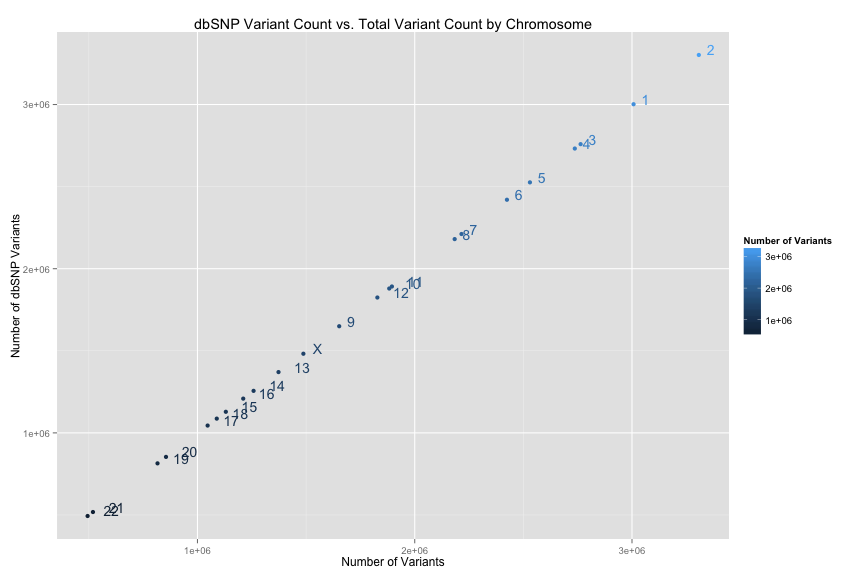
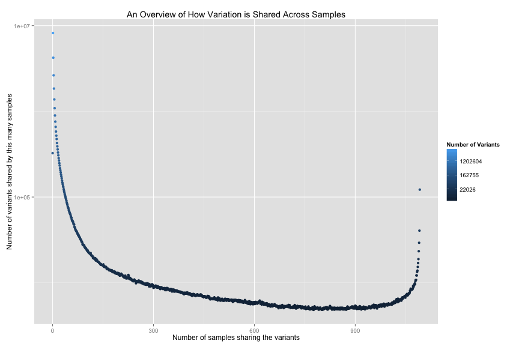

<!-- R Markdown Documentation, DO NOT EDIT THE PLAIN MARKDOWN VERSION OF THIS FILE -->

<!-- Copyright 2014 Google Inc. All rights reserved. -->

<!-- Licensed under the Apache License, Version 2.0 (the "License"); -->
<!-- you may not use this file except in compliance with the License. -->
<!-- You may obtain a copy of the License at -->

<!--     http://www.apache.org/licenses/LICENSE-2.0 -->

<!-- Unless required by applicable law or agreed to in writing, software -->
<!-- distributed under the License is distributed on an "AS IS" BASIS, -->
<!-- WITHOUT WARRANTIES OR CONDITIONS OF ANY KIND, either express or implied. -->
<!-- See the License for the specific language governing permissions and -->
<!-- limitations under the License. -->

genomics-bigquery 1,000 Genomes
=================

### Additional Resources
* [Schema](https://bigquery.cloud.google.com/table/google.com:biggene:1000genomes.variants1kG?pli=1)
* [Provenance](./provenance)
* [Data Stories](./data-stories) such as
 * [Exploring the phenotypic data](./data-stories/exploring-the-phenotypic-data)
 * [Understanding Alternate Alleles in 1,000 Genomes](./data-stories/understanding-alternate-alleles)
 * [Literate Programming with R and BigQuery](./data-stories/literate-programming-demo)
* [Index of variant analyses](./analyses-catalog.md)

### Diving right in
The following query returns the proportion of variants that have been reported in the [dbSNP database](http://www.ncbi.nlm.nih.gov/projects/SNP/snp_summary.cgi?build_id=132) [version 132](http://www.1000genomes.org/category/variants), by chromosome, across the entirety of the 1,000 Genomes low coverage variant data for 1,092 individuals:


```
# Get the proportion of variants that have been reported in the dbSNP database 
# version 132 , by chromosome, in the dataset.
SELECT
  all_variants.contig AS contig,
  dbsnp_variants.num_variants AS num_dbsnp_variants,
  all_variants.num_variants AS num_variants,
  dbsnp_variants.num_variants / all_variants.num_variants frequency
FROM (
  SELECT
    contig,
    COUNT(*) num_variants
  FROM
    [google.com:biggene:1000genomes.variants1kG]
  WHERE
    id IS NOT NULL
  GROUP BY
    contig) dbsnp_variants
JOIN (
  SELECT
    contig,
    COUNT(*) num_variants
  FROM
    [google.com:biggene:1000genomes.variants1kG]
  GROUP BY
    contig
    ) all_variants
  ON dbsnp_variants.contig = all_variants.contig
ORDER BY
  all_variants.num_variants DESC;
```


We see the tabular results:
<!-- html table generated in R 3.0.2 by xtable 1.7-3 package -->
<!-- Sat Apr 19 14:37:17 2014 -->
<TABLE border=1>
<TR> <TH> contig </TH> <TH> num_dbsnp_variants </TH> <TH> num_variants </TH> <TH> frequency </TH>  </TR>
  <TR> <TD> 2 </TD> <TD align="right"> 3301885 </TD> <TD align="right"> 3307592 </TD> <TD align="right"> 0.998275 </TD> </TR>
  <TR> <TD> 1 </TD> <TD align="right"> 3001739 </TD> <TD align="right"> 3007196 </TD> <TD align="right"> 0.998185 </TD> </TR>
  <TR> <TD> 3 </TD> <TD align="right"> 2758667 </TD> <TD align="right"> 2763454 </TD> <TD align="right"> 0.998268 </TD> </TR>
  <TR> <TD> 4 </TD> <TD align="right"> 2731973 </TD> <TD align="right"> 2736765 </TD> <TD align="right"> 0.998249 </TD> </TR>
  <TR> <TD> 5 </TD> <TD align="right"> 2525874 </TD> <TD align="right"> 2530217 </TD> <TD align="right"> 0.998284 </TD> </TR>
  <TR> <TD> 6 </TD> <TD align="right"> 2420027 </TD> <TD align="right"> 2424425 </TD> <TD align="right"> 0.998186 </TD> </TR>
  <TR> <TD> 7 </TD> <TD align="right"> 2211317 </TD> <TD align="right"> 2215231 </TD> <TD align="right"> 0.998233 </TD> </TR>
  <TR> <TD> 8 </TD> <TD align="right"> 2180311 </TD> <TD align="right"> 2183839 </TD> <TD align="right"> 0.998384 </TD> </TR>
  <TR> <TD> 11 </TD> <TD align="right"> 1891627 </TD> <TD align="right"> 1894908 </TD> <TD align="right"> 0.998269 </TD> </TR>
  <TR> <TD> 10 </TD> <TD align="right"> 1879337 </TD> <TD align="right"> 1882663 </TD> <TD align="right"> 0.998233 </TD> </TR>
  <TR> <TD> 12 </TD> <TD align="right"> 1824513 </TD> <TD align="right"> 1828006 </TD> <TD align="right"> 0.998089 </TD> </TR>
  <TR> <TD> 9 </TD> <TD align="right"> 1649563 </TD> <TD align="right"> 1652388 </TD> <TD align="right"> 0.998290 </TD> </TR>
  <TR> <TD> X </TD> <TD align="right"> 1482078 </TD> <TD align="right"> 1487477 </TD> <TD align="right"> 0.996370 </TD> </TR>
  <TR> <TD> 13 </TD> <TD align="right"> 1370342 </TD> <TD align="right"> 1373000 </TD> <TD align="right"> 0.998064 </TD> </TR>
  <TR> <TD> 14 </TD> <TD align="right"> 1255966 </TD> <TD align="right"> 1258254 </TD> <TD align="right"> 0.998182 </TD> </TR>
  <TR> <TD> 16 </TD> <TD align="right"> 1208679 </TD> <TD align="right"> 1210619 </TD> <TD align="right"> 0.998398 </TD> </TR>
  <TR> <TD> 15 </TD> <TD align="right"> 1128457 </TD> <TD align="right"> 1130554 </TD> <TD align="right"> 0.998145 </TD> </TR>
  <TR> <TD> 18 </TD> <TD align="right"> 1086823 </TD> <TD align="right"> 1088820 </TD> <TD align="right"> 0.998166 </TD> </TR>
  <TR> <TD> 17 </TD> <TD align="right"> 1044658 </TD> <TD align="right"> 1046733 </TD> <TD align="right"> 0.998018 </TD> </TR>
  <TR> <TD> 20 </TD> <TD align="right">  853680 </TD> <TD align="right">  855166 </TD> <TD align="right"> 0.998262 </TD> </TR>
  <TR> <TD> 19 </TD> <TD align="right">  814343 </TD> <TD align="right">  816115 </TD> <TD align="right"> 0.997829 </TD> </TR>
  <TR> <TD> 21 </TD> <TD align="right">  517920 </TD> <TD align="right">  518965 </TD> <TD align="right"> 0.997986 </TD> </TR>
  <TR> <TD> 22 </TD> <TD align="right">  493717 </TD> <TD align="right">  494328 </TD> <TD align="right"> 0.998764 </TD> </TR>
   </TABLE>


And visually:



## Variant Metadata
The 1000 Genomes variant data is stored in the [variants1kG](https://bigquery.cloud.google.com/table/google.com:biggene:1000genomes.variants1kG?pli=1) table.  Every record in the variants table maps to a single site (line) in the [VCF](http://www.1000genomes.org/wiki/Analysis/Variant%20Call%20Format/vcf-variant-call-format-version-41) file.  See the [schema](https://bigquery.cloud.google.com/table/google.com:biggene:1000genomes.variants1kG?pli=1) for more detail.

Show variants within BRCA1:

```
# Get variant level metadata for variants within BRCA1.
SELECT
  contig,
  position,
  GROUP_CONCAT(id) WITHIN RECORD AS ids,
  reference_bases AS ref,
  GROUP_CONCAT(alternate_bases) WITHIN RECORD AS alt,
  quality,
  GROUP_CONCAT(filter) WITHIN RECORD AS filters,
  vt,
FROM
  [google.com:biggene:1000genomes.variants1kG]
WHERE
  contig = '17'
  AND position BETWEEN 41196312
      AND 41277500;
```

Number of rows returned by this query:
879

Examing the first few rows, we see:
<!-- html table generated in R 3.0.2 by xtable 1.7-3 package -->
<!-- Sat Apr 19 14:37:23 2014 -->
<TABLE border=1>
<TR> <TH> contig </TH> <TH> position </TH> <TH> ids </TH> <TH> ref </TH> <TH> alt </TH> <TH> quality </TH> <TH> filters </TH> <TH> vt </TH>  </TR>
  <TR> <TD> 17 </TD> <TD align="right"> 41196363 </TD> <TD> rs8176320 </TD> <TD> C </TD> <TD> T </TD> <TD align="right"> 100.00 </TD> <TD> PASS </TD> <TD> SNP </TD> </TR>
  <TR> <TD> 17 </TD> <TD align="right"> 41196368 </TD> <TD> rs184237074 </TD> <TD> C </TD> <TD> T </TD> <TD align="right"> 100.00 </TD> <TD> PASS </TD> <TD> SNP </TD> </TR>
  <TR> <TD> 17 </TD> <TD align="right"> 41196372 </TD> <TD> rs189382442 </TD> <TD> T </TD> <TD> C </TD> <TD align="right"> 100.00 </TD> <TD> PASS </TD> <TD> SNP </TD> </TR>
  <TR> <TD> 17 </TD> <TD align="right"> 41196403 </TD> <TD> rs182218567 </TD> <TD> A </TD> <TD> G </TD> <TD align="right"> 100.00 </TD> <TD> PASS </TD> <TD> SNP </TD> </TR>
  <TR> <TD> 17 </TD> <TD align="right"> 41196408 </TD> <TD> rs12516 </TD> <TD> G </TD> <TD> A </TD> <TD align="right"> 100.00 </TD> <TD> PASS </TD> <TD> SNP </TD> </TR>
  <TR> <TD> 17 </TD> <TD align="right"> 41196582 </TD> <TD> rs111791349 </TD> <TD> C </TD> <TD> T </TD> <TD align="right"> 100.00 </TD> <TD> PASS </TD> <TD> SNP </TD> </TR>
   </TABLE>

One can add more columns to the SELECT statement corresponding to INFO fields of interest as desired.

## Sample Data
Show variants for a paricular sample within BRCA1:

```
# Get sample level data for variants within BRCA1.
SELECT
  contig,
  position,
  GROUP_CONCAT(id) WITHIN RECORD AS ids,
  reference_bases AS ref,
  GROUP_CONCAT(alternate_bases) WITHIN RECORD AS alt,
  quality,
  GROUP_CONCAT(filter) WITHIN RECORD AS filters,
  vt,
  genotype.sample_id AS sample_id,
  genotype.ploidy AS ploidy,
  genotype.phased AS phased,
  genotype.first_allele AS first_allele,
  genotype.second_allele AS second_allele,
  genotype.ds,
  GROUP_CONCAT(STRING(genotype.gl)) WITHIN genotype AS likelihoods,
FROM
  [google.com:biggene:1000genomes.variants1kG]
WHERE
  contig = '17'
  AND position BETWEEN 41196312
      AND 41277500
HAVING
  sample_id = 'HG00100';
```

Number of rows returned by this query:
879

Examing the first few rows, we see:
<!-- html table generated in R 3.0.2 by xtable 1.7-3 package -->
<!-- Sat Apr 19 14:37:26 2014 -->
<TABLE border=1>
<TR> <TH> contig </TH> <TH> position </TH> <TH> ids </TH> <TH> ref </TH> <TH> alt </TH> <TH> quality </TH> <TH> filters </TH> <TH> vt </TH> <TH> sample_id </TH> <TH> ploidy </TH> <TH> phased </TH> <TH> first_allele </TH> <TH> second_allele </TH> <TH> genotype_ds </TH> <TH> likelihoods </TH>  </TR>
  <TR> <TD> 17 </TD> <TD align="right"> 41196363 </TD> <TD> rs8176320 </TD> <TD> C </TD> <TD> T </TD> <TD align="right"> 100.00 </TD> <TD> PASS </TD> <TD> SNP </TD> <TD> HG00100 </TD> <TD align="right">   2 </TD> <TD> TRUE </TD> <TD align="right">   0 </TD> <TD align="right">   0 </TD> <TD align="right"> 0.00 </TD> <TD> -0.03,-1.19,-5 </TD> </TR>
  <TR> <TD> 17 </TD> <TD align="right"> 41196368 </TD> <TD> rs184237074 </TD> <TD> C </TD> <TD> T </TD> <TD align="right"> 100.00 </TD> <TD> PASS </TD> <TD> SNP </TD> <TD> HG00100 </TD> <TD align="right">   2 </TD> <TD> TRUE </TD> <TD align="right">   0 </TD> <TD align="right">   0 </TD> <TD align="right"> 0.00 </TD> <TD> -0.02,-1.35,-5 </TD> </TR>
  <TR> <TD> 17 </TD> <TD align="right"> 41196372 </TD> <TD> rs189382442 </TD> <TD> T </TD> <TD> C </TD> <TD align="right"> 100.00 </TD> <TD> PASS </TD> <TD> SNP </TD> <TD> HG00100 </TD> <TD align="right">   2 </TD> <TD> TRUE </TD> <TD align="right">   0 </TD> <TD align="right">   0 </TD> <TD align="right"> 0.00 </TD> <TD> -0.01,-1.48,-5 </TD> </TR>
  <TR> <TD> 17 </TD> <TD align="right"> 41196403 </TD> <TD> rs182218567 </TD> <TD> A </TD> <TD> G </TD> <TD align="right"> 100.00 </TD> <TD> PASS </TD> <TD> SNP </TD> <TD> HG00100 </TD> <TD align="right">   2 </TD> <TD> TRUE </TD> <TD align="right">   0 </TD> <TD align="right">   0 </TD> <TD align="right"> 0.00 </TD> <TD> -0.03,-1.16,-5 </TD> </TR>
  <TR> <TD> 17 </TD> <TD align="right"> 41196408 </TD> <TD> rs12516 </TD> <TD> G </TD> <TD> A </TD> <TD align="right"> 100.00 </TD> <TD> PASS </TD> <TD> SNP </TD> <TD> HG00100 </TD> <TD align="right">   2 </TD> <TD> TRUE </TD> <TD align="right">   1 </TD> <TD align="right">   0 </TD> <TD align="right"> 1.00 </TD> <TD> -5,0,-2.53 </TD> </TR>
  <TR> <TD> 17 </TD> <TD align="right"> 41196582 </TD> <TD> rs111791349 </TD> <TD> C </TD> <TD> T </TD> <TD align="right"> 100.00 </TD> <TD> PASS </TD> <TD> SNP </TD> <TD> HG00100 </TD> <TD align="right">   2 </TD> <TD> TRUE </TD> <TD align="right">   0 </TD> <TD align="right">   0 </TD> <TD align="right"> 0.00 </TD> <TD> -0.18,-0.46,-2.43 </TD> </TR>
   </TABLE>

Note that this is equivalent to the [vcf-query](http://vcftools.sourceforge.net/perl_module.html#vcf-query) command
```
vcf-query ALL.chr17.phase1_release_v3.20101123.snps_indels_svs.genotypes.vcf.gz 17:41196312-41277500 -c HG00100
```
Lastly, let's get an overview of how much variation is shared across the samples.

```
# Count the number of variants shared by none, shared by one sample, two samples, etc...
SELECT
  num_samples_with_variant,
  COUNT(num_samples_with_variant) AS num_variants_shared_by_this_many_samples
FROM (
  SELECT
    contig,
    position,
    reference_bases,
    SUM(IF(genotype.first_allele > 0
        OR genotype.second_allele > 0,
        1,
        0)) WITHIN RECORD AS num_samples_with_variant
  FROM
    [google.com:biggene:1000genomes.variants1kG])
GROUP BY
  num_samples_with_variant
ORDER BY
  num_samples_with_variant;
```

Number of rows returned by this query:
1093

Examing the first few rows, we see that a substantial number of variants are shared by **none** of the samples but a larger number of the variants are shared by only one sample:
<!-- html table generated in R 3.0.2 by xtable 1.7-3 package -->
<!-- Sat Apr 19 14:37:31 2014 -->
<TABLE border=1>
<TR> <TH> num_samples_with_variant </TH> <TH> num_variants_shared_by_this_many_samples </TH>  </TR>
  <TR> <TD align="right">   0 </TD> <TD align="right"> 325354 </TD> </TR>
  <TR> <TD align="right">   1 </TD> <TD align="right"> 8204165 </TD> </TR>
  <TR> <TD align="right">   2 </TD> <TD align="right"> 4225255 </TD> </TR>
  <TR> <TD align="right">   3 </TD> <TD align="right"> 2631467 </TD> </TR>
  <TR> <TD align="right">   4 </TD> <TD align="right"> 1843238 </TD> </TR>
  <TR> <TD align="right">   5 </TD> <TD align="right"> 1377873 </TD> </TR>
   </TABLE>

Looking at the last few rows in the result, we see that some variants are shared by all samples:
<!-- html table generated in R 3.0.2 by xtable 1.7-3 package -->
<!-- Sat Apr 19 14:37:31 2014 -->
<TABLE border=1>
<TR> <TH> num_samples_with_variant </TH> <TH> num_variants_shared_by_this_many_samples </TH>  </TR>
  <TR> <TD align="right"> 1087 </TD> <TD align="right"> 16971 </TD> </TR>
  <TR> <TD align="right"> 1088 </TD> <TD align="right"> 18875 </TD> </TR>
  <TR> <TD align="right"> 1089 </TD> <TD align="right"> 23322 </TD> </TR>
  <TR> <TD align="right"> 1090 </TD> <TD align="right"> 29248 </TD> </TR>
  <TR> <TD align="right"> 1091 </TD> <TD align="right"> 40544 </TD> </TR>
  <TR> <TD align="right"> 1092 </TD> <TD align="right"> 122030 </TD> </TR>
   </TABLE>

And visually:


