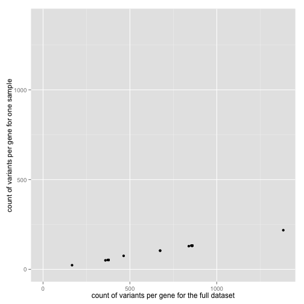

<!-- R Markdown Documentation, DO NOT EDIT THE PLAIN MARKDOWN VERSION OF THIS FILE -->

<!-- Copyright 2014 Google Inc. All rights reserved. -->

<!-- Licensed under the Apache License, Version 2.0 (the "License"); -->
<!-- you may not use this file except in compliance with the License. -->
<!-- You may obtain a copy of the License at -->

<!--     http://www.apache.org/licenses/LICENSE-2.0 -->

<!-- Unless required by applicable law or agreed to in writing, software -->
<!-- distributed under the License is distributed on an "AS IS" BASIS, -->
<!-- WITHOUT WARRANTIES OR CONDITIONS OF ANY KIND, either express or implied. -->
<!-- See the License for the specific language governing permissions and -->
<!-- limitations under the License. -->

Annotation JOINs
========================================================

In this data story we explore JOINing variant data in BigQuery with several annotation databases.  **NOTE: the JOIN criteria may not be correct.**  Please only use this resource for ideas, and file github issues for corrections.


```r
require(bigrquery)
require(ggplot2)
require(xtable)
require(testthat)
project <- "google.com:biggene" # put your projectID here
DisplayAndDispatchQuery <- function(queryUri) {
  querySql <- readChar(queryUri, nchars=1e6)
  cat(querySql)
  query_exec(querySql, project)
}
```

Let us start by getting an idea of the number of rows in each of our tables.

```r
tables <- c("1000genomes.phase1_variants",
            "1000genomes.pedigree",
            "1000genomes.sample_info",
            "annotations.clinvar",
            "annotations.clinvar_disease_names",
            "annotations.known_genes",
            "annotations.known_genes_aliases")
lapply(tables, function(table) {
  querySql <- paste0("SELECT count(*) AS cnt FROM [google.com:biggene:",
                table, "]")
  result <- query_exec(querySql, project)
  paste(table, result, sep=": ")
})
```

```
## 0 bytes processed
```

```
## [[1]]
## [1] "1000genomes.phase1_variants: 39706715"
## 
## [[2]]
## [1] "1000genomes.pedigree: 3501"
## 
## [[3]]
## [1] "1000genomes.sample_info: 3500"
## 
## [[4]]
## [1] "annotations.clinvar: 71356"
## 
## [[5]]
## [1] "annotations.clinvar_disease_names: 16020"
## 
## [[6]]
## [1] "annotations.known_genes: 82960"
## 
## [[7]]
## [1] "annotations.known_genes_aliases: 612731"
```
We can see that all the annotation databases are dwarfed in size by the data in the variants table.

Let us also examine the types of variants within ClinVar.

```r
result <- query_exec("SELECT type, count(1) cnt FROM [google.com:biggene:annotations.clinvar] group by type",
                     project)
```
Number of rows returned by this query: 14.

Display the rows of our result

```r
print(xtable(result), type="html", include.rownames=F)
```

<!-- html table generated in R 3.1.1 by xtable 1.7-3 package -->
<!-- Thu Oct  2 22:35:52 2014 -->
<TABLE border=1>
<TR> <TH> type </TH> <TH> cnt </TH>  </TR>
  <TR> <TD> insertion </TD> <TD align="right"> 1453 </TD> </TR>
  <TR> <TD> deletion </TD> <TD align="right"> 8317 </TD> </TR>
  <TR> <TD> indel </TD> <TD align="right"> 545 </TD> </TR>
  <TR> <TD> duplication </TD> <TD align="right"> 1953 </TD> </TR>
  <TR> <TD> undetermined variant </TD> <TD align="right"> 710 </TD> </TR>
  <TR> <TD> single nucleotide variant </TD> <TD align="right"> 55162 </TD> </TR>
  <TR> <TD> structural variant </TD> <TD align="right">   1 </TD> </TR>
  <TR> <TD> fusion </TD> <TD align="right">   4 </TD> </TR>
  <TR> <TD> inversion </TD> <TD align="right">   4 </TD> </TR>
  <TR> <TD> NT expansion </TD> <TD align="right">  36 </TD> </TR>
  <TR> <TD> copy number loss </TD> <TD align="right"> 1655 </TD> </TR>
  <TR> <TD> copy number gain </TD> <TD align="right"> 1439 </TD> </TR>
  <TR> <TD> short repeat </TD> <TD align="right">   2 </TD> </TR>
  <TR> <TD> protein only </TD> <TD align="right">  75 </TD> </TR>
   </TABLE>
We can see that the vast majority of variants within ClinVar are SNPs.

## JOINs that check whether a position overlaps an interval

### JOINing Sample SNP Variants with ClinVar


```r
result <- DisplayAndDispatchQuery("../../sql/individual-clinically-concerning-variants.sql")
```

```
# Retrieve the SNPs identified by ClinVar as pathenogenic or a risk factor for a particular sample.
# TODO: double check whether the annotation coordinates are 0-based as is
#       the case for the variants.
SELECT
  reference_name,
  start,
  ref,
  alt,
  clinicalsignificance,
  diseasename,
  sample_id,
FROM (
  SELECT
    reference_name,
    var.start AS start,
    ref,
    alt,
    call.call_set_name AS sample_id,
    NTH(1,
      call.genotype) WITHIN var.call AS first_allele,
    NTH(2,
      call.genotype) WITHIN var.call AS second_allele,
    clinicalsignificance,
    disease_id,
  FROM
    FLATTEN([genomics-public-data:1000_genomes.variants],
      alternate_bases) AS var
  JOIN (
    SELECT
      chromosome,
      start,
      clinicalsignificance,
      REGEXP_EXTRACT(hgvs_c,
        r'(\w)>\w') AS ref,
      REGEXP_EXTRACT(hgvs_c,
        r'\w>(\w)')  AS alt,
      REGEXP_EXTRACT(phenotypeids,
        r'MedGen:(\w+)') AS disease_id,
    FROM
      [google.com:biggene:annotations.clinvar]
    WHERE
      type='single nucleotide variant'
      AND (clinicalsignificance CONTAINS 'risk factor'
        OR clinicalsignificance CONTAINS 'pathogenic'
        OR clinicalsignificance CONTAINS 'Pathogenic')
      ) AS clin
  ON
    var.reference_name = clin.chromosome
    AND var.start = clin.start
    AND reference_bases = ref
    AND alternate_bases = alt
  WHERE
    call.call_set_name = 'NA19764'
    AND var.vt='SNP'
  HAVING
    first_allele > 0
    OR (second_allele IS NOT NULL
        AND second_allele > 0)) AS sig
JOIN
  [google.com:biggene:annotations.clinvar_disease_names] AS names
ON
  names.conceptid = sig.disease_id
GROUP BY
  reference_name,
  start,
  ref,
  alt,
  clinicalsignificance,
  diseasename,
  sample_id,
ORDER BY
  clinicalsignificance,
  reference_name,
  start
```
Number of rows returned by this query: 2.

Display the first few rows of our result

```r
print(xtable(head(result)), type="html", include.rownames=F)
```

<!-- html table generated in R 3.1.1 by xtable 1.7-3 package -->
<!-- Thu Oct  2 22:35:59 2014 -->
<TABLE border=1>
<TR> <TH> reference_name </TH> <TH> start </TH> <TH> ref </TH> <TH> alt </TH> <TH> clinicalsignificance </TH> <TH> diseasename </TH> <TH> sample_id </TH>  </TR>
  <TR> <TD> 22 </TD> <TD align="right"> 37469590 </TD> <TD> G </TD> <TD> A </TD> <TD> Pathogenic </TD> <TD> Microcytic anemia </TD> <TD> NA19764 </TD> </TR>
  <TR> <TD> 10 </TD> <TD align="right"> 43615632 </TD> <TD> C </TD> <TD> G </TD> <TD> Pathogenic;Uncertain significance </TD> <TD> Multiple endocrine neoplasia, type 2b </TD> <TD> NA19764 </TD> </TR>
   </TABLE>
We can see that this indivudual has 53 clinically concerning variants.

### JOINing Sample SNP Variants with ClinVar, Grouped by Family

```r
result <- DisplayAndDispatchQuery("../../sql/familial-shared-clinically-concerning-variants.sql")
```

```
# Retrieve the SNPs identified by ClinVar as pathenogenic or a risk factor, counting the
# number of family members sharing the SNP.
# TODO: double check whether the annotation coordinates are 0-based as is
#       the case for the variants.
SELECT
  reference_name,
  start,
  ref,
  alt,
  clinicalsignificance,
  diseasename,
  family_id,
  num_family_members_with_variant,
FROM (
  SELECT
    reference_name,
    start,
    ref,
    alt,
    clinicalsignificance,
    disease_id,
    family_id,
    COUNT(*) AS num_family_members_with_variant,
  FROM
    (FLATTEN(
        (
        SELECT
          reference_name,
          var.start AS start,
          ref,
          alt,
          call.call_set_name AS sample_id,
          NTH(1,
            call.genotype) WITHIN var.call AS first_allele,
          NTH(2,
            call.genotype) WITHIN var.call AS second_allele,
          clinicalsignificance,
          disease_id,
        FROM
          FLATTEN([genomics-public-data:1000_genomes.variants],
            alternate_bases) AS var
        JOIN (
          SELECT
            chromosome,
            start,
            clinicalsignificance,
            REGEXP_EXTRACT(hgvs_c,
              r'(\w)>\w') AS ref,
            REGEXP_EXTRACT(hgvs_c,
              r'\w>(\w)')  AS alt,
            REGEXP_EXTRACT(phenotypeids,
              r'MedGen:(\w+)') AS disease_id,
          FROM
            [google.com:biggene:annotations.clinvar]
          WHERE
            type='single nucleotide variant'
            AND (clinicalsignificance CONTAINS 'risk factor'
              OR clinicalsignificance CONTAINS 'pathogenic'
              OR clinicalsignificance CONTAINS 'Pathogenic')
            ) AS clin
        ON
          var.reference_name = clin.chromosome
          AND var.start = clin.start
          AND reference_bases = ref
          AND alternate_bases = alt
        WHERE
          var.vt='SNP'
        HAVING
          first_allele > 0
          OR (second_allele IS NOT NULL
              AND second_allele > 0)),
        var.call)) AS sig
  JOIN
    [genomics-public-data:1000_genomes.pedigree] AS ped
  ON
    sig.sample_id = ped.individual_id
  GROUP BY
    reference_name,
    start,
    ref,
    alt,
    clinicalsignificance,
    disease_id,
    family_id) families
JOIN
  [google.com:biggene:annotations.clinvar_disease_names] AS names
ON
  names.conceptid = families.disease_id
GROUP BY
  reference_name,
  start,
  ref,
  alt,
  clinicalsignificance,
  diseasename,
  family_id,
  num_family_members_with_variant,
ORDER BY
  num_family_members_with_variant DESC,
  clinicalsignificance,
  reference_name,
  start,
  family_id
```
Number of rows returned by this query: 3014.

Display the first few rows of our result

```r
print(xtable(head(result)), type="html", include.rownames=F)
```

<!-- html table generated in R 3.1.1 by xtable 1.7-3 package -->
<!-- Thu Oct  2 22:36:05 2014 -->
<TABLE border=1>
<TR> <TH> reference_name </TH> <TH> start </TH> <TH> ref </TH> <TH> alt </TH> <TH> clinicalsignificance </TH> <TH> diseasename </TH> <TH> family_id </TH> <TH> num_family_members_with_variant </TH>  </TR>
  <TR> <TD> 14 </TD> <TD align="right"> 51376773 </TD> <TD> G </TD> <TD> A </TD> <TD> Pathogenic </TD> <TD> Glycogen storage disease, type VI </TD> <TD> 1362 </TD> <TD align="right">   4 </TD> </TR>
  <TR> <TD> 22 </TD> <TD align="right"> 37469590 </TD> <TD> G </TD> <TD> A </TD> <TD> Pathogenic </TD> <TD> Microcytic anemia </TD> <TD> 1362 </TD> <TD align="right">   4 </TD> </TR>
  <TR> <TD> 19 </TD> <TD align="right"> 33353463 </TD> <TD> G </TD> <TD> A </TD> <TD> Pathogenic </TD> <TD> Cystinuria </TD> <TD> 1346 </TD> <TD align="right">   3 </TD> </TR>
  <TR> <TD> 19 </TD> <TD align="right"> 33353463 </TD> <TD> G </TD> <TD> A </TD> <TD> Pathogenic </TD> <TD> Cystinuria </TD> <TD> 1420 </TD> <TD align="right">   3 </TD> </TR>
  <TR> <TD> 19 </TD> <TD align="right"> 33353463 </TD> <TD> G </TD> <TD> A </TD> <TD> Pathogenic </TD> <TD> Cystinuria </TD> <TD> 1444 </TD> <TD align="right">   3 </TD> </TR>
  <TR> <TD> 22 </TD> <TD align="right"> 37469590 </TD> <TD> G </TD> <TD> A </TD> <TD> Pathogenic </TD> <TD> Microcytic anemia </TD> <TD> 1340 </TD> <TD align="right">   3 </TD> </TR>
   </TABLE>
We can see that some variants are shared by as many as four family members.

### JOINing Sample INDEL Variants with ClinVar

First, let us see what the INDEL data looks like in ClinVar:

```r
querySql <- 'SELECT * FROM [google.com:biggene:annotations.clinvar] where type="indel"'
result <- query_exec(querySql, project)
```
Number of rows returned by this query: 545.

Display the first few rows of our result

```r
print(xtable(head(result, 20)), type="html", include.rownames=F)
```

<!-- html table generated in R 3.1.1 by xtable 1.7-3 package -->
<!-- Thu Oct  2 22:36:11 2014 -->
<TABLE border=1>
<TR> <TH> alleleid </TH> <TH> type </TH> <TH> name </TH> <TH> geneid </TH> <TH> genesymbol </TH> <TH> clinicalsignificance </TH> <TH> rs_dbsnp </TH> <TH> nsv_dbvar </TH> <TH> rcvaccession </TH> <TH> testedingtr </TH> <TH> phenotypeids </TH> <TH> origin </TH> <TH> assembly </TH> <TH> chromosome </TH> <TH> start </TH> <TH> stop </TH> <TH> cytogenetic </TH> <TH> reviewstatus </TH> <TH> hgvs_c </TH> <TH> hgvs_p </TH> <TH> numbersubmitters </TH> <TH> lastevaluated </TH> <TH> guidelines </TH> <TH> otherids </TH>  </TR>
  <TR> <TD align="right"> 15041 </TD> <TD> indel </TD> <TD> NM_014855.2:c.80_83delGGATinsTGCTGTAAACTGTAACTGTAAA </TD> <TD align="right"> 9907 </TD> <TD>  </TD> <TD> Pathogenic </TD> <TD align="right"> 397704705 </TD> <TD>  </TD> <TD> RCV000000012 </TD> <TD> N </TD> <TD> MedGen:C3150901,OMIM:613647,Orphanet:306511 </TD> <TD> germline </TD> <TD> GRCh37 </TD> <TD> 7 </TD> <TD align="right"> 4820844 </TD> <TD align="right"> 4820847 </TD> <TD>  </TD> <TD> classified by single submitter </TD> <TD> NM_014855.2:c.80_83delGGATinsTGCTGTAAACTGTAACTGTAAA </TD> <TD> NP_055670.1:p.Arg27_Cys29delinsLeuLeuTer </TD> <TD align="right">   1 </TD> <TD> 17 Sep 2012 </TD> <TD>  </TD> <TD> OMIM Allelic Variant:613653.0001 </TD> </TR>
  <TR> <TD align="right"> 15063 </TD> <TD> indel </TD> <TD> ABHD12:c.337_338delGAinsTTT (p.Asp113delinsPhePhefs) </TD> <TD align="right"> 26090 </TD> <TD> ABHD12 </TD> <TD> Pathogenic </TD> <TD align="right"> 387906217 </TD> <TD>  </TD> <TD> RCV000000041 </TD> <TD> N </TD> <TD> MedGen:C2675204,OMIM:612674,Orphanet:171848 </TD> <TD> germline </TD> <TD> GRCh37 </TD> <TD> 20 </TD> <TD align="right"> 25304045 </TD> <TD align="right"> 25304046 </TD> <TD> 20p11.2 </TD> <TD> classified by single submitter </TD> <TD> NM_015600.4:c.337_338delGAinsTTT </TD> <TD> NP_056415.1:p.Asp113delinsPhePhefs </TD> <TD align="right">   1 </TD> <TD> 11 Jan 2011 </TD> <TD>  </TD> <TD> OMIM Allelic Variant:613599.0001 </TD> </TR>
  <TR> <TD align="right"> 15064 </TD> <TD> indel </TD> <TD> NM_015600.4:c.(?_-5279)_191+7002delinsCC </TD> <TD align="right"> 26090 </TD> <TD> ABHD12 </TD> <TD> Pathogenic </TD> <TD align="right">  -1 </TD> <TD>  </TD> <TD> RCV000000042 </TD> <TD> N </TD> <TD> MedGen:C2675204,OMIM:612674,Orphanet:171848 </TD> <TD> germline </TD> <TD> GRCh37 </TD> <TD> 20 </TD> <TD align="right"> 25364147 </TD> <TD align="right"> 25378237 </TD> <TD> 20p11.2 </TD> <TD> classified by single submitter </TD> <TD>  </TD> <TD>  </TD> <TD align="right">   1 </TD> <TD> 11 Jan 2011 </TD> <TD>  </TD> <TD> OMIM Allelic Variant:613599.0002 </TD> </TR>
  <TR> <TD align="right"> 15138 </TD> <TD> indel </TD> <TD> TCN2, 2,152-BP DEL AND 4-BP INS </TD> <TD align="right"> 6948 </TD> <TD> TCN2 </TD> <TD> Pathogenic </TD> <TD align="right">  -1 </TD> <TD>  </TD> <TD> RCV000000119 </TD> <TD> N </TD> <TD>  </TD> <TD> germline </TD> <TD>  </TD> <TD>  </TD> <TD align="right">  -1 </TD> <TD align="right">  -1 </TD> <TD>  </TD> <TD> classified by single submitter </TD> <TD>  </TD> <TD>  </TD> <TD align="right">   1 </TD> <TD> 30 Aug 2013 </TD> <TD>  </TD> <TD> OMIM Allelic Variant:613441.0004 </TD> </TR>
  <TR> <TD align="right"> 15405 </TD> <TD> indel </TD> <TD> NF1:c.945_946delGCinsAA (p.Gln315_Leu316delinsGlnMet) </TD> <TD align="right"> 4763 </TD> <TD> NF1 </TD> <TD> Pathogenic </TD> <TD align="right"> 267606609 </TD> <TD>  </TD> <TD> RCV000000396 </TD> <TD> N </TD> <TD> MedGen:C2931482,OMIM:601321 </TD> <TD> germline </TD> <TD> GRCh37 </TD> <TD> 17 </TD> <TD align="right"> 29527496 </TD> <TD align="right"> 29527497 </TD> <TD> 17q11.2 </TD> <TD> classified by single submitter </TD> <TD> LRG_214:g.110502_110503delGCinsAA </TD> <TD>  </TD> <TD align="right">   1 </TD> <TD> 03 Apr 2013 </TD> <TD>  </TD> <TD> OMIM Allelic Variant:613113.0036 </TD> </TR>
  <TR> <TD align="right"> 15448 </TD> <TD> indel </TD> <TD> HTT, (CAG)n EXPANSION </TD> <TD align="right"> 3064 </TD> <TD> HTT </TD> <TD> Pathogenic </TD> <TD align="right">  -1 </TD> <TD>  </TD> <TD> RCV000030659 </TD> <TD> N </TD> <TD> GeneReviews:NBK1305,MedGen:C0020179,OMIM:143100,SNOMED CT:58756001 </TD> <TD> germline </TD> <TD> GRCh37 </TD> <TD> 4 </TD> <TD align="right"> 3076604 </TD> <TD align="right"> 3076660 </TD> <TD> 4p16 </TD> <TD> classified by multiple submitters </TD> <TD>  </TD> <TD>  </TD> <TD align="right">   2 </TD> <TD> 18 Apr 2013 </TD> <TD>  </TD> <TD> GeneReviews:NBK1305,OMIM Allelic Variant:613004.0001 </TD> </TR>
  <TR> <TD align="right"> 15509 </TD> <TD> indel </TD> <TD> ALDOB, 7-BP DEL/1-BP INS, 3-PRIME IVS8 </TD> <TD align="right"> 229 </TD> <TD> ALDOB </TD> <TD> Pathogenic </TD> <TD align="right">  -1 </TD> <TD>  </TD> <TD> RCV000000499 </TD> <TD> N </TD> <TD> MedGen:C0016751,OMIM:229600,Orphanet:469,SNOMED CT:20052008 </TD> <TD> germline </TD> <TD>  </TD> <TD>  </TD> <TD align="right">  -1 </TD> <TD align="right">  -1 </TD> <TD>  </TD> <TD> classified by single submitter </TD> <TD>  </TD> <TD>  </TD> <TD align="right">   1 </TD> <TD> 25 Apr 2011 </TD> <TD>  </TD> <TD> OMIM Allelic Variant:612724.0007 </TD> </TR>
  <TR> <TD align="right"> 15613 </TD> <TD> indel </TD> <TD> KNG1, 17-BP DEL/17-BP INS, NT1559 </TD> <TD align="right"> 3827 </TD> <TD> KNG1 </TD> <TD> Pathogenic </TD> <TD align="right">  -1 </TD> <TD>  </TD> <TD> RCV000000604 </TD> <TD> N </TD> <TD> MedGen:C0272340,OMIM:228960,SNOMED CT:27312002 </TD> <TD> germline </TD> <TD>  </TD> <TD>  </TD> <TD align="right">  -1 </TD> <TD align="right">  -1 </TD> <TD>  </TD> <TD> classified by single submitter </TD> <TD>  </TD> <TD>  </TD> <TD align="right">   1 </TD> <TD> 23 Feb 2012 </TD> <TD>  </TD> <TD> OMIM Allelic Variant:612358.0003 </TD> </TR>
  <TR> <TD align="right"> 16019 </TD> <TD> indel </TD> <TD> ARMS2, 443-BP DEL/54-BP INS </TD> <TD align="right"> 387715 </TD> <TD> ARMS2 </TD> <TD> risk factor </TD> <TD align="right">  -1 </TD> <TD>  </TD> <TD> RCV000001031 </TD> <TD> N </TD> <TD> MedGen:C3151070,OMIM:613778 </TD> <TD> germline </TD> <TD>  </TD> <TD>  </TD> <TD align="right">  -1 </TD> <TD align="right">  -1 </TD> <TD>  </TD> <TD> classified by single submitter </TD> <TD>  </TD> <TD>  </TD> <TD align="right">   1 </TD> <TD> 26 Feb 2013 </TD> <TD>  </TD> <TD> OMIM Allelic Variant:611313.0002 </TD> </TR>
  <TR> <TD align="right"> 16046 </TD> <TD> indel </TD> <TD> MFSD8, 2-BP DEL/2-BP INS </TD> <TD align="right"> 256471 </TD> <TD> MFSD8 </TD> <TD> Pathogenic </TD> <TD align="right">  -1 </TD> <TD>  </TD> <TD> RCV000001062 </TD> <TD> N </TD> <TD> GeneReviews:NBK1428,MedGen:C1838571,OMIM:610951,Orphanet:168491,Orphanet:228366 </TD> <TD> germline </TD> <TD>  </TD> <TD>  </TD> <TD align="right">  -1 </TD> <TD align="right">  -1 </TD> <TD>  </TD> <TD> classified by single submitter </TD> <TD>  </TD> <TD>  </TD> <TD align="right">   1 </TD> <TD> 24 Mar 2010 </TD> <TD>  </TD> <TD> OMIM Allelic Variant:611124.0007 </TD> </TR>
  <TR> <TD align="right"> 16096 </TD> <TD> indel </TD> <TD> NM_018122.4:c.228-21_228-20delTTinsC </TD> <TD align="right"> 55157 </TD> <TD> DARS2 </TD> <TD> Pathogenic </TD> <TD align="right"> 367543010 </TD> <TD>  </TD> <TD> RCV000001112 </TD> <TD> N </TD> <TD> GeneReviews:NBK43417,MedGen:C1970180,OMIM:611105,Orphanet:137898 </TD> <TD> germline </TD> <TD> GRCh37 </TD> <TD> 1 </TD> <TD align="right"> 173797450 </TD> <TD align="right"> 173797451 </TD> <TD> 1q25 </TD> <TD> classified by multiple submitters </TD> <TD>  </TD> <TD>  </TD> <TD align="right">   2 </TD> <TD> 24 Sep 2013 </TD> <TD>  </TD> <TD> GeneReviews:NBK43417,OMIM Allelic Variant:610956.0001 </TD> </TR>
  <TR> <TD align="right"> 16178 </TD> <TD> indel </TD> <TD> STRA6, 3-BP DEL/2-BP INS </TD> <TD align="right"> 64220 </TD> <TD> STRA6 </TD> <TD> Pathogenic </TD> <TD align="right">  -1 </TD> <TD>  </TD> <TD> RCV000001198 </TD> <TD> N </TD> <TD> MedGen:C1832661,OMIM:601186,Orphanet:2470 </TD> <TD> germline </TD> <TD>  </TD> <TD>  </TD> <TD align="right">  -1 </TD> <TD align="right">  -1 </TD> <TD>  </TD> <TD> classified by single submitter </TD> <TD>  </TD> <TD>  </TD> <TD align="right">   1 </TD> <TD> 20 Mar 2013 </TD> <TD>  </TD> <TD> OMIM Allelic Variant:610745.0007 </TD> </TR>
  <TR> <TD align="right"> 16296 </TD> <TD> indel </TD> <TD> LEPRE1:c.1365_1366delAGinsC (p.Glu455_Gly456delinsAspAlafs) </TD> <TD align="right"> 64175 </TD> <TD> LEPRE1 </TD> <TD> Pathogenic </TD> <TD align="right"> 137853952 </TD> <TD>  </TD> <TD> RCV000001319 </TD> <TD> N </TD> <TD> MedGen:C1970458,OMIM:610915 </TD> <TD> germline </TD> <TD> GRCh37 </TD> <TD> 1 </TD> <TD align="right"> 43218315 </TD> <TD align="right"> 43218316 </TD> <TD> 1p34.2 </TD> <TD> classified by single submitter </TD> <TD> LRG_5:g.19440_19441delAGinsC </TD> <TD>  </TD> <TD align="right">   1 </TD> <TD> 02 Oct 2012 </TD> <TD>  </TD> <TD> OMIM Allelic Variant:610339.0005 </TD> </TR>
  <TR> <TD align="right"> 16349 </TD> <TD> indel </TD> <TD> SLC4A11, IVS15AS, -6, DEL/INS </TD> <TD align="right"> 83959 </TD> <TD> SLC4A11 </TD> <TD> Pathogenic </TD> <TD align="right">  -1 </TD> <TD>  </TD> <TD> RCV000001373 </TD> <TD> N </TD> <TD> MedGen:C1857569,OMIM:217700,Orphanet:293603 </TD> <TD> germline </TD> <TD>  </TD> <TD>  </TD> <TD align="right">  -1 </TD> <TD align="right">  -1 </TD> <TD>  </TD> <TD> classified by single submitter </TD> <TD>  </TD> <TD>  </TD> <TD align="right">   1 </TD> <TD> 22 Apr 2013 </TD> <TD>  </TD> <TD> OMIM Allelic Variant:610206.0007 </TD> </TR>
  <TR> <TD align="right"> 16352 </TD> <TD> indel </TD> <TD> SLC4A11, 4-BP DEL/1-BP INS, NT460 </TD> <TD align="right"> 83959 </TD> <TD> SLC4A11 </TD> <TD> Pathogenic </TD> <TD align="right">  -1 </TD> <TD>  </TD> <TD> RCV000001376 </TD> <TD> N </TD> <TD> MedGen:C1857572,OMIM:217400,Orphanet:1490 </TD> <TD> germline </TD> <TD>  </TD> <TD>  </TD> <TD align="right">  -1 </TD> <TD align="right">  -1 </TD> <TD>  </TD> <TD> classified by single submitter </TD> <TD>  </TD> <TD>  </TD> <TD align="right">   1 </TD> <TD> 22 Apr 2013 </TD> <TD>  </TD> <TD> OMIM Allelic Variant:610206.0010 </TD> </TR>
  <TR> <TD align="right"> 16407 </TD> <TD> indel </TD> <TD> TMEM67, 13-BP DEL, 2-BP INS </TD> <TD align="right"> 91147 </TD> <TD> TMEM67 </TD> <TD> Pathogenic </TD> <TD align="right">  -1 </TD> <TD>  </TD> <TD> RCV000001433 </TD> <TD> N </TD> <TD> GeneReviews:NBK1325,MedGen:C1853153,OMIM:610688,Orphanet:475 </TD> <TD> germline </TD> <TD>  </TD> <TD>  </TD> <TD align="right">  -1 </TD> <TD align="right">  -1 </TD> <TD>  </TD> <TD> classified by single submitter </TD> <TD>  </TD> <TD>  </TD> <TD align="right">   1 </TD> <TD> 05 Aug 2013 </TD> <TD>  </TD> <TD> OMIM Allelic Variant:609884.0007 </TD> </TR>
  <TR> <TD align="right"> 16677 </TD> <TD> indel </TD> <TD> ALDH3A2, 3-BP DEL/21-BP INS, ALA314GLY, PRO315ALA </TD> <TD align="right"> 224 </TD> <TD> ALDH3A2 </TD> <TD> Pathogenic </TD> <TD align="right">  -1 </TD> <TD>  </TD> <TD> RCV000001705 </TD> <TD> N </TD> <TD> MedGen:C0037231,OMIM:270200,Orphanet:816,SNOMED CT:111303009 </TD> <TD> germline </TD> <TD>  </TD> <TD>  </TD> <TD align="right">  -1 </TD> <TD align="right">  -1 </TD> <TD>  </TD> <TD> classified by single submitter </TD> <TD>  </TD> <TD>  </TD> <TD align="right">   1 </TD> <TD> 14 Dec 2012 </TD> <TD>  </TD> <TD> OMIM Allelic Variant:609523.0003 </TD> </TR>
  <TR> <TD align="right"> 16684 </TD> <TD> indel </TD> <TD> THAP1, 5-BP INS/3-BP DEL, NT134 </TD> <TD align="right"> 55145 </TD> <TD> THAP1 </TD> <TD> Pathogenic </TD> <TD align="right">  -1 </TD> <TD>  </TD> <TD> RCV000001712 </TD> <TD> N </TD> <TD> MedGen:C1414216,OMIM:602629,Orphanet:98806 </TD> <TD> germline </TD> <TD>  </TD> <TD>  </TD> <TD align="right">  -1 </TD> <TD align="right">  -1 </TD> <TD>  </TD> <TD> classified by single submitter </TD> <TD>  </TD> <TD>  </TD> <TD align="right">   1 </TD> <TD> 24 Sep 2013 </TD> <TD>  </TD> <TD> OMIM Allelic Variant:609520.0001 </TD> </TR>
  <TR> <TD align="right"> 16709 </TD> <TD> indel </TD> <TD> CYP27B1, 5-BP DEL/6-BP INS </TD> <TD align="right"> 1594 </TD> <TD> CYP27B1 </TD> <TD> Pathogenic </TD> <TD align="right">  -1 </TD> <TD>  </TD> <TD> RCV000001737 </TD> <TD> N </TD> <TD> MedGen:C0268689,OMIM:264700,Orphanet:289157,SNOMED CT:67049004 </TD> <TD> germline </TD> <TD>  </TD> <TD>  </TD> <TD align="right">  -1 </TD> <TD align="right">  -1 </TD> <TD>  </TD> <TD> classified by single submitter </TD> <TD>  </TD> <TD>  </TD> <TD align="right">   1 </TD> <TD> 21 Jun 2012 </TD> <TD>  </TD> <TD> OMIM Allelic Variant:609506.0013 </TD> </TR>
  <TR> <TD align="right"> 16820 </TD> <TD> indel </TD> <TD> CYP17A1, 469-BP INS, 518-BP DEL </TD> <TD align="right"> 1586 </TD> <TD> CYP17A1 </TD> <TD> Pathogenic </TD> <TD align="right">  -1 </TD> <TD>  </TD> <TD> RCV000001853 </TD> <TD> N </TD> <TD>  </TD> <TD> germline </TD> <TD>  </TD> <TD>  </TD> <TD align="right">  -1 </TD> <TD align="right">  -1 </TD> <TD>  </TD> <TD> classified by single submitter </TD> <TD>  </TD> <TD>  </TD> <TD align="right">   1 </TD> <TD> 19 Apr 2013 </TD> <TD>  </TD> <TD> OMIM Allelic Variant:609300.0005 </TD> </TR>
   </TABLE>
We can see that its not obvious as to how to parse the the ClinVar INDEL details in order to know which INDELs within 1,000 Genomes might match.

## JOINs that check whether an interval overlaps another interval

### JOINing Chromosome 17 Variants with Gene Names

Next we will JOIN our variants with gene names.  Note that the JOIN criteria is simple - just matching on the chromosome, but the WHERE clause ensures the intervals overlap.

```r
result <- DisplayAndDispatchQuery("../../sql/gene-variant-counts.sql")
```

```
# Count the number of variants per gene within chromosome 17.
# TODO: double check whether the annotation coordinates are 0-based as is
#       the case for the variants.
SELECT
  gene_variants.name AS name,
  reference_name,
  min_variant_start,
  max_variant_start,
  gene_start,
  gene_end,
  cnt,
  GROUP_CONCAT(alias) AS gene_aliases,
FROM (
  SELECT
    name,
    var.reference_name AS reference_name,
    MIN(variant_start) AS min_variant_start,
    MAX(variant_end) AS max_variant_start,
    gene_start,
    gene_end,
    COUNT(*) AS cnt
  FROM (
    SELECT
      reference_name,
      start AS variant_start,
      IF(vt != 'SV',
        start + (LENGTH(alternate_bases) - LENGTH(reference_bases)),
        END) AS variant_end,
    FROM
      [genomics-public-data:1000_genomes.variants]) AS var
  JOIN (
    SELECT
      name,
      REGEXP_EXTRACT(chrom,
        r'chr(\d+)') AS reference_name,
      txStart AS gene_start,
      txEnd AS gene_end,
    FROM
      [google.com:biggene:annotations.known_genes] ) AS genes
  ON
    var.reference_name = genes.reference_name
  WHERE
    var.reference_name = '17'
    AND (( var.variant_start <= var.variant_end
        AND NOT (
          var.variant_start > genes.gene_end || var.variant_end < genes.gene_start))
      OR (var.variant_start <= var.variant_end
        AND NOT (
          var.variant_end > genes.gene_end || var.variant_start < genes.gene_start)))
  GROUP BY
    name,
    reference_name,
    gene_start,
    gene_end) AS gene_variants
JOIN
  [google.com:biggene:annotations.known_genes_aliases] AS gene_aliases
ON
  gene_variants.name = gene_aliases.name
GROUP BY
  name,
  reference_name,
  min_variant_start,
  max_variant_start,
  gene_start,
  gene_end,
  cnt
ORDER BY
  name,
  reference_name,
  min_variant_start,
  max_variant_start,
  gene_start,
  gene_end,
  cnt
```
Number of rows returned by this query: 4383.

Display the first few rows of our result

```r
print(xtable(head(result)), type="html", include.rownames=F)
```

<!-- html table generated in R 3.1.1 by xtable 1.7-3 package -->
<!-- Thu Oct  2 22:36:19 2014 -->
<TABLE border=1>
<TR> <TH> name </TH> <TH> reference_name </TH> <TH> min_variant_start </TH> <TH> max_variant_start </TH> <TH> gene_start </TH> <TH> gene_end </TH> <TH> cnt </TH> <TH> gene_aliases </TH>  </TR>
  <TR> <TD> uc002fre.2 </TD> <TD> 17 </TD> <TD align="right"> 62234 </TD> <TD align="right"> 202445 </TD> <TD align="right"> 62179 </TD> <TD align="right"> 202633 </TD> <TD align="right"> 2531 </TD> <TD> D3DTG7,NM_006987,NOC2,NP_008918,Q9BSB3,Q9UNE2,RPH3AL,RPH3L_HUMAN,uc002fre.2 </TD> </TR>
  <TR> <TD> uc002frf.2 </TD> <TD> 17 </TD> <TD align="right"> 62234 </TD> <TD align="right"> 202445 </TD> <TD align="right"> 62179 </TD> <TD align="right"> 202633 </TD> <TD align="right"> 2531 </TD> <TD> NM_001190412,NOC2,NP_001177342,Q9UNE2-2,RPH3AL,uc002frf.2 </TD> </TR>
  <TR> <TD> uc002frj.3 </TD> <TD> 17 </TD> <TD align="right"> 289794 </TD> <TD align="right"> 295728 </TD> <TD align="right"> 289770 </TD> <TD align="right"> 295731 </TD> <TD align="right"> 101 </TD> <TD> F101B_HUMAN,FAM101B,NM_182705,NP_874364,Q8N5W9,uc002frj.3 </TD> </TR>
  <TR> <TD> uc002frk.3 </TD> <TD> 17 </TD> <TD align="right"> 412345 </TD> <TD align="right"> 579632 </TD> <TD align="right"> 411907 </TD> <TD align="right"> 579647 </TD> <TD align="right"> 2449 </TD> <TD> AX746953,B1AA16,B1AA16_HUMAN,HCCS1,NM_001128159,NP_001121631,VPS53,uc002frk.3 </TD> </TR>
  <TR> <TD> uc002frl.2 </TD> <TD> 17 </TD> <TD align="right"> 429220 </TD> <TD align="right"> 618038 </TD> <TD align="right"> 429208 </TD> <TD align="right"> 618096 </TD> <TD align="right"> 2794 </TD> <TD> BC040223,VPS53,uc002frl.2 </TD> </TR>
  <TR> <TD> uc002frm.2 </TD> <TD> 17 </TD> <TD align="right"> 435582 </TD> <TD align="right"> 618038 </TD> <TD align="right"> 435532 </TD> <TD align="right"> 618096 </TD> <TD align="right"> 2736 </TD> <TD> NM_018289,NP_060759,PP13624,Q5VIR6-2,VPS53,uc002frm.2 </TD> </TR>
   </TABLE>
And drilling down to just the genes with name matching BRCA1

```r
brca1_all <- subset(result, grepl("BRCA1", gene_aliases))
dim(brca1_all)
```

```
## [1] 20  8
```


```r
print(xtable(brca1_all), type="html", include.rownames=F)
```

<!-- html table generated in R 3.1.1 by xtable 1.7-3 package -->
<!-- Thu Oct  2 22:36:19 2014 -->
<TABLE border=1>
<TR> <TH> name </TH> <TH> reference_name </TH> <TH> min_variant_start </TH> <TH> max_variant_start </TH> <TH> gene_start </TH> <TH> gene_end </TH> <TH> cnt </TH> <TH> gene_aliases </TH>  </TR>
  <TR> <TD> uc002icp.4 </TD> <TD> 17 </TD> <TD align="right"> 41196362 </TD> <TD align="right"> 41277186 </TD> <TD align="right"> 41196311 </TD> <TD align="right"> 41277340 </TD> <TD align="right"> 854 </TD> <TD> BRCA1,NR_027676,P38398-2,RNF53,uc002icp.4 </TD> </TR>
  <TR> <TD> uc002icq.3 </TD> <TD> 17 </TD> <TD align="right"> 41196362 </TD> <TD align="right"> 41277459 </TD> <TD align="right"> 41196311 </TD> <TD align="right"> 41277500 </TD> <TD align="right"> 859 </TD> <TD> BRCA1,BRCA1_HUMAN,NM_007294,NP_009228,O15129,P38398,Q3LRJ0,Q3LRJ6,Q6IN79,Q7KYU9,RNF53,uc002icq.3 </TD> </TR>
  <TR> <TD> uc002ict.3 </TD> <TD> 17 </TD> <TD align="right"> 41196362 </TD> <TD align="right"> 41277459 </TD> <TD align="right"> 41196311 </TD> <TD align="right"> 41277500 </TD> <TD align="right"> 859 </TD> <TD> BRCA1,J3KQF3,J3KQF3_HUMAN,NM_007300,NP_009231,uc002ict.3 </TD> </TR>
  <TR> <TD> uc002icu.3 </TD> <TD> 17 </TD> <TD align="right"> 41196362 </TD> <TD align="right"> 41277459 </TD> <TD align="right"> 41196311 </TD> <TD align="right"> 41277468 </TD> <TD align="right"> 859 </TD> <TD> BRCA1,NM_007299,NP_009230,P38398-6,RNF53,uc002icu.3 </TD> </TR>
  <TR> <TD> uc002idc.1 </TD> <TD> 17 </TD> <TD align="right"> 41215367 </TD> <TD align="right"> 41277459 </TD> <TD align="right"> 41215349 </TD> <TD align="right"> 41277468 </TD> <TD align="right"> 674 </TD> <TD> BC085615,BRCA1,E7EUM2,E7EUM2_HUMAN,NM_007299,NP_009230,uc002idc.1 </TD> </TR>
  <TR> <TD> uc002idd.3 </TD> <TD> 17 </TD> <TD align="right"> 41243189 </TD> <TD align="right"> 41276092 </TD> <TD align="right"> 41243116 </TD> <TD align="right"> 41276132 </TD> <TD align="right"> 359 </TD> <TD> AY354539,BRCA1,NM_007294,NP_009225,Q5YLB2,Q5YLB2_HUMAN,uc002idd.3 </TD> </TR>
  <TR> <TD> uc002ide.1 </TD> <TD> 17 </TD> <TD align="right"> 41243508 </TD> <TD align="right"> 41256876 </TD> <TD align="right"> 41243451 </TD> <TD align="right"> 41256973 </TD> <TD align="right"> 167 </TD> <TD> BC038947,BRCA1,BRCA1_HUMAN,NM_007297,NP_009228,O15129,P38398,Q3LRJ0,Q3LRJ6,Q6IN79,Q7KYU9,RNF53,uc002ide.1 </TD> </TR>
  <TR> <TD> uc010cyx.3 </TD> <TD> 17 </TD> <TD align="right"> 41196362 </TD> <TD align="right"> 41277459 </TD> <TD align="right"> 41196311 </TD> <TD align="right"> 41277468 </TD> <TD align="right"> 859 </TD> <TD> BRCA1,BRCA1_HUMAN,NM_007297,NP_009228,O15129,P38398,Q3LRJ0,Q3LRJ6,Q6IN79,Q7KYU9,RNF53,uc010cyx.3 </TD> </TR>
  <TR> <TD> uc010cyy.1 </TD> <TD> 17 </TD> <TD align="right"> 41243508 </TD> <TD align="right"> 41277186 </TD> <TD align="right"> 41243451 </TD> <TD align="right"> 41277340 </TD> <TD align="right"> 372 </TD> <TD> AK308084,BRCA1,BRCA1_HUMAN,NM_007294,NP_009225,O15129,P38398,Q3LRJ0,Q3LRJ6,Q6IN79,Q7KYU9,RNF53,uc010cyy.1 </TD> </TR>
  <TR> <TD> uc010cyz.2 </TD> <TD> 17 </TD> <TD align="right"> 41243508 </TD> <TD align="right"> 41277459 </TD> <TD align="right"> 41243451 </TD> <TD align="right"> 41277500 </TD> <TD align="right"> 377 </TD> <TD> BC114511,BRCA1,BRCA1_HUMAN,NM_007297,NP_009228,O15129,P38398,Q3LRJ0,Q3LRJ6,Q6IN79,Q7KYU9,RNF53,uc010cyz.2 </TD> </TR>
  <TR> <TD> uc010cza.2 </TD> <TD> 17 </TD> <TD align="right"> 41243508 </TD> <TD align="right"> 41277459 </TD> <TD align="right"> 41243451 </TD> <TD align="right"> 41277500 </TD> <TD align="right"> 377 </TD> <TD> AK307553,BRCA1,BRCA1_HUMAN,NM_007297,NP_009228,O15129,P38398,Q3LRJ0,Q3LRJ6,Q6IN79,Q7KYU9,RNF53,uc010cza.2 </TD> </TR>
  <TR> <TD> uc010whl.2 </TD> <TD> 17 </TD> <TD align="right"> 41196362 </TD> <TD align="right"> 41276092 </TD> <TD align="right"> 41196311 </TD> <TD align="right"> 41276132 </TD> <TD align="right"> 839 </TD> <TD> BRCA1,E7ETR2,E7ETR2_HUMAN,NM_007298,NP_009229,hCG_16943,uc010whl.2 </TD> </TR>
  <TR> <TD> uc010whm.2 </TD> <TD> 17 </TD> <TD align="right"> 41196362 </TD> <TD align="right"> 41277186 </TD> <TD align="right"> 41196311 </TD> <TD align="right"> 41277340 </TD> <TD align="right"> 854 </TD> <TD> BRCA1,C6YB45,C6YB45_HUMAN,DQ333386,uc010whm.2 </TD> </TR>
  <TR> <TD> uc010whn.2 </TD> <TD> 17 </TD> <TD align="right"> 41196362 </TD> <TD align="right"> 41277459 </TD> <TD align="right"> 41196311 </TD> <TD align="right"> 41277500 </TD> <TD align="right"> 859 </TD> <TD> BRCA1,DQ363751,G3XAC3,G3XAC3_HUMAN,NM_007298,NP_009229,hCG_16943,uc010whn.2 </TD> </TR>
  <TR> <TD> uc010who.3 </TD> <TD> 17 </TD> <TD align="right"> 41196362 </TD> <TD align="right"> 41277459 </TD> <TD align="right"> 41196311 </TD> <TD align="right"> 41277500 </TD> <TD align="right"> 859 </TD> <TD> BRCA1,C6YB46,C6YB46_HUMAN,DQ333387,uc010who.2,uc010who.3 </TD> </TR>
  <TR> <TD> uc010whp.2 </TD> <TD> 17 </TD> <TD align="right"> 41196362 </TD> <TD align="right"> 41322379 </TD> <TD align="right"> 41196311 </TD> <TD align="right"> 41322420 </TD> <TD align="right"> 1383 </TD> <TD> AK293762,B4DES0,B4DES0_HUMAN,BRCA1,NM_007298,NP_009229,uc010whp.2 </TD> </TR>
  <TR> <TD> uc010whq.1 </TD> <TD> 17 </TD> <TD align="right"> 41215367 </TD> <TD align="right"> 41256876 </TD> <TD align="right"> 41215349 </TD> <TD align="right"> 41256973 </TD> <TD align="right"> 464 </TD> <TD> BC046142,BRCA1,NM_007299,NP_009230,P38398-3,RNF53,uc010whq.1 </TD> </TR>
  <TR> <TD> uc010whr.1 </TD> <TD> 17 </TD> <TD align="right"> 41215367 </TD> <TD align="right"> 41277459 </TD> <TD align="right"> 41215349 </TD> <TD align="right"> 41277468 </TD> <TD align="right"> 674 </TD> <TD> AK316200,BRCA1,NM_007299,NP_009230,P38398-3,RNF53,uc010whr.1 </TD> </TR>
  <TR> <TD> uc010whs.1 </TD> <TD> 17 </TD> <TD align="right"> 41243508 </TD> <TD align="right"> 41277459 </TD> <TD align="right"> 41243451 </TD> <TD align="right"> 41277468 </TD> <TD align="right"> 377 </TD> <TD> BC114562,BRCA1,BRCA1_HUMAN,NM_007294,NP_009225,O15129,P38398,Q3LRJ0,Q3LRJ6,Q6IN79,Q7KYU9,RNF53,uc010whs.1 </TD> </TR>
  <TR> <TD> uc010wht.1 </TD> <TD> 17 </TD> <TD align="right"> 41243508 </TD> <TD align="right"> 41277459 </TD> <TD align="right"> 41243451 </TD> <TD align="right"> 41277500 </TD> <TD align="right"> 377 </TD> <TD> BC106746,BRCA1,BRCA1_HUMAN,NM_007297,NP_009228,O15129,P38398,Q3LRJ0,Q3LRJ6,Q6IN79,Q7KYU9,RNF53,uc010wht.1 </TD> </TR>
   </TABLE>
We see how many variants we have within these genes for the full dataset.

### JOINing Chromosome 17 Variants for a Particular Sample with Gene Names

Now let us look at these sample variants for a particular sample

```r
result <- DisplayAndDispatchQuery("../../sql/sample-gene-variant-counts.sql")
```

```
# Count the number of variants per gene within chromosome 17 for a particular sample.
# TODO: double check whether the annotation coordinates are 0-based as is
#       the case for the variants.
SELECT
  sample_id,
  gene_variants.name AS name,
  reference_name,
  min_variant_start,
  max_variant_start,
  gene_start,
  gene_end,
  cnt,
  GROUP_CONCAT(alias) AS gene_aliases,
FROM (
  SELECT
    sample_id,
    name,
    var.reference_name AS reference_name,
    MIN(variant_start) AS min_variant_start,
    MAX(variant_end) AS max_variant_start,
    gene_start,
    gene_end,
    COUNT(*) AS cnt
  FROM (
    SELECT
      reference_name,
      start AS variant_start,
      IF(vt != 'SV',
        start + (LENGTH(alternate_bases) - LENGTH(reference_bases)),
        END) AS variant_end,
      call.call_set_name AS sample_id,
      NTH(1,
        call.genotype) WITHIN call AS first_allele,
      NTH(2,
        call.genotype) WITHIN call AS second_allele,
    FROM
      FLATTEN([genomics-public-data:1000_genomes.variants],
        alternate_bases)
    WHERE
      reference_name = '17'
      AND call.call_set_name = 'NA19764'
    HAVING
      first_allele > 0
      OR (second_allele IS NOT NULL
            AND second_allele > 0)
      ) AS var
  JOIN (
    SELECT
      name,
      REGEXP_EXTRACT(chrom,
        r'chr(\d+)') AS reference_name,
      txStart AS gene_start,
      txEnd AS gene_end,
    FROM
      [google.com:biggene:annotations.known_genes] ) AS genes
  ON
    var.reference_name = genes.reference_name
  WHERE
    ( var.variant_start <= var.variant_end
      AND NOT (
        var.variant_start > genes.gene_end || var.variant_end < genes.gene_start))
    OR (var.variant_start <= var.variant_end
      AND NOT (
        var.variant_end > genes.gene_end || var.variant_start < genes.gene_start))
  GROUP BY
    sample_id,
    name,
    reference_name,
    gene_start,
    gene_end) AS gene_variants
JOIN
  [google.com:biggene:annotations.known_genes_aliases] AS gene_aliases
ON
  gene_variants.name = gene_aliases.name
GROUP BY
  sample_id,
  name,
  reference_name,
  min_variant_start,
  max_variant_start,
  gene_start,
  gene_end,
  cnt
ORDER BY
  sample_id,
  name,
  reference_name,
  min_variant_start,
  max_variant_start,
  gene_start,
  gene_end,
  cnt
```
Number of rows returned by this query: 3959.

Display the first few rows of our result

```r
print(xtable(head(result)), type="html", include.rownames=F)
```

<!-- html table generated in R 3.1.1 by xtable 1.7-3 package -->
<!-- Thu Oct  2 22:36:27 2014 -->
<TABLE border=1>
<TR> <TH> sample_id </TH> <TH> name </TH> <TH> reference_name </TH> <TH> min_variant_start </TH> <TH> max_variant_start </TH> <TH> gene_start </TH> <TH> gene_end </TH> <TH> cnt </TH> <TH> gene_aliases </TH>  </TR>
  <TR> <TD> NA19764 </TD> <TD> uc002fre.2 </TD> <TD> 17 </TD> <TD align="right"> 62483 </TD> <TD align="right"> 202207 </TD> <TD align="right"> 62179 </TD> <TD align="right"> 202633 </TD> <TD align="right"> 321 </TD> <TD> D3DTG7,NM_006987,NOC2,NP_008918,Q9BSB3,Q9UNE2,RPH3AL,RPH3L_HUMAN,uc002fre.2 </TD> </TR>
  <TR> <TD> NA19764 </TD> <TD> uc002frf.2 </TD> <TD> 17 </TD> <TD align="right"> 62483 </TD> <TD align="right"> 202207 </TD> <TD align="right"> 62179 </TD> <TD align="right"> 202633 </TD> <TD align="right"> 321 </TD> <TD> NM_001190412,NOC2,NP_001177342,Q9UNE2-2,RPH3AL,uc002frf.2 </TD> </TR>
  <TR> <TD> NA19764 </TD> <TD> uc002frj.3 </TD> <TD> 17 </TD> <TD align="right"> 290361 </TD> <TD align="right"> 295282 </TD> <TD align="right"> 289770 </TD> <TD align="right"> 295731 </TD> <TD align="right">   7 </TD> <TD> F101B_HUMAN,FAM101B,NM_182705,NP_874364,Q8N5W9,uc002frj.3 </TD> </TR>
  <TR> <TD> NA19764 </TD> <TD> uc002frk.3 </TD> <TD> 17 </TD> <TD align="right"> 412672 </TD> <TD align="right"> 578179 </TD> <TD align="right"> 411907 </TD> <TD align="right"> 579647 </TD> <TD align="right"> 267 </TD> <TD> AX746953,B1AA16,B1AA16_HUMAN,HCCS1,NM_001128159,NP_001121631,VPS53,uc002frk.3 </TD> </TR>
  <TR> <TD> NA19764 </TD> <TD> uc002frl.2 </TD> <TD> 17 </TD> <TD align="right"> 430244 </TD> <TD align="right"> 618038 </TD> <TD align="right"> 429208 </TD> <TD align="right"> 618096 </TD> <TD align="right"> 277 </TD> <TD> BC040223,VPS53,uc002frl.2 </TD> </TR>
  <TR> <TD> NA19764 </TD> <TD> uc002frm.2 </TD> <TD> 17 </TD> <TD align="right"> 435895 </TD> <TD align="right"> 618038 </TD> <TD align="right"> 435532 </TD> <TD align="right"> 618096 </TD> <TD align="right"> 269 </TD> <TD> NM_018289,NP_060759,PP13624,Q5VIR6-2,VPS53,uc002frm.2 </TD> </TR>
   </TABLE>
And drilling down to just the genes with name matching BRCA1

```r
brca1_one <- subset(result, grepl("BRCA1", gene_aliases))
dim(brca1_one)
```

```
## [1] 20  9
```


```r
print(xtable(brca1_one), type="html", include.rownames=F)
```

<!-- html table generated in R 3.1.1 by xtable 1.7-3 package -->
<!-- Thu Oct  2 22:36:27 2014 -->
<TABLE border=1>
<TR> <TH> sample_id </TH> <TH> name </TH> <TH> reference_name </TH> <TH> min_variant_start </TH> <TH> max_variant_start </TH> <TH> gene_start </TH> <TH> gene_end </TH> <TH> cnt </TH> <TH> gene_aliases </TH>  </TR>
  <TR> <TD> NA19764 </TD> <TD> uc002icp.4 </TD> <TD> 17 </TD> <TD align="right"> 41196407 </TD> <TD align="right"> 41277186 </TD> <TD align="right"> 41196311 </TD> <TD align="right"> 41277340 </TD> <TD align="right"> 132 </TD> <TD> BRCA1,NR_027676,P38398-2,RNF53,uc002icp.4 </TD> </TR>
  <TR> <TD> NA19764 </TD> <TD> uc002icq.3 </TD> <TD> 17 </TD> <TD align="right"> 41196407 </TD> <TD align="right"> 41277186 </TD> <TD align="right"> 41196311 </TD> <TD align="right"> 41277500 </TD> <TD align="right"> 132 </TD> <TD> BRCA1,BRCA1_HUMAN,NM_007294,NP_009228,O15129,P38398,Q3LRJ0,Q3LRJ6,Q6IN79,Q7KYU9,RNF53,uc002icq.3 </TD> </TR>
  <TR> <TD> NA19764 </TD> <TD> uc002ict.3 </TD> <TD> 17 </TD> <TD align="right"> 41196407 </TD> <TD align="right"> 41277186 </TD> <TD align="right"> 41196311 </TD> <TD align="right"> 41277500 </TD> <TD align="right"> 132 </TD> <TD> BRCA1,J3KQF3,J3KQF3_HUMAN,NM_007300,NP_009231,uc002ict.3 </TD> </TR>
  <TR> <TD> NA19764 </TD> <TD> uc002icu.3 </TD> <TD> 17 </TD> <TD align="right"> 41196407 </TD> <TD align="right"> 41277186 </TD> <TD align="right"> 41196311 </TD> <TD align="right"> 41277468 </TD> <TD align="right"> 132 </TD> <TD> BRCA1,NM_007299,NP_009230,P38398-6,RNF53,uc002icu.3 </TD> </TR>
  <TR> <TD> NA19764 </TD> <TD> uc002idc.1 </TD> <TD> 17 </TD> <TD align="right"> 41215824 </TD> <TD align="right"> 41277186 </TD> <TD align="right"> 41215349 </TD> <TD align="right"> 41277468 </TD> <TD align="right"> 104 </TD> <TD> BC085615,BRCA1,E7EUM2,E7EUM2_HUMAN,NM_007299,NP_009230,uc002idc.1 </TD> </TR>
  <TR> <TD> NA19764 </TD> <TD> uc002idd.3 </TD> <TD> 17 </TD> <TD align="right"> 41243189 </TD> <TD align="right"> 41275644 </TD> <TD align="right"> 41243116 </TD> <TD align="right"> 41276132 </TD> <TD align="right">  50 </TD> <TD> AY354539,BRCA1,NM_007294,NP_009225,Q5YLB2,Q5YLB2_HUMAN,uc002idd.3 </TD> </TR>
  <TR> <TD> NA19764 </TD> <TD> uc002ide.1 </TD> <TD> 17 </TD> <TD align="right"> 41243999 </TD> <TD align="right"> 41255110 </TD> <TD align="right"> 41243451 </TD> <TD align="right"> 41256973 </TD> <TD align="right">  23 </TD> <TD> BC038947,BRCA1,BRCA1_HUMAN,NM_007297,NP_009228,O15129,P38398,Q3LRJ0,Q3LRJ6,Q6IN79,Q7KYU9,RNF53,uc002ide.1 </TD> </TR>
  <TR> <TD> NA19764 </TD> <TD> uc010cyx.3 </TD> <TD> 17 </TD> <TD align="right"> 41196407 </TD> <TD align="right"> 41277186 </TD> <TD align="right"> 41196311 </TD> <TD align="right"> 41277468 </TD> <TD align="right"> 132 </TD> <TD> BRCA1,BRCA1_HUMAN,NM_007297,NP_009228,O15129,P38398,Q3LRJ0,Q3LRJ6,Q6IN79,Q7KYU9,RNF53,uc010cyx.3 </TD> </TR>
  <TR> <TD> NA19764 </TD> <TD> uc010cyy.1 </TD> <TD> 17 </TD> <TD align="right"> 41243999 </TD> <TD align="right"> 41277186 </TD> <TD align="right"> 41243451 </TD> <TD align="right"> 41277340 </TD> <TD align="right">  52 </TD> <TD> AK308084,BRCA1,BRCA1_HUMAN,NM_007294,NP_009225,O15129,P38398,Q3LRJ0,Q3LRJ6,Q6IN79,Q7KYU9,RNF53,uc010cyy.1 </TD> </TR>
  <TR> <TD> NA19764 </TD> <TD> uc010cyz.2 </TD> <TD> 17 </TD> <TD align="right"> 41243999 </TD> <TD align="right"> 41277186 </TD> <TD align="right"> 41243451 </TD> <TD align="right"> 41277500 </TD> <TD align="right">  52 </TD> <TD> BC114511,BRCA1,BRCA1_HUMAN,NM_007297,NP_009228,O15129,P38398,Q3LRJ0,Q3LRJ6,Q6IN79,Q7KYU9,RNF53,uc010cyz.2 </TD> </TR>
  <TR> <TD> NA19764 </TD> <TD> uc010cza.2 </TD> <TD> 17 </TD> <TD align="right"> 41243999 </TD> <TD align="right"> 41277186 </TD> <TD align="right"> 41243451 </TD> <TD align="right"> 41277500 </TD> <TD align="right">  52 </TD> <TD> AK307553,BRCA1,BRCA1_HUMAN,NM_007297,NP_009228,O15129,P38398,Q3LRJ0,Q3LRJ6,Q6IN79,Q7KYU9,RNF53,uc010cza.2 </TD> </TR>
  <TR> <TD> NA19764 </TD> <TD> uc010whl.2 </TD> <TD> 17 </TD> <TD align="right"> 41196407 </TD> <TD align="right"> 41275644 </TD> <TD align="right"> 41196311 </TD> <TD align="right"> 41276132 </TD> <TD align="right"> 129 </TD> <TD> BRCA1,E7ETR2,E7ETR2_HUMAN,NM_007298,NP_009229,hCG_16943,uc010whl.2 </TD> </TR>
  <TR> <TD> NA19764 </TD> <TD> uc010whm.2 </TD> <TD> 17 </TD> <TD align="right"> 41196407 </TD> <TD align="right"> 41277186 </TD> <TD align="right"> 41196311 </TD> <TD align="right"> 41277340 </TD> <TD align="right"> 132 </TD> <TD> BRCA1,C6YB45,C6YB45_HUMAN,DQ333386,uc010whm.2 </TD> </TR>
  <TR> <TD> NA19764 </TD> <TD> uc010whn.2 </TD> <TD> 17 </TD> <TD align="right"> 41196407 </TD> <TD align="right"> 41277186 </TD> <TD align="right"> 41196311 </TD> <TD align="right"> 41277500 </TD> <TD align="right"> 132 </TD> <TD> BRCA1,DQ363751,G3XAC3,G3XAC3_HUMAN,NM_007298,NP_009229,hCG_16943,uc010whn.2 </TD> </TR>
  <TR> <TD> NA19764 </TD> <TD> uc010who.3 </TD> <TD> 17 </TD> <TD align="right"> 41196407 </TD> <TD align="right"> 41277186 </TD> <TD align="right"> 41196311 </TD> <TD align="right"> 41277500 </TD> <TD align="right"> 132 </TD> <TD> BRCA1,C6YB46,C6YB46_HUMAN,DQ333387,uc010who.2,uc010who.3 </TD> </TR>
  <TR> <TD> NA19764 </TD> <TD> uc010whp.2 </TD> <TD> 17 </TD> <TD align="right"> 41196407 </TD> <TD align="right"> 41321909 </TD> <TD align="right"> 41196311 </TD> <TD align="right"> 41322420 </TD> <TD align="right"> 218 </TD> <TD> AK293762,B4DES0,B4DES0_HUMAN,BRCA1,NM_007298,NP_009229,uc010whp.2 </TD> </TR>
  <TR> <TD> NA19764 </TD> <TD> uc010whq.1 </TD> <TD> 17 </TD> <TD align="right"> 41215824 </TD> <TD align="right"> 41255110 </TD> <TD align="right"> 41215349 </TD> <TD align="right"> 41256973 </TD> <TD align="right">  75 </TD> <TD> BC046142,BRCA1,NM_007299,NP_009230,P38398-3,RNF53,uc010whq.1 </TD> </TR>
  <TR> <TD> NA19764 </TD> <TD> uc010whr.1 </TD> <TD> 17 </TD> <TD align="right"> 41215824 </TD> <TD align="right"> 41277186 </TD> <TD align="right"> 41215349 </TD> <TD align="right"> 41277468 </TD> <TD align="right"> 104 </TD> <TD> AK316200,BRCA1,NM_007299,NP_009230,P38398-3,RNF53,uc010whr.1 </TD> </TR>
  <TR> <TD> NA19764 </TD> <TD> uc010whs.1 </TD> <TD> 17 </TD> <TD align="right"> 41243999 </TD> <TD align="right"> 41277186 </TD> <TD align="right"> 41243451 </TD> <TD align="right"> 41277468 </TD> <TD align="right">  52 </TD> <TD> BC114562,BRCA1,BRCA1_HUMAN,NM_007294,NP_009225,O15129,P38398,Q3LRJ0,Q3LRJ6,Q6IN79,Q7KYU9,RNF53,uc010whs.1 </TD> </TR>
  <TR> <TD> NA19764 </TD> <TD> uc010wht.1 </TD> <TD> 17 </TD> <TD align="right"> 41243999 </TD> <TD align="right"> 41277186 </TD> <TD align="right"> 41243451 </TD> <TD align="right"> 41277500 </TD> <TD align="right">  52 </TD> <TD> BC106746,BRCA1,BRCA1_HUMAN,NM_007297,NP_009228,O15129,P38398,Q3LRJ0,Q3LRJ6,Q6IN79,Q7KYU9,RNF53,uc010wht.1 </TD> </TR>
   </TABLE>

Let us compare these to the dataset level gene counts

```r
brca1_all$name == brca1_one$name
```

```
##  [1] TRUE TRUE TRUE TRUE TRUE TRUE TRUE TRUE TRUE TRUE TRUE TRUE TRUE TRUE
## [15] TRUE TRUE TRUE TRUE TRUE TRUE
```

```r
expect_that(brca1_all$name, equals(brca1_one$name))
brca1_all$cnt - brca1_one$cnt
```

```
##  [1]  722  727  727  727  570  309  144  727  320  325  325  710  722  727
## [15]  727 1165  389  570  325  325
```

```r
mean(brca1_all$cnt - brca1_one$cnt)
```

```
## [1] 564.1
```

```r
qplot(brca1_all$cnt, brca1_one$cnt,
      xlim=c(0, max(brca1_all$cnt)),
      ylim=c(0, max(brca1_all$cnt)),
      xlab="count of variants per gene for the full dataset",
      ylab="count of variants per gene for one sample",
      )
```

 
And we see that our sample has variants within the same set of genes, but many fewer per gene.

### JOINing All Variants with Gene Names
Let us go bigger now and run this on the entire 1,000 Genomes dataset.

```r
result <- DisplayAndDispatchQuery("../../sql/specific-gene-variant-counts.sql")
```

```
# Scan the entirety of 1,000 Genomes counting the number of variants found
# within the BRCA1 and APOE genes.
# TODO: double check whether the annotation coordinates are 0-based as is
#       the case for the variants.
SELECT
  gene_variants.name AS name,
  reference_name,
  min_variant_start,
  max_variant_start,
  gene_start,
  gene_end,
  cnt,
  GROUP_CONCAT(alias) AS gene_aliases,
FROM (
  SELECT
    name,
    var.reference_name AS reference_name,
    MIN(variant_start) AS min_variant_start,
    MAX(variant_end) AS max_variant_start,
    gene_start,
    gene_end,
    COUNT(*) AS cnt
  FROM (
    SELECT
      reference_name,
      start AS variant_start,
      IF(vt != 'SV',
        start + (LENGTH(alternate_bases) - LENGTH(reference_bases)),
        END) AS variant_end,
    FROM
      [genomics-public-data:1000_genomes.variants]) AS var
  JOIN (
    SELECT
      name,
      REGEXP_EXTRACT(chrom,
        r'chr(\d+)') AS reference_name,
      txStart AS gene_start,
      txEnd AS gene_end,
    FROM
      [google.com:biggene:annotations.known_genes] ) AS genes
  ON
    var.reference_name = genes.reference_name
  WHERE
    (( var.variant_start <= var.variant_end
        AND NOT (
          var.variant_start > genes.gene_end || var.variant_end < genes.gene_start))
      OR (var.variant_start <= var.variant_end
        AND NOT (
          var.variant_end > genes.gene_end || var.variant_start < genes.gene_start)))
  GROUP BY
    name,
    reference_name,
    gene_start,
    gene_end) AS gene_variants
JOIN
  [google.com:biggene:annotations.known_genes_aliases] AS gene_aliases
ON
  gene_variants.name = gene_aliases.name
GROUP BY
  name,
  reference_name,
  min_variant_start,
  max_variant_start,
  gene_start,
  gene_end,
  cnt
HAVING
  gene_aliases CONTAINS 'BRCA1'
  OR gene_aliases CONTAINS 'APOE'
ORDER BY
  name,
  reference_name,
  min_variant_start,
  max_variant_start,
  gene_start,
  gene_end,
  cnt
```
Number of rows returned by this query: 26.

Display the rows of our result

```r
print(xtable(result), type="html", include.rownames=F)
```

<!-- html table generated in R 3.1.1 by xtable 1.7-3 package -->
<!-- Thu Oct  2 22:36:32 2014 -->
<TABLE border=1>
<TR> <TH> name </TH> <TH> reference_name </TH> <TH> min_variant_start </TH> <TH> max_variant_start </TH> <TH> gene_start </TH> <TH> gene_end </TH> <TH> cnt </TH> <TH> gene_aliases </TH>  </TR>
  <TR> <TD> uc001cvi.2 </TD> <TD> 1 </TD> <TD align="right"> 53708042 </TD> <TD align="right"> 53793510 </TD> <TD align="right"> 53708040 </TD> <TD align="right"> 53793821 </TD> <TD align="right"> 1053 </TD> <TD> APOER2,B1AMT6,B1AMT7,B1AMT8,LRP8,LRP8_HUMAN,NM_004631,NP_004622,O14968,Q14114,Q86V27,Q99876,Q9BR78,uc001cvi.2 </TD> </TR>
  <TR> <TD> uc001cvj.2 </TD> <TD> 1 </TD> <TD align="right"> 53708042 </TD> <TD align="right"> 53793510 </TD> <TD align="right"> 53708040 </TD> <TD align="right"> 53793821 </TD> <TD align="right"> 1053 </TD> <TD> APOER2,LRP8,NM_001018054,NP_001018064,Q14114-3,uc001cvj.2 </TD> </TR>
  <TR> <TD> uc001cvk.2 </TD> <TD> 1 </TD> <TD align="right"> 53708042 </TD> <TD align="right"> 53793510 </TD> <TD align="right"> 53708040 </TD> <TD align="right"> 53793821 </TD> <TD align="right"> 1053 </TD> <TD> APOER2,LRP8,NM_033300,NP_150643,Q14114-4,uc001cvk.2 </TD> </TR>
  <TR> <TD> uc001cvl.2 </TD> <TD> 1 </TD> <TD align="right"> 53708042 </TD> <TD align="right"> 53793510 </TD> <TD align="right"> 53708040 </TD> <TD align="right"> 53793821 </TD> <TD align="right"> 1053 </TD> <TD> APOER2,LRP8,NM_017522,NP_059992,Q14114-2,uc001cvl.2 </TD> </TR>
  <TR> <TD> uc001cvm.1 </TD> <TD> 1 </TD> <TD align="right"> 53716415 </TD> <TD align="right"> 53734101 </TD> <TD align="right"> 53716361 </TD> <TD align="right"> 53734270 </TD> <TD align="right"> 192 </TD> <TD> AK122887,APOER2,LRP8,NM_033300,NP_150643,Q14114-4,uc001cvm.1 </TD> </TR>
  <TR> <TD> uc002icp.4 </TD> <TD> 17 </TD> <TD align="right"> 41196362 </TD> <TD align="right"> 41277186 </TD> <TD align="right"> 41196311 </TD> <TD align="right"> 41277340 </TD> <TD align="right"> 854 </TD> <TD> BRCA1,NR_027676,P38398-2,RNF53,uc002icp.4 </TD> </TR>
  <TR> <TD> uc002icq.3 </TD> <TD> 17 </TD> <TD align="right"> 41196362 </TD> <TD align="right"> 41277459 </TD> <TD align="right"> 41196311 </TD> <TD align="right"> 41277500 </TD> <TD align="right"> 859 </TD> <TD> BRCA1,BRCA1_HUMAN,NM_007294,NP_009228,O15129,P38398,Q3LRJ0,Q3LRJ6,Q6IN79,Q7KYU9,RNF53,uc002icq.3 </TD> </TR>
  <TR> <TD> uc002ict.3 </TD> <TD> 17 </TD> <TD align="right"> 41196362 </TD> <TD align="right"> 41277459 </TD> <TD align="right"> 41196311 </TD> <TD align="right"> 41277500 </TD> <TD align="right"> 859 </TD> <TD> BRCA1,J3KQF3,J3KQF3_HUMAN,NM_007300,NP_009231,uc002ict.3 </TD> </TR>
  <TR> <TD> uc002icu.3 </TD> <TD> 17 </TD> <TD align="right"> 41196362 </TD> <TD align="right"> 41277459 </TD> <TD align="right"> 41196311 </TD> <TD align="right"> 41277468 </TD> <TD align="right"> 859 </TD> <TD> BRCA1,NM_007299,NP_009230,P38398-6,RNF53,uc002icu.3 </TD> </TR>
  <TR> <TD> uc002idc.1 </TD> <TD> 17 </TD> <TD align="right"> 41215367 </TD> <TD align="right"> 41277459 </TD> <TD align="right"> 41215349 </TD> <TD align="right"> 41277468 </TD> <TD align="right"> 674 </TD> <TD> BC085615,BRCA1,E7EUM2,E7EUM2_HUMAN,NM_007299,NP_009230,uc002idc.1 </TD> </TR>
  <TR> <TD> uc002idd.3 </TD> <TD> 17 </TD> <TD align="right"> 41243189 </TD> <TD align="right"> 41276092 </TD> <TD align="right"> 41243116 </TD> <TD align="right"> 41276132 </TD> <TD align="right"> 359 </TD> <TD> AY354539,BRCA1,NM_007294,NP_009225,Q5YLB2,Q5YLB2_HUMAN,uc002idd.3 </TD> </TR>
  <TR> <TD> uc002ide.1 </TD> <TD> 17 </TD> <TD align="right"> 41243508 </TD> <TD align="right"> 41256876 </TD> <TD align="right"> 41243451 </TD> <TD align="right"> 41256973 </TD> <TD align="right"> 167 </TD> <TD> BC038947,BRCA1,BRCA1_HUMAN,NM_007297,NP_009228,O15129,P38398,Q3LRJ0,Q3LRJ6,Q6IN79,Q7KYU9,RNF53,uc002ide.1 </TD> </TR>
  <TR> <TD> uc002pab.3 </TD> <TD> 19 </TD> <TD align="right"> 45409112 </TD> <TD align="right"> 45412419 </TD> <TD align="right"> 45409038 </TD> <TD align="right"> 45412650 </TD> <TD align="right">  36 </TD> <TD> APOE,APOE_HUMAN,B2RC15,C0JYY5,NM_000041,NP_000032,P02649,Q9P2S4,uc002pab.3 </TD> </TR>
  <TR> <TD> uc010cyx.3 </TD> <TD> 17 </TD> <TD align="right"> 41196362 </TD> <TD align="right"> 41277459 </TD> <TD align="right"> 41196311 </TD> <TD align="right"> 41277468 </TD> <TD align="right"> 859 </TD> <TD> BRCA1,BRCA1_HUMAN,NM_007297,NP_009228,O15129,P38398,Q3LRJ0,Q3LRJ6,Q6IN79,Q7KYU9,RNF53,uc010cyx.3 </TD> </TR>
  <TR> <TD> uc010cyy.1 </TD> <TD> 17 </TD> <TD align="right"> 41243508 </TD> <TD align="right"> 41277186 </TD> <TD align="right"> 41243451 </TD> <TD align="right"> 41277340 </TD> <TD align="right"> 372 </TD> <TD> AK308084,BRCA1,BRCA1_HUMAN,NM_007294,NP_009225,O15129,P38398,Q3LRJ0,Q3LRJ6,Q6IN79,Q7KYU9,RNF53,uc010cyy.1 </TD> </TR>
  <TR> <TD> uc010cyz.2 </TD> <TD> 17 </TD> <TD align="right"> 41243508 </TD> <TD align="right"> 41277459 </TD> <TD align="right"> 41243451 </TD> <TD align="right"> 41277500 </TD> <TD align="right"> 377 </TD> <TD> BC114511,BRCA1,BRCA1_HUMAN,NM_007297,NP_009228,O15129,P38398,Q3LRJ0,Q3LRJ6,Q6IN79,Q7KYU9,RNF53,uc010cyz.2 </TD> </TR>
  <TR> <TD> uc010cza.2 </TD> <TD> 17 </TD> <TD align="right"> 41243508 </TD> <TD align="right"> 41277459 </TD> <TD align="right"> 41243451 </TD> <TD align="right"> 41277500 </TD> <TD align="right"> 377 </TD> <TD> AK307553,BRCA1,BRCA1_HUMAN,NM_007297,NP_009228,O15129,P38398,Q3LRJ0,Q3LRJ6,Q6IN79,Q7KYU9,RNF53,uc010cza.2 </TD> </TR>
  <TR> <TD> uc010whl.2 </TD> <TD> 17 </TD> <TD align="right"> 41196362 </TD> <TD align="right"> 41276092 </TD> <TD align="right"> 41196311 </TD> <TD align="right"> 41276132 </TD> <TD align="right"> 839 </TD> <TD> BRCA1,E7ETR2,E7ETR2_HUMAN,NM_007298,NP_009229,hCG_16943,uc010whl.2 </TD> </TR>
  <TR> <TD> uc010whm.2 </TD> <TD> 17 </TD> <TD align="right"> 41196362 </TD> <TD align="right"> 41277186 </TD> <TD align="right"> 41196311 </TD> <TD align="right"> 41277340 </TD> <TD align="right"> 854 </TD> <TD> BRCA1,C6YB45,C6YB45_HUMAN,DQ333386,uc010whm.2 </TD> </TR>
  <TR> <TD> uc010whn.2 </TD> <TD> 17 </TD> <TD align="right"> 41196362 </TD> <TD align="right"> 41277459 </TD> <TD align="right"> 41196311 </TD> <TD align="right"> 41277500 </TD> <TD align="right"> 859 </TD> <TD> BRCA1,DQ363751,G3XAC3,G3XAC3_HUMAN,NM_007298,NP_009229,hCG_16943,uc010whn.2 </TD> </TR>
  <TR> <TD> uc010who.3 </TD> <TD> 17 </TD> <TD align="right"> 41196362 </TD> <TD align="right"> 41277459 </TD> <TD align="right"> 41196311 </TD> <TD align="right"> 41277500 </TD> <TD align="right"> 859 </TD> <TD> BRCA1,C6YB46,C6YB46_HUMAN,DQ333387,uc010who.2,uc010who.3 </TD> </TR>
  <TR> <TD> uc010whp.2 </TD> <TD> 17 </TD> <TD align="right"> 41196362 </TD> <TD align="right"> 41322379 </TD> <TD align="right"> 41196311 </TD> <TD align="right"> 41322420 </TD> <TD align="right"> 1383 </TD> <TD> AK293762,B4DES0,B4DES0_HUMAN,BRCA1,NM_007298,NP_009229,uc010whp.2 </TD> </TR>
  <TR> <TD> uc010whq.1 </TD> <TD> 17 </TD> <TD align="right"> 41215367 </TD> <TD align="right"> 41256876 </TD> <TD align="right"> 41215349 </TD> <TD align="right"> 41256973 </TD> <TD align="right"> 464 </TD> <TD> BC046142,BRCA1,NM_007299,NP_009230,P38398-3,RNF53,uc010whq.1 </TD> </TR>
  <TR> <TD> uc010whr.1 </TD> <TD> 17 </TD> <TD align="right"> 41215367 </TD> <TD align="right"> 41277459 </TD> <TD align="right"> 41215349 </TD> <TD align="right"> 41277468 </TD> <TD align="right"> 674 </TD> <TD> AK316200,BRCA1,NM_007299,NP_009230,P38398-3,RNF53,uc010whr.1 </TD> </TR>
  <TR> <TD> uc010whs.1 </TD> <TD> 17 </TD> <TD align="right"> 41243508 </TD> <TD align="right"> 41277459 </TD> <TD align="right"> 41243451 </TD> <TD align="right"> 41277468 </TD> <TD align="right"> 377 </TD> <TD> BC114562,BRCA1,BRCA1_HUMAN,NM_007294,NP_009225,O15129,P38398,Q3LRJ0,Q3LRJ6,Q6IN79,Q7KYU9,RNF53,uc010whs.1 </TD> </TR>
  <TR> <TD> uc010wht.1 </TD> <TD> 17 </TD> <TD align="right"> 41243508 </TD> <TD align="right"> 41277459 </TD> <TD align="right"> 41243451 </TD> <TD align="right"> 41277500 </TD> <TD align="right"> 377 </TD> <TD> BC106746,BRCA1,BRCA1_HUMAN,NM_007297,NP_009228,O15129,P38398,Q3LRJ0,Q3LRJ6,Q6IN79,Q7KYU9,RNF53,uc010wht.1 </TD> </TR>
   </TABLE>
And we see the count of variants in this entire dataset found within the genes corresponding to BRCA1 and APOE.
