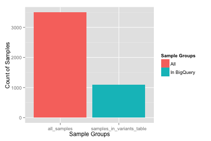
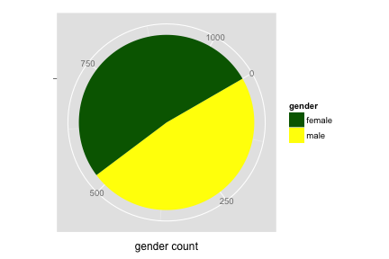
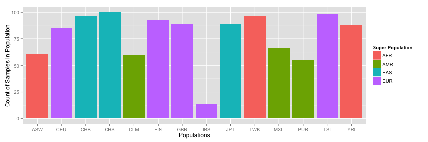
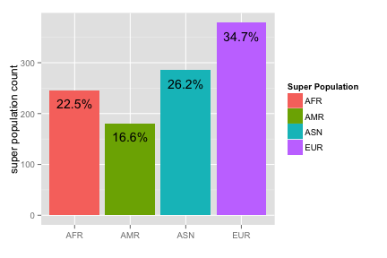
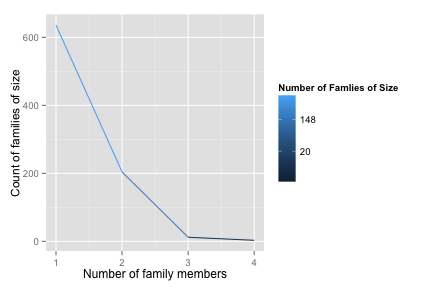

<!-- R Markdown Documentation, DO NOT EDIT THE PLAIN MARKDOWN VERSION OF THIS FILE -->

<!-- Copyright 2014 Google Inc. All rights reserved. -->

<!-- Licensed under the Apache License, Version 2.0 (the "License"); -->
<!-- you may not use this file except in compliance with the License. -->
<!-- You may obtain a copy of the License at -->

<!--     http://www.apache.org/licenses/LICENSE-2.0 -->

<!-- Unless required by applicable law or agreed to in writing, software -->
<!-- distributed under the License is distributed on an "AS IS" BASIS, -->
<!-- WITHOUT WARRANTIES OR CONDITIONS OF ANY KIND, either express or implied. -->
<!-- See the License for the specific language governing permissions and -->
<!-- limitations under the License. -->

Exploring the Sample Information
========================================================

[Ethnicity, gender, and family relationship](http://www.1000genomes.org/faq/can-i-get-phenotype-gender-and-family-relationship-information-samples) information is available for the 1,000 Genomes dataset.  Super population groupings are described in the [FAQ](http://www.1000genomes.org/category/frequently-asked-questions/population).

Note that the full 1,000 Genomes dataset has data for 3,500 individuals but the low coverage variant data in table `variants` is only for a subset of those individuals.  Let’s explore ethnicity, gender, and family relationships for the individuals whose variant data we do have.


How many sample are we working with in this variant dataset?

```
# Count the number of samples in the phenotypic data
SELECT
  COUNT(sample) AS all_samples,
  SUM(IF(In_Phase1_Integrated_Variant_Set = TRUE, 1, 0)) AS samples_in_variants_table
FROM
  [genomics-public-data:1000_genomes.sample_info]
```

<!-- html table generated in R 3.1.1 by xtable 1.7-3 package -->
<!-- Thu Oct  2 21:29:54 2014 -->
<TABLE border=1>
<TR> <TH> all_samples </TH> <TH> samples_in_variants_table </TH>  </TR>
  <TR> <TD align="right"> 3500 </TD> <TD align="right"> 1092 </TD> </TR>
   </TABLE>


So for analyses across all samples upon table `variants`, the sample size is 1,092.

What is the gender ratio?

```
# Compute sample count and ratio by gender
SELECT
  gender,
  gender_count,
  RATIO_TO_REPORT(gender_count)
OVER
  (
  ORDER BY
    gender_count) AS gender_ratio
FROM (
  SELECT
    gender,
    COUNT(gender) AS gender_count,
  FROM
    [genomics-public-data:1000_genomes.sample_info]
  WHERE
    In_Phase1_Integrated_Variant_Set = TRUE
  GROUP BY
    gender)
```

<!-- html table generated in R 3.1.1 by xtable 1.7-3 package -->
<!-- Thu Oct  2 21:29:59 2014 -->
<TABLE border=1>
<TR> <TH> gender </TH> <TH> gender_count </TH> <TH> gender_ratio </TH>  </TR>
  <TR> <TD> male </TD> <TD align="right"> 525 </TD> <TD align="right"> 0.48 </TD> </TR>
  <TR> <TD> female </TD> <TD align="right"> 567 </TD> <TD align="right"> 0.52 </TD> </TR>
   </TABLE>


So for analyses across genders, the sample size is roughly even.

What are the ratios of ethnicities?

```
# Compute sample count and ratio by ethnicity
SELECT
  population,
  population_description,
  population_count,
  RATIO_TO_REPORT(population_count)
OVER
  (
  ORDER BY
    population_count) AS population_ratio,
  super_population,
  super_population_description,
from(
  SELECT
    population,
    population_description,
    super_population,
    super_population_description,
    COUNT(population) AS population_count,
  FROM
    [genomics-public-data:1000_genomes.sample_info]
  WHERE
    In_Phase1_Integrated_Variant_Set = TRUE
  GROUP BY
    population,
    population_description,
    super_population,
    super_population_description)
```

<!-- html table generated in R 3.1.1 by xtable 1.7-3 package -->
<!-- Thu Oct  2 21:30:04 2014 -->
<TABLE border=1>
<TR> <TH> population </TH> <TH> population_description </TH> <TH> population_count </TH> <TH> population_ratio </TH> <TH> super_population </TH> <TH> super_population_description </TH>  </TR>
  <TR> <TD> IBS </TD> <TD> Iberian populations in Spain </TD> <TD align="right">  14 </TD> <TD align="right"> 0.01 </TD> <TD> EUR </TD> <TD> European </TD> </TR>
  <TR> <TD> PUR </TD> <TD> Puerto Rican in Puerto Rico </TD> <TD align="right">  55 </TD> <TD align="right"> 0.05 </TD> <TD> AMR </TD> <TD> American </TD> </TR>
  <TR> <TD> CLM </TD> <TD> Colombian in Medellin, Colombia </TD> <TD align="right">  60 </TD> <TD align="right"> 0.05 </TD> <TD> AMR </TD> <TD> American </TD> </TR>
  <TR> <TD> ASW </TD> <TD> African Ancestry in Southwest US </TD> <TD align="right">  61 </TD> <TD align="right"> 0.06 </TD> <TD> AFR </TD> <TD> African </TD> </TR>
  <TR> <TD> MXL </TD> <TD> Mexican Ancestry in Los Angeles, California </TD> <TD align="right">  66 </TD> <TD align="right"> 0.06 </TD> <TD> AMR </TD> <TD> American </TD> </TR>
  <TR> <TD> CEU </TD> <TD> Utah residents with Northern and Western European ancestry </TD> <TD align="right">  85 </TD> <TD align="right"> 0.08 </TD> <TD> EUR </TD> <TD> European </TD> </TR>
  <TR> <TD> YRI </TD> <TD> Yoruba in Ibadan, Nigeria </TD> <TD align="right">  88 </TD> <TD align="right"> 0.08 </TD> <TD> AFR </TD> <TD> African </TD> </TR>
  <TR> <TD> GBR </TD> <TD> British in England and Scotland </TD> <TD align="right">  89 </TD> <TD align="right"> 0.08 </TD> <TD> EUR </TD> <TD> European </TD> </TR>
  <TR> <TD> JPT </TD> <TD> Japanese in Tokyo, Japan </TD> <TD align="right">  89 </TD> <TD align="right"> 0.08 </TD> <TD> EAS </TD> <TD> East Asian </TD> </TR>
  <TR> <TD> FIN </TD> <TD> Finnish in Finland </TD> <TD align="right">  93 </TD> <TD align="right"> 0.09 </TD> <TD> EUR </TD> <TD> European </TD> </TR>
  <TR> <TD> CHB </TD> <TD> Han Chinese in Bejing, China </TD> <TD align="right">  97 </TD> <TD align="right"> 0.09 </TD> <TD> EAS </TD> <TD> East Asian </TD> </TR>
  <TR> <TD> LWK </TD> <TD> Luhya in Webuye, Kenya </TD> <TD align="right">  97 </TD> <TD align="right"> 0.09 </TD> <TD> AFR </TD> <TD> African </TD> </TR>
  <TR> <TD> TSI </TD> <TD> Toscani in Italy </TD> <TD align="right">  98 </TD> <TD align="right"> 0.09 </TD> <TD> EUR </TD> <TD> European </TD> </TR>
  <TR> <TD> CHS </TD> <TD> Southern Han Chinese, China </TD> <TD align="right"> 100 </TD> <TD align="right"> 0.09 </TD> <TD> EAS </TD> <TD> East Asian </TD> </TR>
   </TABLE>


So for analyses across ethnicity, we see that our sample sizes will range from 55 to 100, with an outlier of 14.

What are the ratios of ethnicities grouped by super population?

```
# Ratios of ethnicities grouped by super population
SELECT
  super_population,
  super_population_description,
  super_population_count,
  RATIO_TO_REPORT(super_population_count)
OVER
  (
  ORDER BY
    super_population_count) AS super_population_ratio
from(
  SELECT
    super_population,
    super_population_description,
    COUNT(population) AS super_population_count,
  FROM
    [genomics-public-data:1000_genomes.sample_info]
  WHERE
    In_Phase1_Integrated_Variant_Set = TRUE
  GROUP BY
    super_population,
    super_population_description)
```

<!-- html table generated in R 3.1.1 by xtable 1.7-3 package -->
<!-- Thu Oct  2 21:30:10 2014 -->
<TABLE border=1>
<TR> <TH> super_population </TH> <TH> super_population_description </TH> <TH> super_population_count </TH> <TH> super_population_ratio </TH>  </TR>
  <TR> <TD> AMR </TD> <TD> American </TD> <TD align="right">   181 </TD> <TD align="right"> 0.1658 </TD> </TR>
  <TR> <TD> AFR </TD> <TD> African </TD> <TD align="right">   246 </TD> <TD align="right"> 0.2253 </TD> </TR>
  <TR> <TD> EAS </TD> <TD> East Asian </TD> <TD align="right">   286 </TD> <TD align="right"> 0.2619 </TD> </TR>
  <TR> <TD> EUR </TD> <TD> European </TD> <TD align="right">   379 </TD> <TD align="right"> 0.3471 </TD> </TR>
   </TABLE>


We see that ratios range from 16.6% to 34.7% of samples per super population.

How are the genders distributed across ethnicities?

```
# Ratios of ethnicities grouped by gender
SELECT
  population,
  gender,
  population_count,
  RATIO_TO_REPORT(population_count) OVER(
  PARTITION BY
    population
  ORDER BY
    gender)
  AS population_ratio
from(
  SELECT
    gender,
    population,
    COUNT(population) AS population_count,
  FROM
    [genomics-public-data:1000_genomes.sample_info]
  WHERE
    In_Phase1_Integrated_Variant_Set = TRUE
  GROUP BY
    gender,
    population)
ORDER BY
  population,
  gender
```
Number of rows returned by this query: 28.

Displaying the first few rows of our result:
<!-- html table generated in R 3.1.1 by xtable 1.7-3 package -->
<!-- Thu Oct  2 21:30:21 2014 -->
<TABLE border=1>
<TR> <TH> population </TH> <TH> gender </TH> <TH> population_count </TH> <TH> population_ratio </TH>  </TR>
  <TR> <TD> ASW </TD> <TD> female </TD> <TD align="right">  37 </TD> <TD align="right"> 0.61 </TD> </TR>
  <TR> <TD> ASW </TD> <TD> male </TD> <TD align="right">  24 </TD> <TD align="right"> 0.39 </TD> </TR>
  <TR> <TD> CEU </TD> <TD> female </TD> <TD align="right">  40 </TD> <TD align="right"> 0.47 </TD> </TR>
  <TR> <TD> CEU </TD> <TD> male </TD> <TD align="right">  45 </TD> <TD align="right"> 0.53 </TD> </TR>
  <TR> <TD> CHB </TD> <TD> female </TD> <TD align="right">  53 </TD> <TD align="right"> 0.55 </TD> </TR>
  <TR> <TD> CHB </TD> <TD> male </TD> <TD align="right">  44 </TD> <TD align="right"> 0.45 </TD> </TR>
   </TABLE>


So for analyses taking into account both ethnicity and gender, we are often near the boundary for small-sample significance tests.

Some of the individuals are related.  What is the distribution of family sizes?

```
# Compute the distribution of family sizes
SELECT
num_family_members AS family_size,
COUNT(num_family_members) AS num_families_of_size
FROM (
  SELECT
  family_id,
  COUNT(family_id) AS num_family_members,
  FROM
  [genomics-public-data:1000_genomes.sample_info]
  WHERE
  In_Phase1_Integrated_Variant_Set = TRUE
  GROUP BY
  family_id)
GROUP BY
family_size
```
<!-- html table generated in R 3.1.1 by xtable 1.7-3 package -->
<!-- Thu Oct  2 21:30:29 2014 -->
<TABLE border=1>
<TR> <TH> family_size </TH> <TH> num_families_of_size </TH>  </TR>
  <TR> <TD align="right">   1 </TD> <TD align="right"> 636 </TD> </TR>
  <TR> <TD align="right">   2 </TD> <TD align="right"> 204 </TD> </TR>
  <TR> <TD align="right">   3 </TD> <TD align="right">  12 </TD> </TR>
  <TR> <TD align="right">   4 </TD> <TD align="right">   3 </TD> </TR>
   </TABLE>


We see that roughly two thirds of the families are comprised of only one family member.
