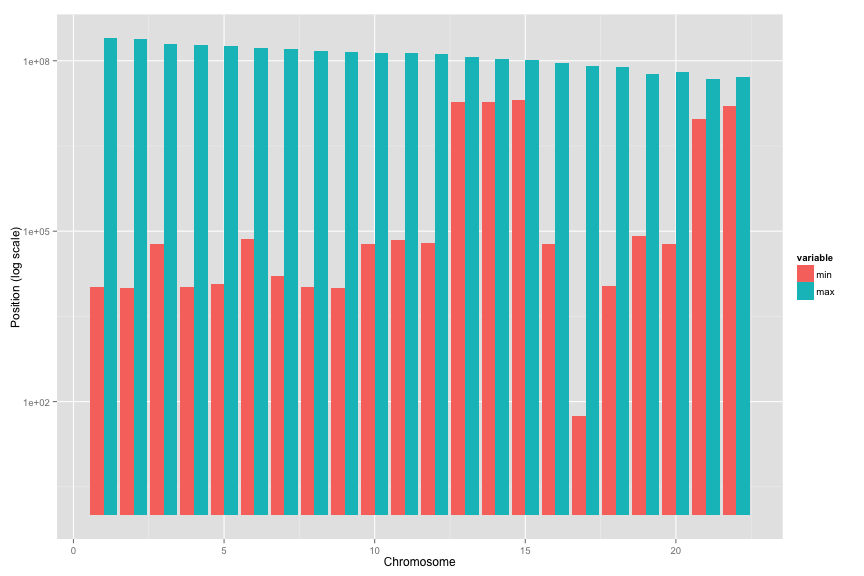
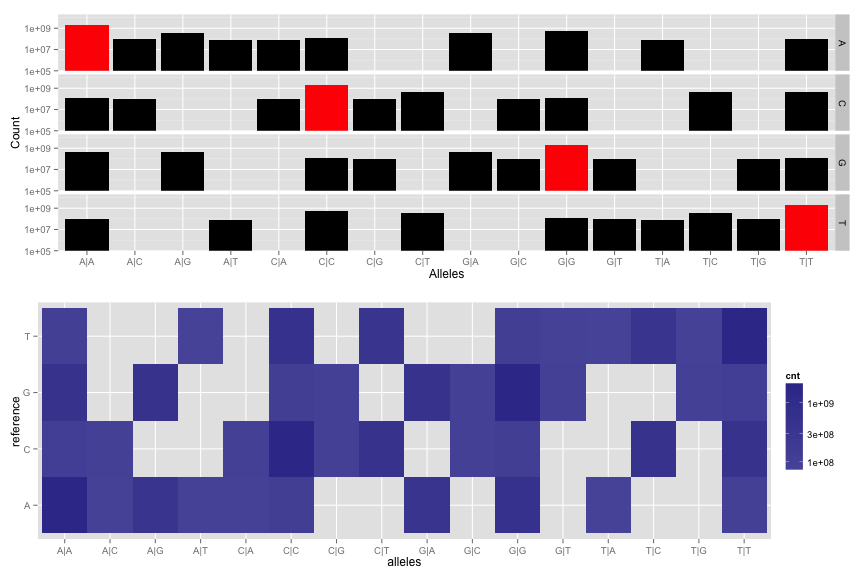
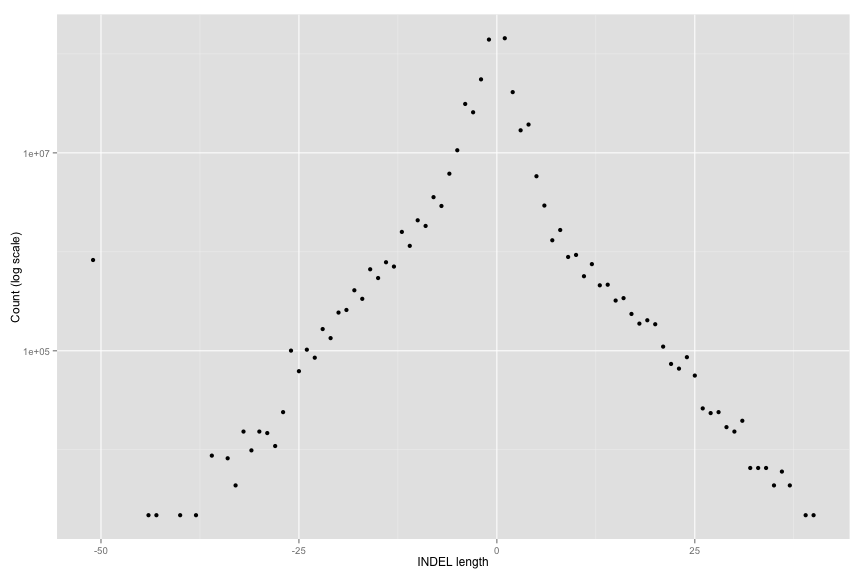
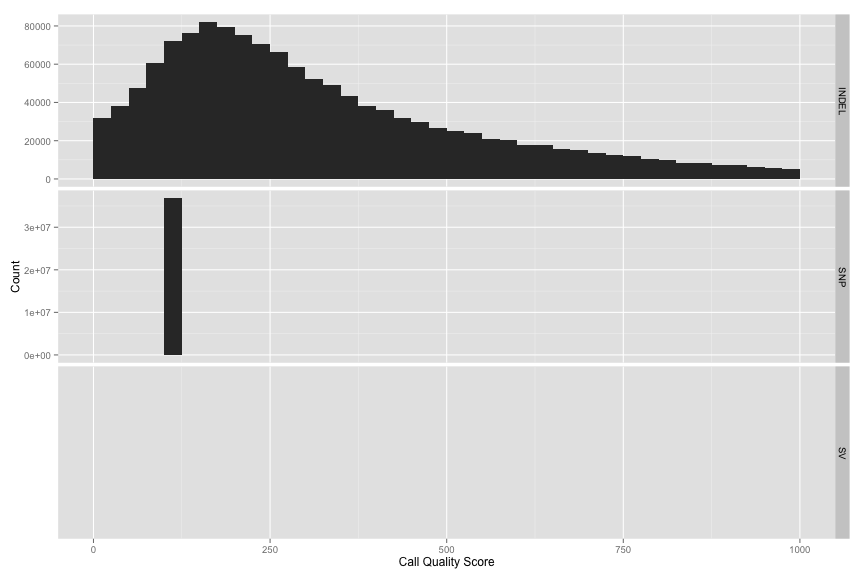
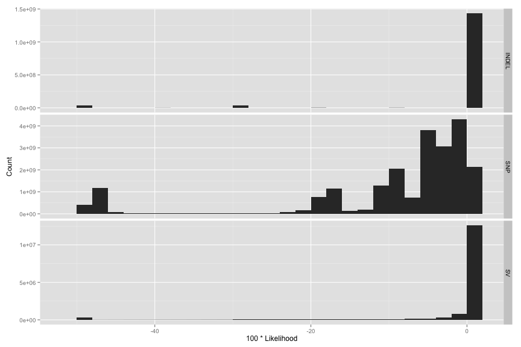
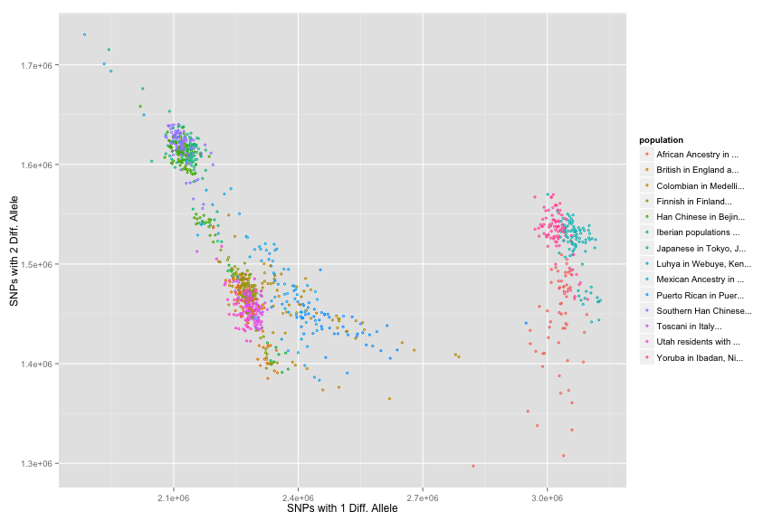

<!-- R Markdown Documentation, DO NOT EDIT THE PLAIN MARKDOWN VERSION OF THIS FILE -->

<!-- Copyright 2014 Google Inc. All rights reserved. -->

<!-- Licensed under the Apache License, Version 2.0 (the "License"); -->
<!-- you may not use this file except in compliance with the License. -->
<!-- You may obtain a copy of the License at -->

<!--     http://www.apache.org/licenses/LICENSE-2.0 -->

<!-- Unless required by applicable law or agreed to in writing, software -->
<!-- distributed under the License is distributed on an "AS IS" BASIS, -->
<!-- WITHOUT WARRANTIES OR CONDITIONS OF ANY KIND, either express or implied. -->
<!-- See the License for the specific language governing permissions and -->
<!-- limitations under the License. -->


Basic Plots of 1k Genome Data
=============================

Min/Max Chromosomal Positions of Variants
-----------------------------------------

```
SELECT
   INTEGER(contig) AS chromosome,
   MIN(position) AS min,
   MAX(position) AS max
 FROM
   [google.com:biggene:1000genomes.variants1kG]
 OMIT RECORD IF
   contig IN ("X", "Y")
 GROUP BY
   chromosome
```



 * A basic sanity check
 
 * Chromosomes 13,14,15,21,22 have abnormally high min positions.
 * Chromosome 7 has low min position.
 * Hard to sequence regions?

Frequency of Variant Types Per Chromosome
-----------------------------------------

```
SELECT
  INTEGER(contig) AS chromosome,
  vt AS variant_type,
  COUNT(1) AS cnt
 FROM
   [google.com:biggene:1000genomes.variants1kG]
 OMIT RECORD IF
   contig IN ("X", "Y")
 GROUP BY
   chromosome,
   variant_type
```


 * Mostly SNPs.
 * Very few structural variants.
 * Note suppressed zero.

Types of SNP pairs (looks at both alleles)
------------------------------------------

```
SELECT
  reference_bases AS reference,
  CONCAT(
    IF(genotype.first_allele=0,
       reference_bases,
       alternate_bases),
    "|",
    IF(genotype.second_allele=0,
       reference_bases,
       alternate_bases)
    ) AS alleles,
  COUNT(1) AS cnt,
FROM
  FLATTEN([google.com:biggene:1000genomes.variants1kG], genotype)
OMIT RECORD IF
     contig IN ("X", "Y")
  OR genotype.first_allele < 0
  OR genotype.second_allele < 0
  OR vt != "SNP"
GROUP BY
  reference,
  alleles
```



 * Total count is #genomes * #SNPs.
 * Same data - two views
 
 * Red bars denote no mutation - both alleles equal reference.
 
 * Why are A -> C,C and A-> G,G likely, but not A -> C,G or A -> G,C?

 * Note that A & T rows are reverses of each other, as are C & G rows.

Length of Insertion/Deletion
---------------------------

```
SELECT
  CASE
    WHEN LENGTH(alternate_bases) - 
         LENGTH(reference_bases) > 50 
      THEN 51
    WHEN LENGTH(alternate_bases) - 
         LENGTH(reference_bases) < -50 
      THEN -51
    ELSE
      LENGTH(alternate_bases) - 
      LENGTH(reference_bases) 
END AS length,
  COUNT(1) AS cnt
FROM
  FLATTEN([google.com:biggene:1000genomes.variants1kG], genotype)
WHERE
      genotype.first_allele =
      POSITION(alternate_bases)
  AND LENGTH(alternate_bases) -
      LENGTH(reference_bases) != 0
OMIT RECORD IF
      contig IN ("X", "Y")
  AND vt != "INDEL"
GROUP BY
  length
```



 * +/-51 are over/under flow bins
 * -> Large tail of deletions
 
 * Positive length = Insertion
 * Negative length = Deletion
 
 * Drops off quickly.

Quality score of calls (at least, of INDELs)
--------------------------------------------

```
SELECT
  vt AS variant_type,
  quality,
  COUNT(1) AS cnt
FROM
  [google.com:biggene:1000genomes.variants1kG]
OMIT RECORD IF
  contig IN ("X", "Y")
GROUP BY
  variant_type,
  quality
```



From the 1k genome docs:
> phred-scaled quality score for the assertion made in ALT. i.e. -10log_10 prob(call in ALT is wrong). If ALT is ”.” (no variant) then this is -10log_10 p(variant), and if ALT is not ”.” this is -10log_10 p(no variant). High QUAL scores indicate high confidence calls. 

From Broad Institute:
> The Phred scaled probability that a REF/ALT polymorphism exists at this site given sequencing data. Because the Phred scale is -10 * log(1-p), a value of 10 indicates a 1 in 10 chance of error, while a 100 indicates a 1 in 10^10 chance. These values can grow very large when a large amount of NGS data is used for variant calling.

Likelihood Scores for each Allele
---------------------------------

```
SELECT
  variant_type,
  likelihood,
  COUNT(1) AS cnt
FROM (
  SELECT
    vt AS variant_type,
    ROUND(100 * IF(genotype.gl > -0.5, genotype.gl,
          -0.5)) AS likelihood,
  FROM
    FLATTEN([google.com:biggene:1000genomes.variants1kG], genotype)
  WHERE
        (genotype.first_allele <= genotype.second_allele
          AND POSITION(genotype.gl) = 1 +
          (genotype.second_allele *
            (genotype.second_allele + 1) / 2) +
          genotype.first_allele)
        OR (genotype.second_allele < genotype.first_allele
          AND POSITION(genotype.gl) = 1 +
          (genotype.first_allele *
            (genotype.first_allele + 1) / 2) +
          genotype.second_allele)
  OMIT RECORD IF 
       contig in ("X", "Y")
    OR genotype.phased = false
)
GROUP BY
  variant_type,
  likelihood
```



This is the likelihood for the most likely set of alleles for each variant.

SNP distribution in Genomes
---------------------------

```
SELECT
  variant_info.genome AS genome,
  CONCAT(SUBSTR(sample_info.population_description,
                0, 20), "...") AS population,
  sample_info.super_population_description
                AS super_population,
  SUM(variant_info.single) AS cnt1,
  SUM(variant_info.double) AS cnt2
FROM
  (SELECT
     genotype.sample_id AS genome,
     IF((genotype.first_allele > 0 AND
         genotype.second_allele = 0) OR
        (genotype.first_allele = 0 AND
         genotype.second_allele > 0), 1, 0)
       AS single,
     IF(genotype.first_allele > 0 AND
        genotype.second_allele > 0, 1, 0)
       AS double,
   FROM
     FLATTEN([google.com:biggene:1000genomes.variants1kG], genotype)
   OMIT RECORD IF
     contig IN ("X", "Y")
  ) AS variant_info
  JOIN
    [google.com:biggene:1000genomes.sample_info] AS sample_info
  ON
    variant_info.genome = sample_info.sample
GROUP BY
  genome,
  population,
  super_population
```

First by Population:


Each point is a genome:
 * X coord denotes the #SNPs w/ 1 mutation
 * Y coord denotes the #SNPs w/ 2 mutations

Cluster correlate very well with ethnicity.

Then by super population:


