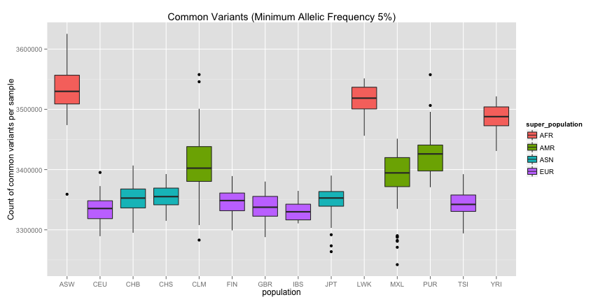

<!-- R Markdown Documentation, DO NOT EDIT THE PLAIN MARKDOWN VERSION OF THIS FILE -->

<!-- Copyright 2014 Google Inc. All rights reserved. -->

<!-- Licensed under the Apache License, Version 2.0 (the "License"); -->
<!-- you may not use this file except in compliance with the License. -->
<!-- You may obtain a copy of the License at -->

<!--     http://www.apache.org/licenses/LICENSE-2.0 -->

<!-- Unless required by applicable law or agreed to in writing, software -->
<!-- distributed under the License is distributed on an "AS IS" BASIS, -->
<!-- WITHOUT WARRANTIES OR CONDITIONS OF ANY KIND, either express or implied. -->
<!-- See the License for the specific language governing permissions and -->
<!-- limitations under the License. -->

Literate Programming with R and BigQuery
========================================================

R Markdown Introduction
-------------------------

This is an R Markdown document. [Markdown](http://daringfireball.net/projects/markdown/syntax) is a simple formatting syntax for authoring web pages (click the [RStudio](http://www.rstudio.com/) **Help** toolbar button for more details on using R Markdown).  Markdown can also be used to [author slides](http://www.rstudio.com/ide/docs/presentations/overview).

When you click the [RStudio](http://www.rstudio.com/) **Knit HTML** button a web page will be generated that includes both content as well as the output of any embedded R code chunks within the document (but see [the caveat](#caveat) later in this document).  You can embed an R code chunk like this:


```r
summary(cars)
```

```
     speed           dist    
 Min.   : 4.0   Min.   :  2  
 1st Qu.:12.0   1st Qu.: 26  
 Median :15.0   Median : 36  
 Mean   :15.4   Mean   : 43  
 3rd Qu.:19.0   3rd Qu.: 56  
 Max.   :25.0   Max.   :120  
```


You can also embed plots, for example:


```r
plot(cars)
```


Analysis
--------------

Now let us move onto [literate programming](http://en.wikipedia.org/wiki/Literate_programming) for [BigQuery](https://developers.google.com/bigquery/).  

If you have never used the [bigrquery](https://github.com/hadley/bigrquery) package before, you will likely need to do something like the following to get it installed:


```r
### Only needed the first time around
install.packages("devtools")
devtools::install_github("assertthat")
devtools::install_github("bigrquery")
```


<a id="caveat">_Caveat: Be advised that the bigrquery package will initiate the OAuth dance for you via redirection to your browser.  This is pretty handy, but that means you will want to run a query interactively from the R prompt the very first time around so that it can cache your credentials.  After that you can knit via the [RStudio](http://www.rstudio.com/) Knit HTML button or via `require(knitr); knit("./1000genomes/data-stories/literate-programming-demo/README.Rmd", encoding="UTF-8");`._</a>

Next we will load our needed packages into our session:

```r
library(bigrquery)
library(ggplot2)
```


And pull in the SQL for an interesting query:

```r
sql <- readChar("../../sql/minimum-allelic-frequency-by-ethnicity.sql", nchars = 1e+06)
cat(sql)
```

```
# Count the variation for each sample including phenotypic traits
SELECT
  samples.genotype.sample_id AS sample_id,
  gender,
  population,
  super_population,
  COUNT(samples.genotype.sample_id) AS num_variants_for_sample,
  SUM(IF(samples.af >= 0.05,
      INTEGER(1),
      INTEGER(0))) AS common_variant,
  SUM(IF(samples.af < 0.05
      AND samples.af > 0.005,
      INTEGER(1),
      INTEGER(0))) AS middle_variant,
  SUM(IF(samples.af <= 0.005
      AND samples.af > 0.001,
      INTEGER(1),
      INTEGER(0))) AS rare_variant,
  SUM(IF(samples.af <= 0.001,
      INTEGER(1),
      INTEGER(0))) AS very_rare_variant,
FROM
  FLATTEN([google.com:biggene:1000genomes.variants1kG],
    genotype) AS samples
JOIN
  [google.com:biggene:1000genomes.sample_info] p
ON
  samples.genotype.sample_id = p.sample
WHERE
  samples.vt = 'SNP'
  AND (samples.genotype.first_allele > 0
    OR samples.genotype.second_allele > 0)
GROUP BY
  sample_id,
  gender,
  population,
  super_population
ORDER BY
  sample_id;
```


We will execute our query, bringing the results down to our R session for further examination:

```r
billing_project <- "google.com:biggene"  # put your projectID here
result <- query_exec(project = "google.com:biggene", dataset = "1000genomes", 
    query = sql, billing = billing_project)
```


Let us examine our query result:

```r
head(result)
```

```
  sample_id gender population super_population num_variants_for_sample
1   HG00096   male        GBR              EUR                 3503172
2   HG00097 female        GBR              EUR                 3510561
3   HG00099 female        GBR              EUR                 3513503
4   HG00100 female        GBR              EUR                 3525879
5   HG00101   male        GBR              EUR                 3491663
6   HG00102 female        GBR              EUR                 3510479
  common_variant middle_variant rare_variant very_rare_variant
1        3339817         128924        24135             10296
2        3319102         152639        27066             11754
3        3321988         150869        27843             12803
4        3364308         130449        24407              6715
5        3312663         141650        26278             11072
6        3333491         140417        25801             10770
```

```r
summary(result)
```

```
  sample_id            gender           population       
 Length:1092        Length:1092        Length:1092       
 Class :character   Class :character   Class :character  
 Mode  :character   Mode  :character   Mode  :character  
                                                         
                                                         
                                                         
 super_population   num_variants_for_sample common_variant   
 Length:1092        Min.   :3378147         Min.   :3242195  
 Class :character   1st Qu.:3497808         1st Qu.:3339579  
 Mode  :character   Median :3523486         Median :3363229  
                    Mean   :3701043         Mean   :3391840  
                    3rd Qu.:3699966         3rd Qu.:3439482  
                    Max.   :4396532         Max.   :3625317  
 middle_variant    rare_variant    very_rare_variant
 Min.   : 98565   Min.   : 13735   Min.   : 4193    
 1st Qu.:118992   1st Qu.: 24493   1st Qu.: 9855    
 Median :131980   Median : 27564   Median :13236    
 Mean   :246709   Mean   : 47543   Mean   :14951    
 3rd Qu.:203668   3rd Qu.: 40252   3rd Qu.:17854    
 Max.   :712288   Max.   :153881   Max.   :46396    
```

```r
str(result)
```

```
'data.frame':	1092 obs. of  9 variables:
 $ sample_id              : chr  "HG00096" "HG00097" "HG00099" "HG00100" ...
 $ gender                 : chr  "male" "female" "female" "female" ...
 $ population             : chr  "GBR" "GBR" "GBR" "GBR" ...
 $ super_population       : chr  "EUR" "EUR" "EUR" "EUR" ...
 $ num_variants_for_sample: int  3503172 3510561 3513503 3525879 3491663 3510479 3499302 3489999 3524334 3489822 ...
 $ common_variant         : int  3339817 3319102 3321988 3364308 3312663 3333491 3335168 3300090 3366585 3325077 ...
 $ middle_variant         : int  128924 152639 150869 130449 141650 140417 128914 150545 126371 130208 ...
 $ rare_variant           : int  24135 27066 27843 24407 26278 25801 24011 26898 24102 24585 ...
 $ very_rare_variant      : int  10296 11754 12803 6715 11072 10770 11209 12466 7276 9952 ...
```

We can see that we have a row for each sample, with counts for the sample's variants four buckets based upon the allelic frequncy of each variant.


Data Visualization
-------------------
Some data visualization will help us to see more clearly the pattern resident within the results:

```r
ggplot(result, aes(x = population, y = common_variant, fill = super_population)) + 
    geom_boxplot() + ylab("Count of common variants per sample") + ggtitle("Common Variants (Minimum Allelic Frequency 5%)")
```



and now its clear to see that the ethnicities within the African super population have a much higher rate of mutation compared to the other ethnicities.


Provenance
-------------------
Lastly, let us capture version information about R and loaded packages for the sake of provenance.

```r
sessionInfo()
```

```
R version 3.0.2 (2013-09-25)
Platform: x86_64-apple-darwin10.8.0 (64-bit)

locale:
[1] en_US.UTF-8/en_US.UTF-8/en_US.UTF-8/C/en_US.UTF-8/en_US.UTF-8

attached base packages:
[1] stats     graphics  grDevices utils     datasets  methods   base     

other attached packages:
[1] ggplot2_0.9.3.1 bigrquery_0.1   knitr_1.5      

loaded via a namespace (and not attached):
 [1] assertthat_0.1.0.99 colorspace_1.2-4    dichromat_2.0-0    
 [4] digest_0.6.4        evaluate_0.5.1      formatR_0.10       
 [7] grid_3.0.2          gtable_0.1.2        httr_0.3.0.99      
[10] jsonlite_0.9.4      labeling_0.2        MASS_7.3-30        
[13] munsell_0.4.2       plyr_1.8.1          proto_0.3-10       
[16] RColorBrewer_1.0-5  Rcpp_0.11.1         RCurl_1.95-4.1     
[19] reshape2_1.2.2      scales_0.2.3        stringr_0.6.2      
[22] tools_3.0.2        
```

