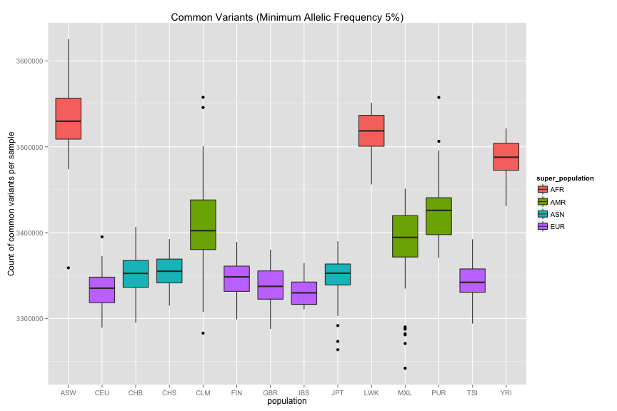

<!-- R Markdown Documentation, DO NOT EDIT THE PLAIN MARKDOWN VERSION OF THIS FILE -->

<!-- Copyright 2014 Google Inc. All rights reserved. -->

<!-- Licensed under the Apache License, Version 2.0 (the "License"); -->
<!-- you may not use this file except in compliance with the License. -->
<!-- You may obtain a copy of the License at -->

<!--     http://www.apache.org/licenses/LICENSE-2.0 -->

<!-- Unless required by applicable law or agreed to in writing, software -->
<!-- distributed under the License is distributed on an "AS IS" BASIS, -->
<!-- WITHOUT WARRANTIES OR CONDITIONS OF ANY KIND, either express or implied. -->
<!-- See the License for the specific language governing permissions and -->
<!-- limitations under the License. -->

Reproducing 1,000 Genomes allele frequencies for variants in BRCA1
========================================================

The following query computes the frequency of both the reference and alternate SNPs within BRCA1 for all samples within 1,000 Genomes.


```
# The following query computes the allelic frequency for BRCA1 variants in the
# 1,000 Genomes dataset and also includes the pre-computed value from the dataset.
SELECT
  contig_name,
  start_pos,
  reference_bases,
  alternate_bases,
  SUM(ref_count)+SUM(alt_count) AS num_sample_alleles,
  SUM(ref_count) AS sample_allele_ref_cnt,
  SUM(alt_count) AS sample_allele_alt_cnt,
  SUM(ref_count)/(SUM(ref_count)+SUM(alt_count)) AS ref_freq,
  SUM(alt_count)/(SUM(ref_count)+SUM(alt_count)) AS alt_freq,
  alt_freq_from_1KG
FROM (
  SELECT
    contig_name,
    start_pos,
    reference_bases,
    alternate_bases,
    alt,
    SUM(IF(0 = first_allele,
        1,
        0) + IF(0 = second_allele,
        1,
        0)) AS ref_count,
    SUM(IF(alt = first_allele,
        1,
        0) + IF(alt = second_allele,
        1,
        0)) AS alt_count,
    alt_freq_from_1KG
  FROM (
    SELECT
      contig_name,
      start_pos,
      reference_bases,
      alternate_bases,
      alt_freq_from_1KG,
      POSITION(alternate_bases) AS alt,
      NTH(1,
        call.genotype) WITHIN call AS first_allele,
      NTH(2,
        call.genotype) WITHIN call AS second_allele,
    FROM
      FLATTEN((
        SELECT
          contig_name,
          start_pos,
          reference_bases,
          alternate_bases,
          af AS alt_freq_from_1KG,
          call.genotype
        FROM
          [google.com:biggene:1000genomes.phase1_variants]
        WHERE
          contig_name = '17'
          AND start_pos BETWEEN 41196312
          AND 41277500
          AND vt='SNP'),
        call)
      )
  GROUP BY
    contig_name,
    start_pos,
    reference_bases,
    alternate_bases,
    alt,
    alt_freq_from_1KG)
GROUP BY
  contig_name,
  start_pos,
  reference_bases,
  alternate_bases,
  alt,
  alt_freq_from_1KG
ORDER BY
  contig_name,
  start_pos
```
Number of rows returned by this query: 843.

Displaying the first few rows of our result:
<!-- html table generated in R 3.1.1 by xtable 1.7-3 package -->
<!-- Fri Sep 19 14:02:19 2014 -->
<TABLE border=1>
<TR> <TH> contig_name </TH> <TH> start_pos </TH> <TH> reference_bases </TH> <TH> alternate_bases </TH> <TH> num_sample_alleles </TH> <TH> sample_allele_ref_cnt </TH> <TH> sample_allele_alt_cnt </TH> <TH> ref_freq </TH> <TH> alt_freq </TH> <TH> alt_freq_from_1KG </TH>  </TR>
  <TR> <TD> 17 </TD> <TD align="right"> 41196363 </TD> <TD> C </TD> <TD> T </TD> <TD align="right">    2184 </TD> <TD align="right">    2173 </TD> <TD align="right">      11 </TD> <TD align="right"> 0.994963 </TD> <TD align="right"> 0.005037 </TD> <TD align="right"> 0.010000 </TD> </TR>
  <TR> <TD> 17 </TD> <TD align="right"> 41196368 </TD> <TD> C </TD> <TD> T </TD> <TD align="right">    2184 </TD> <TD align="right">    2183 </TD> <TD align="right">       1 </TD> <TD align="right"> 0.999542 </TD> <TD align="right"> 0.000458 </TD> <TD align="right"> 0.000500 </TD> </TR>
  <TR> <TD> 17 </TD> <TD align="right"> 41196372 </TD> <TD> T </TD> <TD> C </TD> <TD align="right">    2184 </TD> <TD align="right">    2183 </TD> <TD align="right">       1 </TD> <TD align="right"> 0.999542 </TD> <TD align="right"> 0.000458 </TD> <TD align="right"> 0.000500 </TD> </TR>
  <TR> <TD> 17 </TD> <TD align="right"> 41196403 </TD> <TD> A </TD> <TD> G </TD> <TD align="right">    2184 </TD> <TD align="right">    2183 </TD> <TD align="right">       1 </TD> <TD align="right"> 0.999542 </TD> <TD align="right"> 0.000458 </TD> <TD align="right"> 0.000500 </TD> </TR>
  <TR> <TD> 17 </TD> <TD align="right"> 41196408 </TD> <TD> G </TD> <TD> A </TD> <TD align="right">    2184 </TD> <TD align="right">    1503 </TD> <TD align="right">     681 </TD> <TD align="right"> 0.688187 </TD> <TD align="right"> 0.311813 </TD> <TD align="right"> 0.310000 </TD> </TR>
  <TR> <TD> 17 </TD> <TD align="right"> 41196582 </TD> <TD> C </TD> <TD> T </TD> <TD align="right">    2184 </TD> <TD align="right">    2173 </TD> <TD align="right">      11 </TD> <TD align="right"> 0.994963 </TD> <TD align="right"> 0.005037 </TD> <TD align="right"> 0.010000 </TD> </TR>
   </TABLE>

And do our results match the precomputed values resident in the AF INFO field?

```r
print(expect_equal(object=result$alt_freq,
                   expected=result$alt_freq_from_1KG,
                   tolerance=0.005,
                   scale=1))
```

```
## As expected: result$alt_freq equals result$alt_freq_from_1KG
```
We can see from the results that when the computed frequency values in column alt_freq are rounded, they exactly match the alternate allele frequencies as reported in the AF INFO field from the 1,000 Genomes VCF data.

Next, we compute those same alternate allele frequencies further broken down by super population groups.

```
# The following query computes the allelic frequency for BRCA1 variants in the
# 1,000 Genomes dataset further classified by ethnicity from the phenotypic data
# and also includes the pre-computed value from the dataset.
SELECT
  contig_name,
  start_pos,
  super_population,
  reference_bases,
  alternate_bases,
  SUM(ref_count)+SUM(alt_count) AS num_sample_alleles,
  SUM(ref_count) AS sample_allele_ref_cnt,
  SUM(alt_count) AS sample_allele_alt_cnt,
  SUM(ref_count)/(SUM(ref_count)+SUM(alt_count)) AS ref_freq,
  SUM(alt_count)/(SUM(ref_count)+SUM(alt_count)) AS alt_freq,
  alt_freq_from_1KG
FROM (
  SELECT
    contig_name,
    start_pos,
    super_population,
    reference_bases,
    alternate_bases,
    alt,
    SUM(IF(0 = allele1,
        1,
        0) + IF(0 = allele2,
        1,
        0)) AS ref_count,
    SUM(IF(alt = allele1,
        1,
        0) + IF(alt = allele2,
        1,
        0)) AS alt_count,
    alt_freq_from_1KG
  FROM (
    SELECT
      g.contig_name AS contig_name,
      g.start_pos AS start_pos,
      p.super_population AS super_population,
      g.reference_bases AS reference_bases,
      g.alternate_bases AS alternate_bases,
      POSITION(g.alternate_bases) AS alt,
      allele1,
      allele2,
      CASE
      WHEN p.super_population =  'ASN'
      THEN  g.asn_af
      WHEN p.super_population=  'EUR'
      THEN g.eur_af
      WHEN p.super_population = 'AFR'
      THEN g.afr_af
      WHEN p.super_population = 'AMR'
      THEN  g.amr_af
      END AS alt_freq_from_1KG
    FROM
      FLATTEN((
        SELECT
          contig_name,
          start_pos,
          reference_bases,
          alternate_bases,
          afr_af,
          amr_af,
          asn_af,
          eur_af,
          call.callset_name,
          NTH(1,
            call.genotype) WITHIN call AS allele1,
          NTH(2,
            call.genotype) WITHIN call AS allele2,
        FROM
          [google.com:biggene:1000genomes.phase1_variants]
        WHERE
          contig_name = '17'
          AND start_pos BETWEEN 41196312
          AND 41277500
          AND vt='SNP'
          ),
        call) AS g
    JOIN
      [google.com:biggene:1000genomes.sample_info] p
    ON
      g.call.callset_name = p.sample
      )
  GROUP BY
    contig_name,
    start_pos,
    super_population,
    reference_bases,
    alternate_bases,
    alt,
    alt_freq_from_1KG)
GROUP BY
  contig_name,
  start_pos,
  super_population,
  reference_bases,
  alternate_bases,
  alt_freq_from_1KG
ORDER BY
  contig_name,
  start_pos,
  super_population
```
Number of rows returned by this query: 3372.

Displaying the first few rows of our result:
<!-- html table generated in R 3.1.1 by xtable 1.7-3 package -->
<!-- Fri Sep 19 14:02:25 2014 -->
<TABLE border=1>
<TR> <TH> contig_name </TH> <TH> start_pos </TH> <TH> super_population </TH> <TH> reference_bases </TH> <TH> alternate_bases </TH> <TH> num_sample_alleles </TH> <TH> sample_allele_ref_cnt </TH> <TH> sample_allele_alt_cnt </TH> <TH> ref_freq </TH> <TH> alt_freq </TH> <TH> alt_freq_from_1KG </TH>  </TR>
  <TR> <TD> 17 </TD> <TD align="right"> 41196363 </TD> <TD> AFR </TD> <TD> C </TD> <TD> T </TD> <TD align="right">     492 </TD> <TD align="right">     492 </TD> <TD align="right">       0 </TD> <TD align="right"> 1.000000 </TD> <TD align="right"> 0.000000 </TD> <TD align="right">  </TD> </TR>
  <TR> <TD> 17 </TD> <TD align="right"> 41196363 </TD> <TD> AMR </TD> <TD> C </TD> <TD> T </TD> <TD align="right">     362 </TD> <TD align="right">     360 </TD> <TD align="right">       2 </TD> <TD align="right"> 0.994475 </TD> <TD align="right"> 0.005525 </TD> <TD align="right"> 0.010000 </TD> </TR>
  <TR> <TD> 17 </TD> <TD align="right"> 41196363 </TD> <TD> ASN </TD> <TD> C </TD> <TD> T </TD> <TD align="right">     572 </TD> <TD align="right">     572 </TD> <TD align="right">       0 </TD> <TD align="right"> 1.000000 </TD> <TD align="right"> 0.000000 </TD> <TD align="right">  </TD> </TR>
  <TR> <TD> 17 </TD> <TD align="right"> 41196363 </TD> <TD> EUR </TD> <TD> C </TD> <TD> T </TD> <TD align="right">     758 </TD> <TD align="right">     749 </TD> <TD align="right">       9 </TD> <TD align="right"> 0.988127 </TD> <TD align="right"> 0.011873 </TD> <TD align="right"> 0.010000 </TD> </TR>
  <TR> <TD> 17 </TD> <TD align="right"> 41196368 </TD> <TD> AFR </TD> <TD> C </TD> <TD> T </TD> <TD align="right">     492 </TD> <TD align="right">     492 </TD> <TD align="right">       0 </TD> <TD align="right"> 1.000000 </TD> <TD align="right"> 0.000000 </TD> <TD align="right">  </TD> </TR>
  <TR> <TD> 17 </TD> <TD align="right"> 41196368 </TD> <TD> AMR </TD> <TD> C </TD> <TD> T </TD> <TD align="right">     362 </TD> <TD align="right">     362 </TD> <TD align="right">       0 </TD> <TD align="right"> 1.000000 </TD> <TD align="right"> 0.000000 </TD> <TD align="right">  </TD> </TR>
   </TABLE>

And do our results match the precomputed values resident in the superpopulation-specific AF INFO fields?

```r
# coerce NAs to be zero
result$alt_freq_from_1KG[is.na(result$alt_freq_from_1KG)] <- 0.0
print(expect_equal(object=result$alt_freq,
                   expected=result$alt_freq_from_1KG,
                   tolerance=0.005,
                   scale=1))
```

```
## As expected: result$alt_freq equals result$alt_freq_from_1KG
```
We can see from the results that when the computed frequency values in column alt_freq are rounded, they exactly match the alternate allele frequencies as reported in the AFR_AF, ASN_AF, AMR_AF, EUR_AF INFO fields from the 1,000 Genomes VCF data.

Moving onto other results regarding rates of variation across populations:

```
# Count the variation for each sample including phenotypic traits
SELECT
  samples.call.callset_name AS sample_id,
  gender,
  population,
  super_population,
  COUNT(samples.call.callset_name) AS num_variants_for_sample,
  SUM(IF(samples.af >= 0.05,
      INTEGER(1),
      INTEGER(0))) AS common_variant,
  SUM(IF(samples.af < 0.05
      AND samples.af > 0.005,
      INTEGER(1),
      INTEGER(0))) AS middle_variant,
  SUM(IF(samples.af <= 0.005
      AND samples.af > 0.001,
      INTEGER(1),
      INTEGER(0))) AS rare_variant,
  SUM(IF(samples.af <= 0.001,
      INTEGER(1),
      INTEGER(0))) AS very_rare_variant,
FROM
  FLATTEN((
    SELECT
      af,
      vt,
      call.callset_name,
      NTH(1,
        call.genotype) WITHIN call AS first_allele,
      NTH(2,
        call.genotype) WITHIN call AS second_allele,
    FROM
      [google.com:biggene:1000genomes.phase1_variants]
    WHERE
      vt = 'SNP'
    HAVING
      first_allele > 0
      OR second_allele > 0
      ),
    call) AS samples
JOIN
  [google.com:biggene:1000genomes.sample_info] p
ON
  samples.call.callset_name = p.sample
GROUP BY
  sample_id,
  gender,
  population,
  super_population
ORDER BY
  sample_id
```
Number of rows returned by this query: 1092.

Displaying the first few rows of our result:
<!-- html table generated in R 3.1.1 by xtable 1.7-3 package -->
<!-- Fri Sep 19 14:02:31 2014 -->
<TABLE border=1>
<TR> <TH> sample_id </TH> <TH> gender </TH> <TH> population </TH> <TH> super_population </TH> <TH> num_variants_for_sample </TH> <TH> common_variant </TH> <TH> middle_variant </TH> <TH> rare_variant </TH> <TH> very_rare_variant </TH>  </TR>
  <TR> <TD> HG00096 </TD> <TD> male </TD> <TD> GBR </TD> <TD> EUR </TD> <TD align="right"> 3503172 </TD> <TD align="right"> 3339817 </TD> <TD align="right">  128924 </TD> <TD align="right">   24135 </TD> <TD align="right">   10296 </TD> </TR>
  <TR> <TD> HG00097 </TD> <TD> female </TD> <TD> GBR </TD> <TD> EUR </TD> <TD align="right"> 3510561 </TD> <TD align="right"> 3319102 </TD> <TD align="right">  152639 </TD> <TD align="right">   27066 </TD> <TD align="right">   11754 </TD> </TR>
  <TR> <TD> HG00099 </TD> <TD> female </TD> <TD> GBR </TD> <TD> EUR </TD> <TD align="right"> 3513503 </TD> <TD align="right"> 3321988 </TD> <TD align="right">  150869 </TD> <TD align="right">   27843 </TD> <TD align="right">   12803 </TD> </TR>
  <TR> <TD> HG00100 </TD> <TD> female </TD> <TD> GBR </TD> <TD> EUR </TD> <TD align="right"> 3525879 </TD> <TD align="right"> 3364308 </TD> <TD align="right">  130449 </TD> <TD align="right">   24407 </TD> <TD align="right">    6715 </TD> </TR>
  <TR> <TD> HG00101 </TD> <TD> male </TD> <TD> GBR </TD> <TD> EUR </TD> <TD align="right"> 3491663 </TD> <TD align="right"> 3312663 </TD> <TD align="right">  141650 </TD> <TD align="right">   26278 </TD> <TD align="right">   11072 </TD> </TR>
  <TR> <TD> HG00102 </TD> <TD> female </TD> <TD> GBR </TD> <TD> EUR </TD> <TD align="right"> 3510479 </TD> <TD align="right"> 3333491 </TD> <TD align="right">  140417 </TD> <TD align="right">   25801 </TD> <TD align="right">   10770 </TD> </TR>
   </TABLE>

Some data visualization will help us to see more clearly the pattern resident within the results:

and now its clear to see that the ethnicities within the African super population have a much higher rate of mutation compared to the other ethnicities for the common variants.

This difference is even more notable when looking at all variants:


Now lets examine the rate of variation across genders:

We see a noticieable difference, BUT this query included variants within chromosome X.  Updating the query to ignore sex chromosomes:

```
# Count the variation for each sample including phenotypic traits but excluding
# sex chromosomes.
SELECT
  samples.call.callset_name AS sample_id,
  gender,
  population,
  super_population,
  COUNT(samples.call.callset_name) AS num_variants_for_sample,
  SUM(IF(samples.af >= 0.05,
      INTEGER(1),
      INTEGER(0))) AS common_variant,
  SUM(IF(samples.af < 0.05
      AND samples.af > 0.005,
      INTEGER(1),
      INTEGER(0))) AS middle_variant,
  SUM(IF(samples.af <= 0.005
      AND samples.af > 0.001,
      INTEGER(1),
      INTEGER(0))) AS rare_variant,
  SUM(IF(samples.af <= 0.001,
      INTEGER(1),
      INTEGER(0))) AS very_rare_variant,
FROM
  FLATTEN((
    SELECT
      af,
      vt,
      call.callset_name,
      NTH(1,
        call.genotype) WITHIN call AS first_allele,
      NTH(2,
        call.genotype) WITHIN call AS second_allele,
    FROM
      [google.com:biggene:1000genomes.phase1_variants]
    WHERE
      vt = 'SNP'
      AND contig_name != 'X'
      AND contig_name != 'Y'
    HAVING
      first_allele > 0
      OR second_allele > 0
      ),
    call) AS samples
JOIN
  [google.com:biggene:1000genomes.sample_info] p
ON
  samples.call.callset_name = p.sample
GROUP BY
  sample_id,
  gender,
  population,
  super_population
ORDER BY
  sample_id
```
We see that the genders are quite close in their rate of variation.

