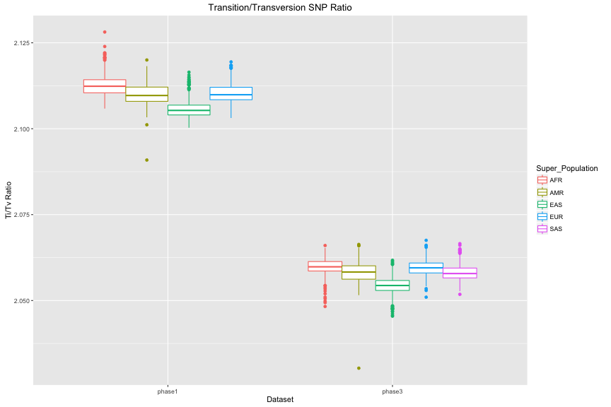
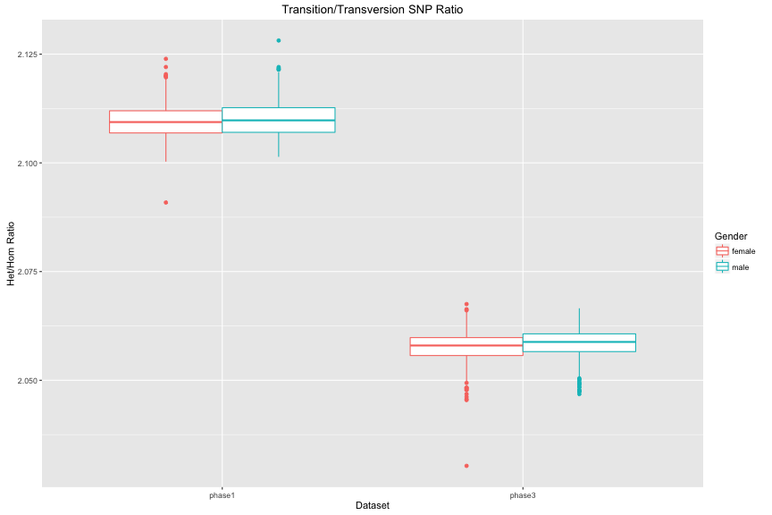
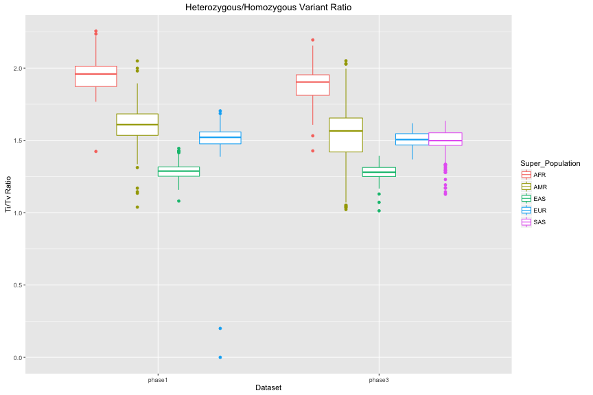
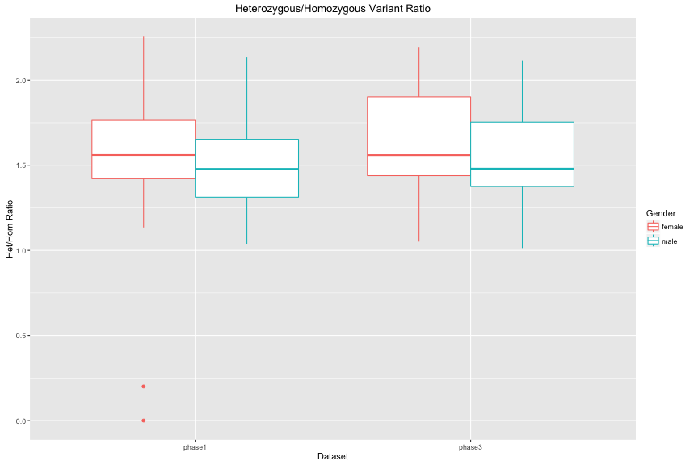
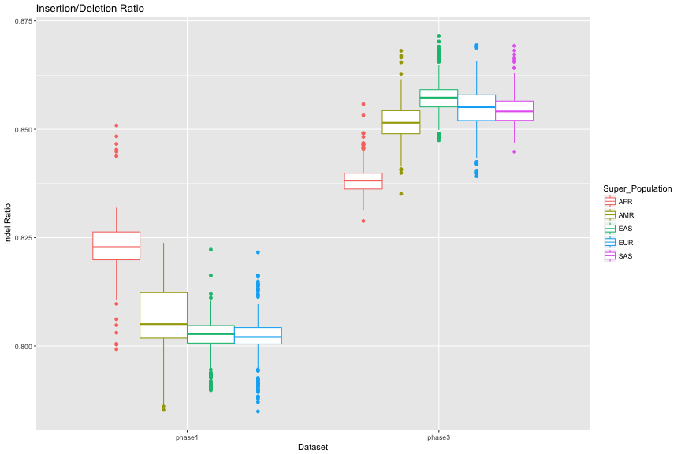
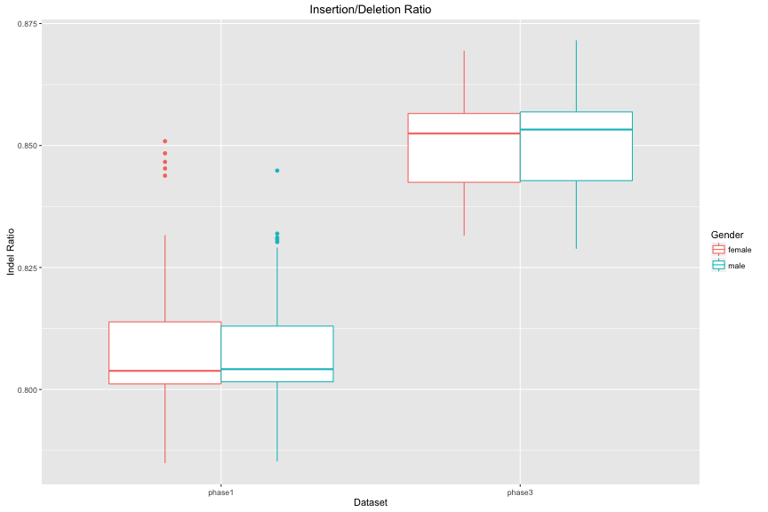

<!-- R Markdown Documentation, DO NOT EDIT THE PLAIN MARKDOWN VERSION OF THIS FILE -->

<!-- Copyright 2016 Google Inc. All rights reserved. -->

<!-- Licensed under the Apache License, Version 2.0 (the "License"); -->
<!-- you may not use this file except in compliance with the License. -->
<!-- You may obtain a copy of the License at -->

<!--     http://www.apache.org/licenses/LICENSE-2.0 -->

<!-- Unless required by applicable law or agreed to in writing, software -->
<!-- distributed under the License is distributed on an "AS IS" BASIS, -->
<!-- WITHOUT WARRANTIES OR CONDITIONS OF ANY KIND, either express or implied. -->
<!-- See the License for the specific language governing permissions and -->
<!-- limitations under the License. -->

1,000 Genomes Phase 3 Variants
==============================

### Additional Resources
* [Schema](https://bigquery.cloud.google.com/table/genomics-public-data:1000_genomes_phase_3.variants_20150220_release?pli=1)
* [Data Provenance](http://googlegenomics.readthedocs.io/en/latest/use_cases/discover_public_data/1000_genomes.html)
* [Index of variant analyses](./sql)

### Metrics

In the following plots we display metrics computed on both 1,000 Genomes phase 1 and phase 3 variants.








### Analysis Provenance

The following query was run over 1,000 Genomes data:

1. phase 3 variantsfor 2,504 individuals and materialized to table [google.com:biggene:1000genomes_analysis_results.phase3_metrics](https://bigquery.cloud.google.com/table/google.com:biggene:1000genomes_analysis_results.phase3_metrics?pli=1)
2. phase 1 variants for 1095 individuals and materialized to table [google.com:biggene:1000genomes_analysis_results.phase1_metrics](https://bigquery.cloud.google.com/table/google.com:biggene:1000genomes_analysis_results.phase1_metrics?pli=1)
    * note that 1,092 individuals have variants across the entire genome
    * two individuals have variants on chrM only
    * one individual has variants on chrY only

Note that it was written to specifically handle the multi-allelic data found in phase 3.


```
#standardSQL
--
-- Compute several common metrics on multi-allelic data.  This will work on data
-- in either "genome call" format or in "multi-sample variants" format since hom_RR_count
-- is not used in any of the ratios computed.
-- http://googlegenomics.readthedocs.io/en/latest/use_cases/load_data/multi_sample_variants.html
--
-- Edit the BigQuery table name below to run this query on other data such as 1,000
-- Genomes phase 1 variants.
-- http://googlegenomics.readthedocs.io/en/latest/use_cases/discover_public_data/1000_genomes.html
--
WITH calls AS (
  -- For multi-allelic data we FLATTEN by both alternate_bases and call which yields the
  -- cross product of those values.  We provide the alt_num value so that queries downstream
  -- of this can correctly identify calls with genotypes that match the particular alternate.
  SELECT
    reference_name,
    start,
    reference_bases,
    alt,
    alt_offset + 1 AS alt_num,  -- The number corresponding to the alternate_bases value.
    CONCAT(reference_bases, '->', alt) AS mutation,
    REGEXP_CONTAINS(alt, r'^[ACGT]+$') AS is_sequence,
    call.call_set_name,
    (SELECT LOGICAL_AND(gt = 0) FROM UNNEST(call.genotype) gt) AS reference_match_call,
    call.genotype[SAFE_ORDINAL(1)] AS first_allele,
    call.genotype[SAFE_ORDINAL(2)] AS second_allele
  FROM
    -- To run on phase 1 variants, update the following line to change the source table.
    `genomics-public-data.1000_genomes_phase_3.variants_20150220_release` v,
        v.call call, v.alternate_bases alt WITH OFFSET alt_offset
  -- Use this WHERE clause for fast testing of the query. Remove it for the full analysis.
  # WHERE
  #   reference_name IN ('chr17','17')
  #   AND start BETWEEN 41196311 AND 41277499 # per GRCh37
),

compute_metrics AS (
  SELECT
    call_set_name,
    -- Anchor on alt_num=1 so that we don't over count hom_RR for multi-allelic sites.
    alt_num = 1 AND reference_match_call AS is_hom_RR,
    -- Otherwise, check whether the genotypes in the call match this alt_num.
    first_allele = alt_num AND (second_allele = alt_num OR second_allele IS NULL) AS is_hom_AA,
    (first_allele = 0 AND second_allele = alt_num) OR (first_allele = alt_num AND second_allele = 0) AS is_het_RA,
    (first_allele > 0 AND first_allele != alt_num AND second_allele = alt_num)
    OR (first_allele = alt_num AND second_allele > 0 AND second_allele != alt_num) AS is_het_AA,
    -- To prevent over counting of variant types due to the FLATTENED data, we make sure the genotype
    -- in the call corresponds to the the alt_num in this row and use this boolean in the downstream
    -- query.
    first_allele = alt_num OR second_allele = alt_num AS call_has_alternate_bases,
    NOT is_sequence AS is_sv,
    is_sequence AND LENGTH(reference_bases) = 1 AND LENGTH(alt) = 1 AS is_snp,
    is_sequence AND LENGTH(reference_bases) > 1 AND LENGTH(reference_bases) = LENGTH(alt) AS is_expanded_snp,
    is_sequence AND LENGTH(reference_bases) < LENGTH(alt) AS is_insertion,
    is_sequence AND LENGTH(reference_bases) > LENGTH(alt) AS is_deletion,
    mutation IN ('A->G','G->A','C->T','T->C') AS is_transition,
    mutation IN ('A->C','C->A','G->T','T->G','A->T','T->A','C->G','G->C') AS is_transversion
  FROM calls
),

compute_sums AS (
  SELECT
    call_set_name,
    SUM(CAST(is_hom_RR AS INT64)) AS hom_RR_count,
    SUM(CAST(is_hom_AA AS INT64)) AS hom_AA_count,
    SUM(CAST(is_het_RA AS INT64)) AS het_RA_count,
    -- Divide by het_AA two since we have two rows for this sample's alleles because we
    -- FLATTENED by alternate_bases.
    SUM(CAST(is_het_AA AS INT64))/2 AS het_AA_count,
    SUM(CAST(call_has_alternate_bases AS INT64)) AS calls_has_alternate_bases_count,
    SUM(CAST(call_has_alternate_bases AND is_sv AS INT64)) AS sv_count,
    SUM(CAST(call_has_alternate_bases AND is_snp AS INT64)) AS snp_count,
    SUM(CAST(call_has_alternate_bases AND is_expanded_snp AS INT64)) AS expanded_snp_count,
    SUM(CAST(call_has_alternate_bases AND is_insertion AS INT64)) AS insertion_count,
    SUM(CAST(call_has_alternate_bases AND is_deletion AS INT64)) AS deletion_count,
    SUM(CAST(call_has_alternate_bases AND is_transition AS INT64)) AS transitions_count,
    SUM(CAST(call_has_alternate_bases AND is_transversion AS INT64)) AS transversions_count
  FROM compute_metrics
  GROUP BY
    call_set_name
)

SELECT
  call_set_name,
  -- Ratios.
  SAFE_DIVIDE(transitions_count, transversions_count) AS ti_tv_ratio,
  SAFE_DIVIDE((het_RA_count + 2 * het_AA_count), hom_AA_count) AS het_hom_ratio,
  SAFE_DIVIDE(insertion_count, deletion_count) AS ins_del_ratio,
  -- Call type counts.
  hom_RR_count,
  hom_AA_count,
  het_RA_count,
  het_AA_count,
  -- Alternate allele type counts.
  sv_count,
  snp_count,
  expanded_snp_count,
  insertion_count,
  deletion_count,
  -- SNP type counts.
  transitions_count,
  transversions_count,
  -- Let's check our work for over/under counting.
  calls_has_alternate_bases_count,
  transitions_count + transversions_count AS check_snp_count,
  sv_count + snp_count + expanded_snp_count + insertion_count + deletion_count AS check_calls_has_alternate_bases_count,
  hom_RR_count + hom_AA_count + het_RA_count + het_AA_count AS check_total_num_calls
FROM compute_sums
ORDER BY
  call_set_name
```
