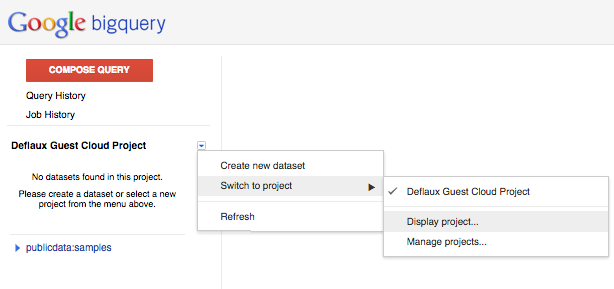
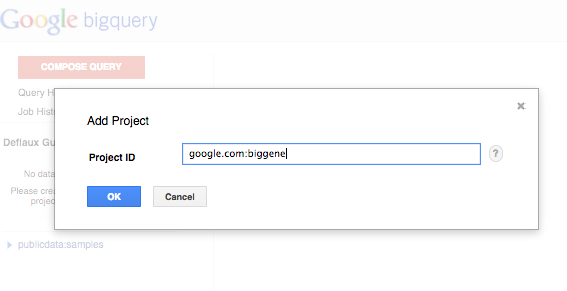

bigquery-examples
=================

The projects in this repository demonstrate working with genomic data via [Google BigQuery](https://developers.google.com/bigquery/).  All examples are built upon public datasets.  

You can execute these examples by:
 1. Copying and pasting the queries into 
   * the BigQuery [Browser Tool](https://bigquery.cloud.google.com)
   * the [bq Command-Line Tool](https://developers.google.com/bigquery/bq-command-line-tool)
   * one of the many [third-party tools](https://developers.google.com/bigquery/third-party-tools) that have integrated BigQuery
 1. Running the chunks of R code within the RMarkdown files in [R](http://www.r-project.org/) or [RStudio](http://www.rstudio.com/)
 1. Running the chunks of Python code within the [iPython Notebooks](http://ipython.org/notebook.html) in [iPython](http://ipython.org/)
 
With minor modification, you can run the same analyses on your own genomic data within BigQuery.

Getting Started
-----------------

 1. Set up a BigQuery project.  
  * Follow the [BigQuery instructions](https://developers.google.com/bigquery/sign-up) on how to sign up for BigQuery and set up a new API project.
  * You can use the Team tab to share a project with co-workers and colleagues.
  
 1. Run a query.
  * go to the BigQuery [Browser Tool](https://bigquery.cloud.google.com)
  * click on the **Compose query** button
  * paste the SQL query for 1,000 Genomes [indel length counts](1000genomes/sql/indel-length-counts.sql) into the query textbox
  * click **Run query** to get your results
  * Note: you do not need to enable billing to run the smaller queries. 
     * All of the queries for the small phenotypic dataset available in the data story ["Exploring the phenotypic data"](./1000genomes/data-stories/exploring-the-phenotypic-data) should be runnable in this free mode.
     * If you see an `Exceeded quota` error, that means you will need to enable billing and you will be charged for that query. See BigQuery [pricing](https://developers.google.com/bigquery/pricing) for more detail.
     * For example, queries within the 1,000 Genomes dataset that examine sample genotype columns will process approximately 1TB of data per query. (1,000 GB * $0.005 per GB processed = $5.00)

 1. Add the public datasets to your project so that they show up in the left-hand naviation pane
  * go to the BigQuery [Browser Tool](https://bigquery.cloud.google.com)
  * click on the drop down icon beside your project name in the left navigator
  * pick _‘Switch to project’_ in the menu, and _‘Display project...’_ in the submenu 
  * enter _google.com:biggene_ in the _‘Add Project’_ dialog 

 1. What next?
   * New to BigQuery?  See the [query reference](https://developers.google.com/bigquery/query-reference).
   * New to working with variants?  See an overview of the [VCF data format](http://vcftools.sourceforge.net/VCF-poster.pdf).

Datasets
--------------

### [1000genomes](./1000genomes)
Sample analyses upon VCF data from the [1,000 Genomes Project](http://www.1000genomes.org/)  

**Project Name**: _google.com:biggene_
    
### [pgp](./pgp)
Sample analyses upon the [Personal Genome Project](http://www.personalgenomes.org/)

**Project Name**: _google.com:biggene_

Loading your own Variant Data into BigQuery
-------------------------------------------

The Google Genomics API spec includes a not-yet-implemented [import method that loads VCF files](https://developers.google.com/genomics/v1beta/reference/variants/import) directly from Cloud Storage. Until an implementation of the method is available, you will need to transform your VCF data into JSON with a schema similar to what you see in these examples, and then load the JSON into BigQuery.  See [Preparing Data for BigQuery](https://developers.google.com/bigquery/preparing-data-for-bigquery) and also [BigQuery in Practice : Loading Data Sets That are Terabytes and Beyond](https://cloud.google.com/developers/articles/bigquery-in-practice) for more detail.

The mailing list
----------------

The [Google Genomics Discuss mailing list](https://groups.google.com/forum/#!forum/google-genomics-discuss) is a good
way to sync up with other people who use googlegenomics including the core developers. You can subscribe
by sending an email to ``google-genomics-discuss+subscribe@googlegroups.com`` or just post using
the [web forum page](https://groups.google.com/forum/#!forum/google-genomics-discuss).
