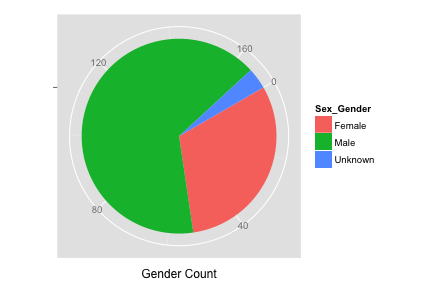

<!-- R Markdown Documentation, DO NOT EDIT THE PLAIN MARKDOWN VERSION OF THIS FILE -->

<!-- Copyright 2014 Google Inc. All rights reserved. -->

<!-- Licensed under the Apache License, Version 2.0 (the "License"); -->
<!-- you may not use this file except in compliance with the License. -->
<!-- You may obtain a copy of the License at -->

<!--     http://www.apache.org/licenses/LICENSE-2.0 -->

<!-- Unless required by applicable law or agreed to in writing, software -->
<!-- distributed under the License is distributed on an "AS IS" BASIS, -->
<!-- WITHOUT WARRANTIES OR CONDITIONS OF ANY KIND, either express or implied. -->
<!-- See the License for the specific language governing permissions and -->
<!-- limitations under the License. -->

Personal Genomes Project
=================

### Additional Resources
* [Schema](https://bigquery.cloud.google.com/table/google.com:biggene:pgp.variants?pli=1)
* [Provenance](./provenance)
* [Data Stories](./data-stories) such as
 * [Comparing PGP to 1000 Genomes](./data-stories/comparing-pgp-to-1000genomes)
 * [Issues with the Variant-Centric Approach](./data-stories/issues-with-the-variant-centric-approach)


**See [PGP Public data](http://googlegenomics.readthedocs.org/en/latest/use_cases/discover_public_data/pgp_public_data.html#bigquery-pgp-tables) for provenance details of the most recent import of the PGP data which has the up-to-date schema.**  The other tables you see here comprise a variety of schema experiments.  Some of the column names for common data may differ from those of your own variants data exported to BigQuery.

Here is an initial query joining the variant data with the phenotypic data.  See the [phenotypes schema](https://bigquery.cloud.google.com/table/google.com:biggene:pgp.phenotypes?pli=1) for more detail.


```
# Compute sample count by gender
SELECT
  Sex_Gender,
  COUNT(1) AS cnt
FROM
  (
  SELECT
    call.callset_name,
    Sex_Gender
  FROM
    FLATTEN([google.com:biggene:pgp.variants],
      call) AS var
  JOIN
    [google.com:biggene:pgp.phenotypes] AS pheno
  ON
    pheno.Participant = var.call.callset_name
  GROUP BY
    call.callset_name,
    Sex_Gender)
GROUP BY
  Sex_Gender
Running query:   RUNNING  2.1s
```

<!-- html table generated in R 3.1.2 by xtable 1.7-4 package -->
<!-- Tue Apr 14 07:55:07 2015 -->
<table border=1>
<tr> <th> Sex_Gender </th> <th> cnt </th>  </tr>
  <tr> <td> Female </td> <td align="right">  53 </td> </tr>
  <tr> <td> Male </td> <td align="right"> 112 </td> </tr>
  <tr> <td>  </td> <td align="right">   6 </td> </tr>
   </table>


