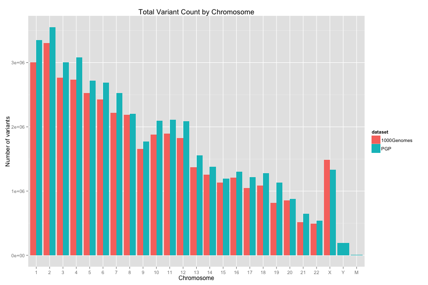
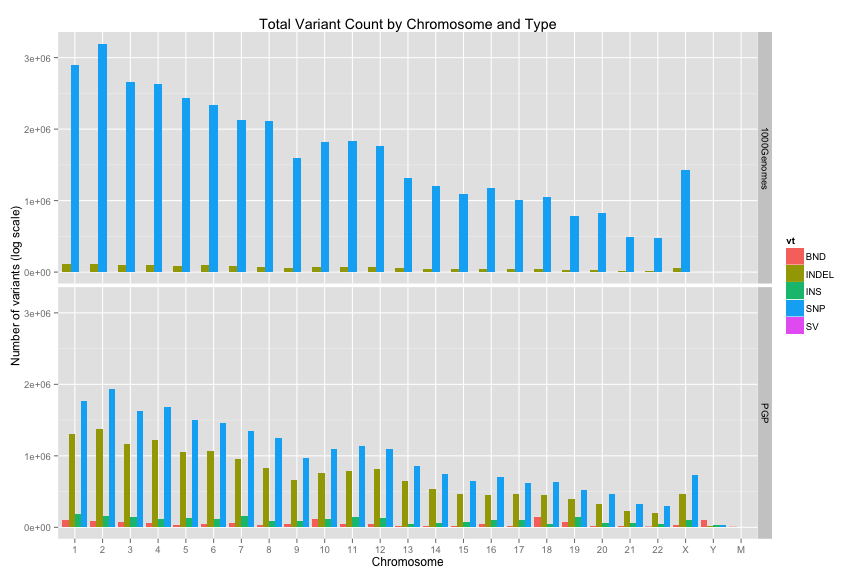
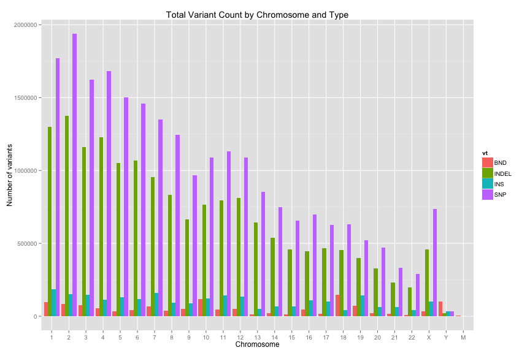
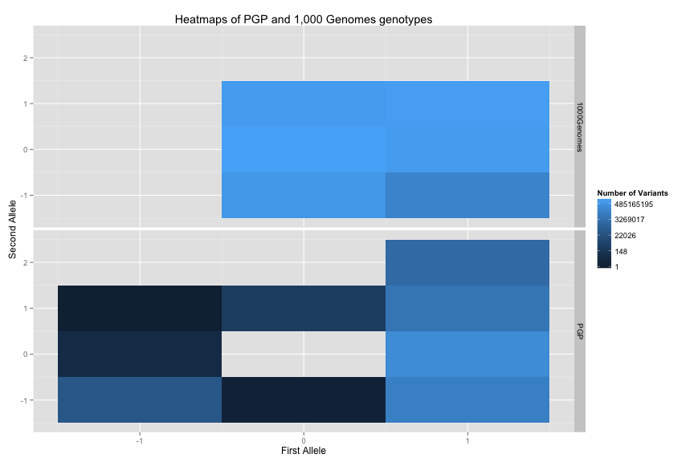

<!-- R Markdown Documentation, DO NOT EDIT THE PLAIN MARKDOWN VERSION OF THIS FILE -->

<!-- Copyright 2014 Google Inc. All rights reserved. -->

<!-- Licensed under the Apache License, Version 2.0 (the "License"); -->
<!-- you may not use this file except in compliance with the License. -->
<!-- You may obtain a copy of the License at -->

<!--     http://www.apache.org/licenses/LICENSE-2.0 -->

<!-- Unless required by applicable law or agreed to in writing, software -->
<!-- distributed under the License is distributed on an "AS IS" BASIS, -->
<!-- WITHOUT WARRANTIES OR CONDITIONS OF ANY KIND, either express or implied. -->
<!-- See the License for the specific language governing permissions and -->
<!-- limitations under the License. -->

Comparing PGP variants data to that of 1,000 Genomes
========================================================

How does the structure and composition of the PGP dataset vary from that of 1,000 Genomes, described in detail via the [1,000 Genomes data stories](../../../1000genomes/data-stories)?


Variant Level Data
------------------

First let us get an overview of how many variants we have in these datasets:

```
# Count the number of variants per chromosome.
SELECT
  contig_name,
  cnt,
  dataset
FROM (
  SELECT
    contig AS contig_name,
    COUNT(1) AS cnt,
    '1000Genomes' AS dataset
  FROM
    [google.com:biggene:1000genomes.variants1kG]
  GROUP BY
    contig_name
    ),
  (
  SELECT
    contig_name,
    COUNT(1) AS cnt,
    'PGP' AS dataset
  FROM
    [google.com:biggene:pgp.variants]
  GROUP BY
    contig_name)
ORDER BY
  contig_name;
```


We see the first few tabular results:
<!-- html table generated in R 3.0.2 by xtable 1.7-3 package -->
<!-- Mon May 12 16:09:01 2014 -->
<TABLE border=1>
<TR> <TH> contig_name </TH> <TH> cnt </TH> <TH> dataset </TH>  </TR>
  <TR> <TD> 1 </TD> <TD align="right"> 3007196 </TD> <TD> 1000Genomes </TD> </TR>
  <TR> <TD> 1 </TD> <TD align="right"> 3349506 </TD> <TD> PGP </TD> </TR>
  <TR> <TD> 10 </TD> <TD align="right"> 2093521 </TD> <TD> PGP </TD> </TR>
  <TR> <TD> 10 </TD> <TD align="right"> 1882663 </TD> <TD> 1000Genomes </TD> </TR>
  <TR> <TD> 11 </TD> <TD align="right"> 1894908 </TD> <TD> 1000Genomes </TD> </TR>
  <TR> <TD> 11 </TD> <TD align="right"> 2110229 </TD> <TD> PGP </TD> </TR>
   </TABLE>




We see that the PGP dataset has more variants for all chromosomes except X.

Let's break this down further by variant type:

```
# Count the number of variants by variant type and chromosome.
SELECT
  contig_name,
  vt,
  cnt,
  dataset
FROM (
  SELECT
    contig_name,
    CASE
    WHEN (svtype IS NULL
      AND ref_len = 1
      AND alt_len = 1) THEN "SNP"
    WHEN (svtype IS NULL) THEN "INDEL"
    ELSE svtype END AS vt,
    COUNT(1) AS cnt,
    'PGP' AS dataset
  FROM (
    SELECT
      contig_name,
      svtype,
      LENGTH(reference_bases) AS ref_len,
      MAX(LENGTH(alternate_bases)) WITHIN RECORD AS alt_len,
    FROM
      [google.com:biggene:pgp.variants]
      )
  GROUP BY
    contig_name,
    vt
    ),
  (
  SELECT
    contig AS contig_name,
    vt,
    COUNT(1) AS cnt,
    '1000Genomes' AS dataset
  FROM
    [google.com:biggene:1000genomes.variants1kG]
  GROUP BY
    contig_name,
    vt
    ),
ORDER BY
  contig_name,
  vt;
```

_Notice in this query that the PGP dataset does not have a column indicating the variant type.  Instead we are inferring if from both the `svtype` and length of the reference and alternate alleles.  **Does this seem reasonable?**_

We see the first few tabular results:
<!-- html table generated in R 3.0.2 by xtable 1.7-3 package -->
<!-- Mon May 12 16:09:04 2014 -->
<TABLE border=1>
<TR> <TH> contig_name </TH> <TH> vt </TH> <TH> cnt </TH> <TH> dataset </TH>  </TR>
  <TR> <TD> 1 </TD> <TD> BND </TD> <TD align="right">   96169 </TD> <TD> PGP </TD> </TR>
  <TR> <TD> 1 </TD> <TD> INDEL </TD> <TD align="right">  109119 </TD> <TD> 1000Genomes </TD> </TR>
  <TR> <TD> 1 </TD> <TD> INDEL </TD> <TD align="right"> 1301492 </TD> <TD> PGP </TD> </TR>
  <TR> <TD> 1 </TD> <TD> INS </TD> <TD align="right">  183238 </TD> <TD> PGP </TD> </TR>
  <TR> <TD> 1 </TD> <TD> SNP </TD> <TD align="right"> 2896960 </TD> <TD> 1000Genomes </TD> </TR>
  <TR> <TD> 1 </TD> <TD> SNP </TD> <TD align="right"> 1768607 </TD> <TD> PGP </TD> </TR>
   </TABLE>




In 1,000 Genomes the vast majority of variants are SNPs but the PGP dataset is much more diverse.  

Re-plotting the data to just show the PGP variants:


We can see that for PGP the proportion of indels is much higher and we have many more structural variants than in 1,000 Genomes.

Sample Level Data
-----------------

Now let us see our distribution of genotypes across the PGP variants:

```
# Count the number of sample genotypes.
SELECT
  call.gt,
  COUNT(call.gt) AS cnt
FROM
  [google.com:biggene:pgp.variants]
GROUP BY
  call.gt
ORDER BY
  cnt DESC
```


We see the tabular results:
<!-- html table generated in R 3.0.2 by xtable 1.7-3 package -->
<!-- Mon May 12 16:09:09 2014 -->
<TABLE border=1>
<TR> <TH> call_gt </TH> <TH> cnt </TH>  </TR>
  <TR> <TD> 1/0 </TD> <TD align="right"> 258784955 </TD> </TR>
  <TR> <TD> . </TD> <TD align="right"> 248183125 </TD> </TR>
  <TR> <TD> 1/1 </TD> <TD align="right"> 240510331 </TD> </TR>
  <TR> <TD> 1|0 </TD> <TD align="right"> 141042214 </TD> </TR>
  <TR> <TD> 0|1 </TD> <TD align="right"> 18229931 </TD> </TR>
  <TR> <TD> 1/. </TD> <TD align="right"> 15285288 </TD> </TR>
  <TR> <TD> 1 </TD> <TD align="right"> 12620268 </TD> </TR>
  <TR> <TD> 1|. </TD> <TD align="right"> 11054273 </TD> </TR>
  <TR> <TD> 1|1 </TD> <TD align="right"> 5621388 </TD> </TR>
  <TR> <TD> 1/2 </TD> <TD align="right"> 3170602 </TD> </TR>
  <TR> <TD> 1|2 </TD> <TD align="right"> 1188648 </TD> </TR>
  <TR> <TD> .|1 </TD> <TD align="right">  755842 </TD> </TR>
  <TR> <TD> .|. </TD> <TD align="right">   54267 </TD> </TR>
  <TR> <TD> 0/1 </TD> <TD align="right">     569 </TD> </TR>
  <TR> <TD> ./. </TD> <TD align="right">     237 </TD> </TR>
  <TR> <TD> ./0 </TD> <TD align="right">      15 </TD> </TR>
  <TR> <TD> .|0 </TD> <TD align="right">       6 </TD> </TR>
  <TR> <TD> 0/. </TD> <TD align="right">       5 </TD> </TR>
  <TR> <TD> 0|. </TD> <TD align="right">       2 </TD> </TR>
  <TR> <TD> ./1 </TD> <TD align="right">       1 </TD> </TR>
   </TABLE>


Comparing this to 1,000 Genomes:

```
# Count the number of sample genotypes, parsed into components.
SELECT
  first_allele,
  phased,
  second_allele,
  dataset,
  cnt
FROM (
  SELECT
    genotype.first_allele AS first_allele,
    genotype.phased AS phased,
    genotype.second_allele AS second_allele,
    COUNT(1) AS cnt,
    '1000Genomes' AS dataset
  FROM
    [google.com:biggene:1000genomes.variants1kG]
  GROUP BY
    first_allele,
    phased,
    second_allele,
    dataset),
  (
  SELECT
    IF(LENGTH(first_allele) = 0
      OR first_allele = ".",
      -1,
      INTEGER(first_allele)) AS first_allele,
    IF(phased = "|",
      TRUE,
      FALSE) AS phased,
    IF(LENGTH(second_allele) = 0
      OR second_allele = ".",
      -1,
      INTEGER(second_allele)) AS second_allele,
    COUNT(1) AS cnt,
    'PGP' AS dataset
  FROM (
    SELECT
      SUBSTR(call.gt,
        1,
        1) AS first_allele,
      SUBSTR(call.gt,
        2,
        1) AS phased,
      SUBSTR(call.gt,
        3,
        1) AS second_allele,
    FROM
      [google.com:biggene:pgp.variants])
  GROUP BY
    first_allele,
    phased,
    second_allele,
    dataset)
```

_Notice in this query that the genotype in PGP requires further parsing to extract its constituents.  The next version of the schema will include the parsed values as columns._



The two most notable aspects of these heatmaps is that PGP (unlike 1,000 Genomes)
 1. contains no genotypes that match the reference 
 1. does have some variants with more than one alternate allele
 
Next let us examine the upper and lower bounds on the number of samples per variant:

```
# Summarize the minimum and maximum number of samples per variant by chromosome.
SELECT
  contig_name,
  MIN(sample_count) AS minimum_sample_count,
  MAX(sample_count) AS maximum_sample_count,
FROM (
  SELECT
    contig_name,
    COUNT(call.callset_name) WITHIN RECORD AS sample_count
  FROM
    [google.com:biggene:pgp.variants]
    )
GROUP BY
  contig_name
ORDER BY
  contig_name
```


We see the tabular results:
<!-- html table generated in R 3.0.2 by xtable 1.7-3 package -->
<!-- Mon May 12 16:09:17 2014 -->
<TABLE border=1>
<TR> <TH> contig_name </TH> <TH> minimum_sample_count </TH> <TH> maximum_sample_count </TH>  </TR>
  <TR> <TD> 1 </TD> <TD align="right">       1 </TD> <TD align="right">     172 </TD> </TR>
  <TR> <TD> 10 </TD> <TD align="right">       1 </TD> <TD align="right">     172 </TD> </TR>
  <TR> <TD> 11 </TD> <TD align="right">       1 </TD> <TD align="right">     172 </TD> </TR>
  <TR> <TD> 12 </TD> <TD align="right">       1 </TD> <TD align="right">     172 </TD> </TR>
  <TR> <TD> 13 </TD> <TD align="right">       1 </TD> <TD align="right">     172 </TD> </TR>
  <TR> <TD> 14 </TD> <TD align="right">       1 </TD> <TD align="right">     172 </TD> </TR>
  <TR> <TD> 15 </TD> <TD align="right">       1 </TD> <TD align="right">     172 </TD> </TR>
  <TR> <TD> 16 </TD> <TD align="right">       1 </TD> <TD align="right">     172 </TD> </TR>
  <TR> <TD> 17 </TD> <TD align="right">       1 </TD> <TD align="right">     172 </TD> </TR>
  <TR> <TD> 18 </TD> <TD align="right">       1 </TD> <TD align="right">     172 </TD> </TR>
  <TR> <TD> 19 </TD> <TD align="right">       1 </TD> <TD align="right">     172 </TD> </TR>
  <TR> <TD> 2 </TD> <TD align="right">       1 </TD> <TD align="right">     172 </TD> </TR>
  <TR> <TD> 20 </TD> <TD align="right">       1 </TD> <TD align="right">     172 </TD> </TR>
  <TR> <TD> 21 </TD> <TD align="right">       1 </TD> <TD align="right">     172 </TD> </TR>
  <TR> <TD> 22 </TD> <TD align="right">       1 </TD> <TD align="right">     172 </TD> </TR>
  <TR> <TD> 3 </TD> <TD align="right">       1 </TD> <TD align="right">     172 </TD> </TR>
  <TR> <TD> 4 </TD> <TD align="right">       1 </TD> <TD align="right">     172 </TD> </TR>
  <TR> <TD> 5 </TD> <TD align="right">       1 </TD> <TD align="right">     172 </TD> </TR>
  <TR> <TD> 6 </TD> <TD align="right">       1 </TD> <TD align="right">     172 </TD> </TR>
  <TR> <TD> 7 </TD> <TD align="right">       1 </TD> <TD align="right">     172 </TD> </TR>
  <TR> <TD> 8 </TD> <TD align="right">       1 </TD> <TD align="right">     172 </TD> </TR>
  <TR> <TD> 9 </TD> <TD align="right">       1 </TD> <TD align="right">     172 </TD> </TR>
  <TR> <TD> M </TD> <TD align="right">       1 </TD> <TD align="right">     172 </TD> </TR>
  <TR> <TD> X </TD> <TD align="right">       1 </TD> <TD align="right">     172 </TD> </TR>
  <TR> <TD> Y </TD> <TD align="right">       1 </TD> <TD align="right">     118 </TD> </TR>
   </TABLE>

For all chromosomes, we have private variants (shared by only one sample) and that for all chromosomes except Y, we have variants shared by all samples.

Other Miscellaneous Differences
-------

There is a new column, `end_pos`, that was computed from the source data when imported into the Variant Store:

```
# What is the meaning of end_pos?
SELECT
  svtype,
  MIN(end_pos - start_pos) AS min_length_delta,
  MAX(end_pos - start_pos) AS max_length_delta,
  IF((end_pos - start_pos) = 1,
    TRUE,
    FALSE) AS is_snp,
  COUNT(1) AS cnt,
FROM
  [google.com:biggene:pgp.variants]
GROUP BY
  svtype,
  is_snp
```


We see the tabular results:
<!-- html table generated in R 3.0.2 by xtable 1.7-3 package -->
<!-- Mon May 12 16:09:20 2014 -->
<TABLE border=1>
<TR> <TH> svtype </TH> <TH> min_length_delta </TH> <TH> max_length_delta </TH> <TH> is_snp </TH> <TH> cnt </TH>  </TR>
  <TR> <TD>  </TD> <TD align="right">       1 </TD> <TD align="right">       1 </TD> <TD> TRUE </TD> <TD align="right"> 29791008 </TD> </TR>
  <TR> <TD>  </TD> <TD align="right">       2 </TD> <TD align="right">     195 </TD> <TD> FALSE </TD> <TD align="right"> 10303720 </TD> </TR>
  <TR> <TD> INS </TD> <TD align="right">       1 </TD> <TD align="right">       1 </TD> <TD> TRUE </TD> <TD align="right"> 2474927 </TD> </TR>
  <TR> <TD> BND </TD> <TD align="right">       1 </TD> <TD align="right">       1 </TD> <TD> TRUE </TD> <TD align="right"> 1261792 </TD> </TR>
   </TABLE>

_Notice that `end_pos` is not computed for structural variants but we expect this to be available at a later date.  It can be helpful when joining with annotations that span a genomic position interval._

Lastly, let us see which columns are sufficient to serve as a unique key into this dataset:

```
# Which fields constitute a minimum unique key into this data?
SELECT
  contig_name,
  COUNT(1) AS cnt,
FROM (
  SELECT
    contig_name,
    start_pos,
    reference_bases,
    alt,
    COUNT(1) AS cnt,
  FROM (
    SELECT
      contig_name,
      start_pos,
      reference_bases,
      GROUP_CONCAT(alternate_bases) WITHIN RECORD AS alt,
    FROM
      [google.com:biggene:pgp.variants])
    GROUP EACH BY
    contig_name,
    start_pos,
    reference_bases,
    alt,
  HAVING
    cnt > 1)
GROUP BY
  contig_name;
Retrieving data:  2.2s
Retrieving data:  2.4s
```


```r
print(expect_true(is.null(result)))
```

```
As expected: is.null(result) is true 
```


The minimal unique key is: `(contig_name, start_pos, reference_bases, alternate_bases)`  Compare this to the [unique key for 1,000 Genomes](../../../1000genomes/data-stories/understanding-alternate-alleles).
