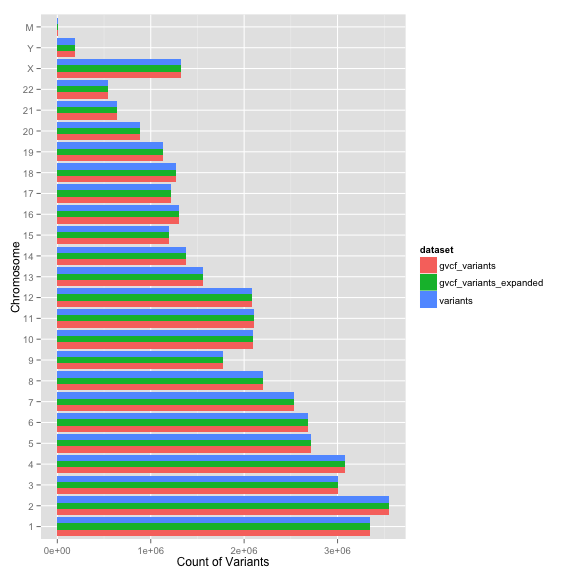
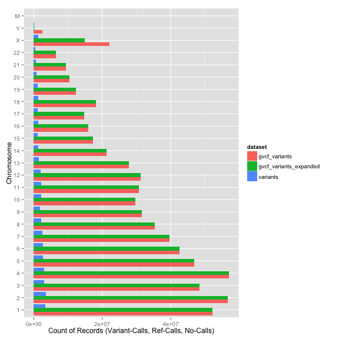
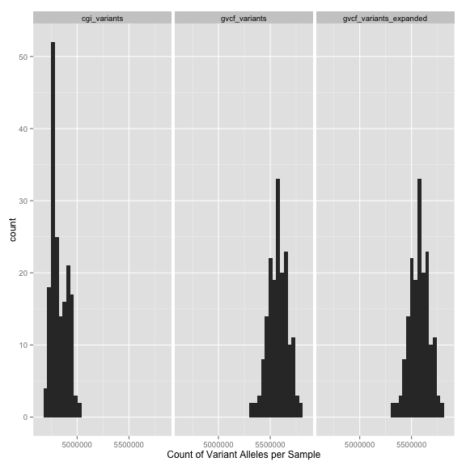
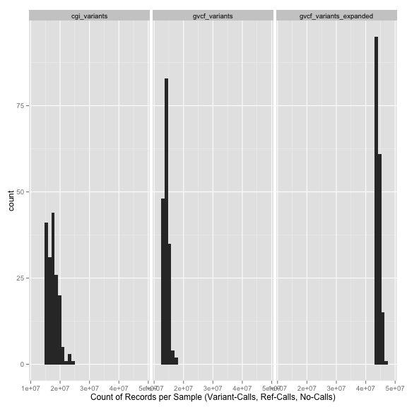

<!-- R Markdown Documentation, DO NOT EDIT THE PLAIN MARKDOWN VERSION OF THIS FILE -->

<!-- Licensed under the Apache License, Version 2.0 (the "License"); -->
<!-- you may not use this file except in compliance with the License. -->
<!-- You may obtain a copy of the License at -->

<!--     http://www.apache.org/licenses/LICENSE-2.0 -->

<!-- Unless required by applicable law or agreed to in writing, software -->
<!-- distributed under the License is distributed on an "AS IS" BASIS, -->
<!-- WITHOUT WARRANTIES OR CONDITIONS OF ANY KIND, either express or implied. -->
<!-- See the License for the specific language governing permissions and -->
<!-- limitations under the License. -->

A Comparison of Schemas and Data Encodings
========================================

Comparison
-----------------

TODO(deflaux) table here with links to Ti/TV and allelic frequency queries for each treatment.  Include metrics about number of lines in SQL, run time, and footprint of table.

Motivation
-----------------

We wrote many, many [queries for 1,000 Genomes](../../../1000genomes/sql) and they were relatively straighforward since all the data for all samples for a particular variant could be found on a single row in the table.

For subsequent work with data encoded as [gVCF](https://sites.google.com/site/gvcftools/home/about-gvcf/gvcf-conventions), the queries were much more challenging.  With gVCF data we have *reference-matching block records*, so our SQL statements need to determine which samples have reference-matching regions that overlap the variant(s) in which we are interested.

This is pretty straightforward for individual variants.  For example for a particular variant in the [Klotho gene](http://www.snpedia.com/index.php/Rs9536314) discussed in [this data story](../issues-with-the-variant-centric-approach#thomas-confirms-amazing-intelligence-in-the-pgp-cohort) the `WHERE` clause
```
    WHERE
      contig_name = '13'
      AND start_pos == 33628138
```
becomes
```
    WHERE
      contig_name = '13'
      AND start_pos <= 33628138
      AND (end_pos >= 33628139
        OR END >= 33628139)
```
to capture not only that variant, but any other records that overlap that genomic position.  Suppose we want to calculate an aggregate for a particular variant, such as the number of samples with the variant on one or both alleles and of samples that match the reference.


```
# Missingness rate for Klotho variant rs9536314 in the "amazing
# intelligence of PGP participants" data story.
SELECT
  COUNT(sample_id) AS num_samples_called_for_position,
  SUM(called_count) AS num_alleles_called_for_position,
  1 - (SUM(called_count)/(172*2)) AS missingness_rate
FROM (
  SELECT
    contig_name,
    start_pos,
    end_pos,
    END,
    reference_bases,
    GROUP_CONCAT(alternate_bases) WITHIN RECORD AS alt,
    call.callset_name AS sample_id,
    GROUP_CONCAT(STRING(call.genotype),
      '/') WITHIN call AS genotype,
    SUM(call.genotype >= 0) WITHIN RECORD as called_count,
  FROM
    [google.com:biggene:test.pgp_gvcf_variants]
  WHERE
    contig_name = '13'
    AND start_pos <= 33628138
    AND (end_pos = 33628139
      OR END >= 33628139)
    )
```

<!-- html table generated in R 3.0.2 by xtable 1.7-3 package -->
<!-- Thu Jul 31 18:11:48 2014 -->
<TABLE border=1>
<TR> <TH> num_samples_called_for_position </TH> <TH> num_alleles_called_for_position </TH> <TH> missingness_rate </TH>  </TR>
  <TR> <TD align="right">     170 </TD> <TD align="right">     340 </TD> <TD align="right"> 0.011628 </TD> </TR>
   </TABLE>


This works fine for a single variant, but what if we want to compute missingness for a gene, a chromosome, or our whole dataset?

```
# Missingness rate for variants within BRCA1.
SELECT
  vars.contig_name AS contig_name,
  vars.start_pos AS start_pos,
  reference_bases,
  variant_called_count,
  SUM(refs.called_count) AS reference_called_count,
  variant_called_count + SUM(refs.called_count) AS num_alleles_called_for_position,
  1 - ((variant_called_count + SUM(refs.called_count))/(172*2)) AS missingness_rate
FROM (
    # _JOIN our variant sample counts with the corresponding reference-matching blocks
  SELECT
    vars.contig_name,
    vars.start_pos,
    refs.start_pos,
    vars.end_pos,
    refs.END,
    reference_bases,
    variant_called_count,
    refs.called_count
  FROM (
      # Constrain the left hand side of the _JOIN to reference-matching blocks
    SELECT
      contig_name,
      start_pos,
      END,
      IF(alternate_bases IS NULL,
        FALSE,
        TRUE) AS is_variant_call,
      SUM(call.genotype >= 0) WITHIN RECORD AS called_count,
    FROM
      [google.com:biggene:test.pgp_gvcf_variants]
    WHERE
      contig_name = '17'
    HAVING
      is_variant_call = FALSE) AS refs
  JOIN (
      # Constrain the right hand side of the _JOIN to variants
      # _GROUP our variant sample counts together since a single SNP may be IN more than
      # one row due 1 / 2 genotypes
    SELECT
      contig_name,
      start_pos,
      end_pos,
      reference_bases,
      SUM(called_count) AS variant_called_count,
    FROM (
        # _LIMIT the query to SNPs _ON chromosome 17 WITHIN BRCA1
      SELECT
        contig_name,
        start_pos,
        end_pos,
        reference_bases,
        LENGTH(reference_bases) AS ref_len,
        MIN(LENGTH(alternate_bases)) WITHIN RECORD AS alt_len,
        IF(alternate_bases IS NULL,
          FALSE,
          TRUE) AS is_variant_call,
        SUM(call.genotype >= 0) WITHIN RECORD AS called_count,
      FROM
        [google.com:biggene:test.pgp_gvcf_variants]
      WHERE
        contig_name = '17'
        AND start_pos BETWEEN 41196312
        AND 41277500
      HAVING
        ref_len = 1
        AND alt_len = 1
        AND is_variant_call)
    GROUP BY
      contig_name,
      start_pos,
      end_pos,
      reference_bases) AS vars
    # The _JOIN criteria IS complicated since we are trying to see if a SNP overlaps an interval
  ON
    vars.contig_name = refs.contig_name
  WHERE
    refs.start_pos <= vars.start_pos
    AND refs.END >= vars.end_pos
    )
GROUP BY
  contig_name,
  start_pos,
  reference_bases,
  variant_called_count
```

Number of rows returned by this query: 540.

Examing the first few rows, we see:
<!-- html table generated in R 3.0.2 by xtable 1.7-3 package -->
<!-- Thu Jul 31 18:11:53 2014 -->
<TABLE border=1>
<TR> <TH> contig_name </TH> <TH> start_pos </TH> <TH> reference_bases </TH> <TH> variant_called_count </TH> <TH> reference_called_count </TH> <TH> num_alleles_called_for_position </TH> <TH> missingness_rate </TH>  </TR>
  <TR> <TD> 17 </TD> <TD align="right"> 41212423 </TD> <TD> T </TD> <TD align="right">       2 </TD> <TD align="right">     342 </TD> <TD align="right">     344 </TD> <TD align="right"> 0.000000 </TD> </TR>
  <TR> <TD> 17 </TD> <TD align="right"> 41212403 </TD> <TD> C </TD> <TD align="right">       2 </TD> <TD align="right">     338 </TD> <TD align="right">     340 </TD> <TD align="right"> 0.011628 </TD> </TR>
  <TR> <TD> 17 </TD> <TD align="right"> 41212026 </TD> <TD> G </TD> <TD align="right">       2 </TD> <TD align="right">     342 </TD> <TD align="right">     344 </TD> <TD align="right"> 0.000000 </TD> </TR>
  <TR> <TD> 17 </TD> <TD align="right"> 41212032 </TD> <TD> C </TD> <TD align="right">       2 </TD> <TD align="right">     340 </TD> <TD align="right">     342 </TD> <TD align="right"> 0.005814 </TD> </TR>
  <TR> <TD> 17 </TD> <TD align="right"> 41212150 </TD> <TD> C </TD> <TD align="right">       4 </TD> <TD align="right">     338 </TD> <TD align="right">     342 </TD> <TD align="right"> 0.005814 </TD> </TR>
  <TR> <TD> 17 </TD> <TD align="right"> 41212762 </TD> <TD> G </TD> <TD align="right">       8 </TD> <TD align="right">     336 </TD> <TD align="right">     344 </TD> <TD align="right"> 0.000000 </TD> </TR>
   </TABLE>


TODO(deflaux): more here about equi-JOINs in BigQuery and the cross product when we try to do this at a larger scale, UDF example, etc...

Details
--------------

To determine how to improve the usability of the data and the schemas, we have the same data encoded four different ways, to compare and contrast querying each.
 1. [cgi_variants](https://bigquery.cloud.google.com/table/google.com:biggene:pgp.cgi_variants?pli=1): a flat schema (one row per sample) with reference matching blocks
 1. [variants](https://bigquery.cloud.google.com/table/google.com:biggene:pgp.variants?pli=1): a nested schema (per-sample data is nested) containing only variants
 1. [gvcf_variants](https://bigquery.cloud.google.com/table/google.com:biggene:test.pgp_gvcf_variants?pli=1): a nested schema (per-sample data is nested) with reference matching blocks
 1. [gvcf_variants_expanded](https://bigquery.cloud.google.com/table/google.com:biggene:test.pgp_gvcf_variants_expanded?pli=1): a nested schema (per-sample data is nested) with reference matching blocks BUT with reference-matching and no-call samples nested into variant rows (redundant data)

For more detail about how the CGI genomes were transformed and loaded into BigQuery, see the [provenance](../../provenance) of the various tables.  Also note that while the [cgi_variants](https://bigquery.cloud.google.com/table/google.com:biggene:pgp.cgi_variants?pli=1) has data is for 174 individuals, the tables created from the derived VCF/gVCF data only have data for 172 individuals because `cgatools mkvcf` did not successfully convert two of the genomes.

Appendix
==========================
Some queries to help check that the four versions of the data were correctly transformed.

Check Record Counts
---------------------


```
# Call counts for the PGP data encoded four different ways.
SELECT
  chromosome,
  num_records,
  num_variants,
  dataset
FROM
  (
  SELECT
    SUBSTR(chromosome,
      4) AS chromosome,
    COUNT(1) AS num_records,
    SUM(reference != '=') AS num_variants,
    'cgi_variants' AS dataset
  FROM
    [google.com:biggene:pgp.cgi_variants]
  # Skip the genomes we were unable to convert to VCF/gVCF
  OMIT RECORD IF 
    sample_id = 'huEDF7DA' OR sample_id = 'hu34D5B9'
  GROUP BY
    chromosome),
  (
  SELECT
    contig_name AS chromosome,
    COUNT(1) AS num_records,
    SUM(reference_bases != 'N') AS num_variants,
    'variants' AS dataset
  FROM
    [google.com:biggene:pgp.variants]
  GROUP BY
    chromosome),
  (
  SELECT
    contig_name AS chromosome,
    COUNT(1) AS num_records,
    SUM(reference_bases != 'N') AS num_variants,
    'gvcf_variants' AS dataset
  FROM
    [google.com:biggene:test.pgp_gvcf_variants]
  GROUP BY
    chromosome),
  (
  SELECT
    contig_name AS chromosome,
    COUNT(1) AS num_records,
    SUM(reference_bases != 'N') AS num_variants,
    'gvcf_variants_expanded' AS dataset
  FROM
    [google.com:biggene:test.pgp_gvcf_variants_expanded2]
  GROUP BY
    chromosome)
ORDER BY
  chromosome,
  dataset
```

Number of rows returned by this query: 100.

Examing the first few rows, we see:
<!-- html table generated in R 3.0.2 by xtable 1.7-3 package -->
<!-- Thu Jul 31 18:11:57 2014 -->
<TABLE border=1>
<TR> <TH> chromosome </TH> <TH> num_records </TH> <TH> num_variants </TH> <TH> dataset </TH>  </TR>
  <TR> <TD> 1 </TD> <TD align="right"> 238124699 </TD> <TD align="right"> 52490861 </TD> <TD> cgi_variants </TD> </TR>
  <TR> <TD> 1 </TD> <TD align="right"> 52200100 </TD> <TD align="right"> 3349506 </TD> <TD> gvcf_variants </TD> </TR>
  <TR> <TD> 1 </TD> <TD align="right"> 52200100 </TD> <TD align="right"> 3349506 </TD> <TD> gvcf_variants_expanded </TD> </TR>
  <TR> <TD> 1 </TD> <TD align="right"> 3349506 </TD> <TD align="right"> 3349506 </TD> <TD> variants </TD> </TR>
  <TR> <TD> 10 </TD> <TD align="right"> 139345544 </TD> <TD align="right"> 33649415 </TD> <TD> cgi_variants </TD> </TR>
  <TR> <TD> 10 </TD> <TD align="right"> 29709727 </TD> <TD align="right"> 2093519 </TD> <TD> gvcf_variants </TD> </TR>
  <TR> <TD> 10 </TD> <TD align="right"> 29709727 </TD> <TD align="right"> 2093519 </TD> <TD> gvcf_variants_expanded </TD> </TR>
  <TR> <TD> 10 </TD> <TD align="right"> 2093521 </TD> <TD align="right"> 2093519 </TD> <TD> variants </TD> </TR>
   </TABLE>


And visually:





Let's also confirm with a few tests:

```r
cgi_variants <- filter(result, dataset == "cgi_variants")
variants <- filter(result, dataset == "variants")
gvcf_variants <- filter(result, dataset == "gvcf_variants")
gvcf_variants_expanded <- filter(result, dataset == "gvcf_variants_expanded")
```

cgi_variants will have many, many more rows than the other tables because it is completely flat (one row per sample):

```r
print(expect_that(unique(cgi_variants$num_records > variants$num_records), is_true()))
```

```
## As expected: unique(cgi_variants$num_records > variants$num_records) is true
```

```r
print(expect_that(unique(cgi_variants$num_records > gvcf_variants$num_records), 
    is_true()))
```

```
## As expected: unique(cgi_variants$num_records > gvcf_variants$num_records) is true
```

```r
print(expect_that(unique(cgi_variants$num_records > gvcf_variants_expanded$num_records), 
    is_true()))
```

```
## As expected: unique(cgi_variants$num_records > gvcf_variants_expanded$num_records) is true
```

All tables derived from VCF/gVCF data will have the same number of variant records:

```r
print(expect_equal(variants$num_variants, gvcf_variants$num_variants))
```

```
## As expected: variants$num_variants equals gvcf_variants$num_variants
```

```r
print(expect_equal(variants$num_variants, gvcf_variants_expanded$num_variants))
```

```
## As expected: variants$num_variants equals gvcf_variants_expanded$num_variants
```

The variants table has almost no additional records (just a handful of no-call records):

```r
print(expect_equal(variants$num_records, variants$num_variants, tolerance = 1e-06))
```

```
## As expected: variants$num_records equals variants$num_variants
```


But the gvcf_variants and gvcf_variants_expanded tables have additional records (reference-matching block records):

```r
print(expect_that(unique(gvcf_variants$num_records >= variants$num_records), 
    is_true()))
```

```
## As expected: unique(gvcf_variants$num_records >= variants$num_records) is true
```

```r
print(expect_that(unique(gvcf_variants_expanded$num_records >= variants$num_records), 
    is_true()))
```

```
## As expected: unique(gvcf_variants_expanded$num_records >= variants$num_records) is true
```

```r
# TODO(deflaux): the counts are equal for Y and M, fix the bug in
# cgi-ref-blocks-mapper.py and re-run it
```

The gvcf_variants and gvcf_variants_expanded tables have the same number of records, the difference between the two is in the number of nested sample variant calls.

```r
print(expect_equal(gvcf_variants$num_records, gvcf_variants_expanded$num_records))
```

```
## As expected: gvcf_variants$num_records equals gvcf_variants_expanded$num_records
```


Check Sample Counts
---------------------


```
# Sample call counts for the PGP data encoded several different ways.  
# NOTE: table pgp.variants was left out of this example since its more trouble
# than its worth to parse the GT field into its components. 
SELECT
  sample_id,
  num_records,
  num_variant_alleles,
  dataset
FROM
  (
  SELECT
    sample_id,
    COUNT(sample_id) AS num_records,
    INTEGER(SUM(allele1_is_variant + allele2_is_variant)) AS num_variant_alleles,
    'cgi_variants' AS dataset
  FROM (
    SELECT
      sample_id,
      allele1Seq != reference
      AND allele1Seq != '='
      AND allele1Seq != '?' AS allele1_is_variant,
      allele2Seq != reference
      AND allele2Seq != '='
      AND allele2Seq != '?' AS allele2_is_variant,
    FROM
      [google.com:biggene:pgp.cgi_variants]
      # Skip the genomes we were unable to convert to VCF/gVCF
    OMIT
      RECORD IF
      sample_id = 'huEDF7DA'
      OR sample_id = 'hu34D5B9')
  GROUP BY
    sample_id),
  (
  SELECT
    sample_id,
    COUNT(sample_id) AS num_records,
    INTEGER(SUM(num_variant_alleles)) AS num_variant_alleles,
    'gvcf_variants' AS dataset
  FROM (
    SELECT
      call.callset_name AS sample_id,
      SUM(call.genotype > 0) WITHIN call AS num_variant_alleles,
    FROM
      [google.com:biggene:test.pgp_gvcf_variants])
  GROUP BY
    sample_id),
  (
  SELECT
    sample_id,
    COUNT(sample_id) AS num_records,
    INTEGER(SUM(num_variant_alleles)) AS num_variant_alleles,
    'gvcf_variants_expanded' AS dataset
  FROM
    (
    SELECT
      call.callset_name AS sample_id,
      SUM(call.genotype > 0) WITHIN call AS num_variant_alleles,
    FROM
      [google.com:biggene:test.pgp_gvcf_variants_expanded])
  GROUP BY
    sample_id)
ORDER BY
  sample_id,
  dataset
```

Number of rows returned by this query: 516.

Examing the first few rows, we see:
<!-- html table generated in R 3.0.2 by xtable 1.7-3 package -->
<!-- Thu Jul 31 18:12:05 2014 -->
<TABLE border=1>
<TR> <TH> sample_id </TH> <TH> num_records </TH> <TH> num_variant_alleles </TH> <TH> dataset </TH>  </TR>
  <TR> <TD> hu011C57 </TD> <TD align="right"> 17615409 </TD> <TD align="right"> 4744749 </TD> <TD> cgi_variants </TD> </TR>
  <TR> <TD> hu011C57 </TD> <TD align="right"> 14123577 </TD> <TD align="right"> 5518279 </TD> <TD> gvcf_variants </TD> </TR>
  <TR> <TD> hu011C57 </TD> <TD align="right"> 43988119 </TD> <TD align="right"> 5518279 </TD> <TD> gvcf_variants_expanded </TD> </TR>
  <TR> <TD> hu016B28 </TD> <TD align="right"> 17585284 </TD> <TD align="right"> 4777466 </TD> <TD> cgi_variants </TD> </TR>
  <TR> <TD> hu016B28 </TD> <TD align="right"> 14134088 </TD> <TD align="right"> 5556632 </TD> <TD> gvcf_variants </TD> </TR>
  <TR> <TD> hu016B28 </TD> <TD align="right"> 43933062 </TD> <TD align="right"> 5556632 </TD> <TD> gvcf_variants_expanded </TD> </TR>
  <TR> <TD> hu0211D6 </TD> <TD align="right"> 20148634 </TD> <TD align="right"> 4844626 </TD> <TD> cgi_variants </TD> </TR>
  <TR> <TD> hu0211D6 </TD> <TD align="right"> 15668766 </TD> <TD align="right"> 5462930 </TD> <TD> gvcf_variants </TD> </TR>
   </TABLE>


And visually:






Let's also confirm with a few tests:

```r
cgi_variants <- filter(result, dataset == "cgi_variants")
gvcf_variants <- filter(result, dataset == "gvcf_variants")
gvcf_variants_expanded <- filter(result, dataset == "gvcf_variants_expanded")
```

The tables have data for all the same samples:

```r
print(expect_equal(length(cgi_variants$sample_id), 172))
```

```
## As expected: length(cgi_variants$sample_id) equals 172
```

```r
print(expect_equal(cgi_variants$sample_id, gvcf_variants$sample_id))
```

```
## As expected: cgi_variants$sample_id equals gvcf_variants$sample_id
```

```r
print(expect_equal(cgi_variants$sample_id, gvcf_variants_expanded$sample_id))
```

```
## As expected: cgi_variants$sample_id equals gvcf_variants_expanded$sample_id
```

Make sure we correctly expanded the reference-matching calls into the variant records:

```r
print(expect_equal(gvcf_variants$num_variant_alleles, gvcf_variants_expanded$num_variant_alleles))
```

```
## As expected: gvcf_variants$num_variant_alleles equals gvcf_variants_expanded$num_variant_alleles
```

The cgi_variants table actually has fewer variant alleles per sample.  `cgatools mkvcf` does not use only the masterVar files as an input source.  TODO(deflaux): dig more in to the reason for this difference and/or import the Var data.

```r
print(expect_that(unique(cgi_variants$num_variant_alleles < gvcf_variants$num_variant_alleles), 
    is_true()))
```

```
## As expected: unique(cgi_variants$num_variant_alleles < gvcf_variants$num_variant_alleles) is true
```

```r
print(expect_equal(cgi_variants$num_variant_alleles, gvcf_variants$num_variant_alleles, 
    tolerance = 0.15))
```

```
## As expected: cgi_variants$num_variant_alleles equals gvcf_variants$num_variant_alleles
```


Spot Check a Particular Variant
-------------------------------

```
# Sample level data for Klotho variant rs9536314 for use in the "amazing
# intelligence of PGP participants" data story, specifically joining two 
# tables to compare the different encodings.
SELECT
  cgi.sample_id,
  chromosome,
  locusBegin,
  locusEnd,
  reference,
  allele1Seq,
  allele2Seq,
  contig_name,
  start_pos,
  end_pos,
  END,
  ref,
  alt,
  gvcf.sample_id,
  genotype
FROM
  [google.com:biggene:pgp.cgi_variants] AS cgi
  left OUTER JOIN
  (
  SELECT
    contig_name,
    start_pos,
    end_pos,
    END,
    ref,
    alt,
    sample_id,
    genotype
  FROM
    FLATTEN(
    SELECT
      contig_name,
      start_pos,
      end_pos,
      END,
      reference_bases AS ref,
      GROUP_CONCAT(alternate_bases) WITHIN RECORD AS alt,
      call.callset_name AS sample_id,
      GROUP_CONCAT(STRING(call.genotype),
        '/') WITHIN call AS genotype,
    FROM
      [google.com:biggene:test.pgp_gvcf_variants]
    WHERE
      contig_name = '13'
      AND start_pos <= 33628138
      AND (end_pos >= 33628139
        OR END >= 33628139)
      ,
      call)) AS gvcf
ON
  cgi.sample_id = gvcf.sample_id
WHERE
  chromosome = "chr13"
  AND locusBegin <= 33628137
  AND locusEnd >= 33628138
  # Skip the genomes we were unable to convert to VCF/gVCF
OMIT RECORD IF 
  cgi.sample_id = 'huEDF7DA' OR cgi.sample_id = 'hu34D5B9'
ORDER BY
  cgi.sample_id
```

Number of rows returned by this query: 172.  We have one row for every indivudual in the CGI dataset.

Examing the NULL rows, we see that no-call records account for the difference, as we expect:
<!-- html table generated in R 3.0.2 by xtable 1.7-3 package -->
<!-- Thu Jul 31 18:12:11 2014 -->
<TABLE border=1>
<TR> <TH> cgi_sample_id </TH> <TH> chromosome </TH> <TH> locusBegin </TH> <TH> locusEnd </TH> <TH> reference </TH> <TH> allele1Seq </TH> <TH> allele2Seq </TH> <TH> contig_name </TH> <TH> start_pos </TH> <TH> end_pos </TH> <TH> END </TH> <TH> ref </TH> <TH> alt </TH> <TH> gvcf_sample_id </TH> <TH> genotype </TH>  </TR>
  <TR> <TD> hu67EBB3 </TD> <TD> chr13 </TD> <TD align="right"> 33628132 </TD> <TD align="right"> 33628144 </TD> <TD> = </TD> <TD> ? </TD> <TD> ? </TD> <TD>  </TD> <TD align="right">  </TD> <TD align="right">  </TD> <TD align="right">  </TD> <TD>  </TD> <TD>  </TD> <TD>  </TD> <TD>  </TD> </TR>
  <TR> <TD> huF1DC30 </TD> <TD> chr13 </TD> <TD align="right"> 33628132 </TD> <TD align="right"> 33628140 </TD> <TD> = </TD> <TD> ? </TD> <TD> ? </TD> <TD>  </TD> <TD align="right">  </TD> <TD align="right">  </TD> <TD align="right">  </TD> <TD>  </TD> <TD>  </TD> <TD>  </TD> <TD>  </TD> </TR>
   </TABLE>


```
# Sample level data for Klotho variant rs9536314 for use in the "amazing
# intelligence of PGP participants" data story, specifically joining two 
# tables to compare the different encodings.
SELECT
  cgi.sample_id,
  chromosome,
  locusBegin,
  locusEnd,
  reference,
  allele1Seq,
  allele2Seq,
  contig_name,
  start_pos,
  end_pos,
  END,
  ref,
  alt,
  gvcf.sample_id,
  genotype
FROM
  [google.com:biggene:pgp.cgi_variants] AS cgi
  left OUTER JOIN
  (
  SELECT
    contig_name,
    start_pos,
    end_pos,
    END,
    ref,
    alt,
    sample_id,
    genotype
  FROM
    FLATTEN(
    SELECT
      contig_name,
      start_pos,
      end_pos,
      END,
      reference_bases AS ref,
      GROUP_CONCAT(alternate_bases) WITHIN RECORD AS alt,
      call.callset_name AS sample_id,
      GROUP_CONCAT(STRING(call.genotype),
        '/') WITHIN call AS genotype,
    FROM
      [google.com:biggene:test.pgp_gvcf_variants_expanded2]
    WHERE
      contig_name = '13'
      AND start_pos == 33628138
      ,
      call)) AS gvcf
ON
  cgi.sample_id = gvcf.sample_id
WHERE
  chromosome = "chr13"
  AND locusBegin <= 33628137
  AND locusEnd >= 33628138
# Skip the genomes we were unable to convert to VCF/gVCF
OMIT RECORD IF 
  cgi.sample_id = 'huEDF7DA' OR cgi.sample_id = 'hu34D5B9'
ORDER BY
  cgi.sample_id
```

Number of rows returned by this query: 172.  We have one row for every indivudual in the CGI dataset.

Examing the NULL rows, we see that no-call records account for the difference, as we expect:
<!-- html table generated in R 3.0.2 by xtable 1.7-3 package -->
<!-- Thu Jul 31 18:12:16 2014 -->
<TABLE border=1>
<TR> <TH> cgi_sample_id </TH> <TH> chromosome </TH> <TH> locusBegin </TH> <TH> locusEnd </TH> <TH> reference </TH> <TH> allele1Seq </TH> <TH> allele2Seq </TH> <TH> contig_name </TH> <TH> start_pos </TH> <TH> end_pos </TH> <TH> END </TH> <TH> ref </TH> <TH> alt </TH> <TH> gvcf_sample_id </TH> <TH> genotype </TH>  </TR>
  <TR> <TD> hu67EBB3 </TD> <TD> chr13 </TD> <TD align="right"> 33628132 </TD> <TD align="right"> 33628144 </TD> <TD> = </TD> <TD> ? </TD> <TD> ? </TD> <TD>  </TD> <TD align="right">  </TD> <TD align="right">  </TD> <TD align="right">  </TD> <TD>  </TD> <TD>  </TD> <TD>  </TD> <TD>  </TD> </TR>
  <TR> <TD> huF1DC30 </TD> <TD> chr13 </TD> <TD align="right"> 33628132 </TD> <TD align="right"> 33628140 </TD> <TD> = </TD> <TD> ? </TD> <TD> ? </TD> <TD>  </TD> <TD align="right">  </TD> <TD align="right">  </TD> <TD align="right">  </TD> <TD>  </TD> <TD>  </TD> <TD>  </TD> <TD>  </TD> </TR>
   </TABLE>


And we get the same result from both the gvcf tables:

```r
# Leave out the columns expected to differ
gvcf_result_expanded <- select(result, -start_pos, -end_pos, -END, -ref, -alt)
print(expect_equal(gvcf_result, gvcf_result_expanded))
```

```
## As expected: gvcf_result equals gvcf_result_expanded
```

