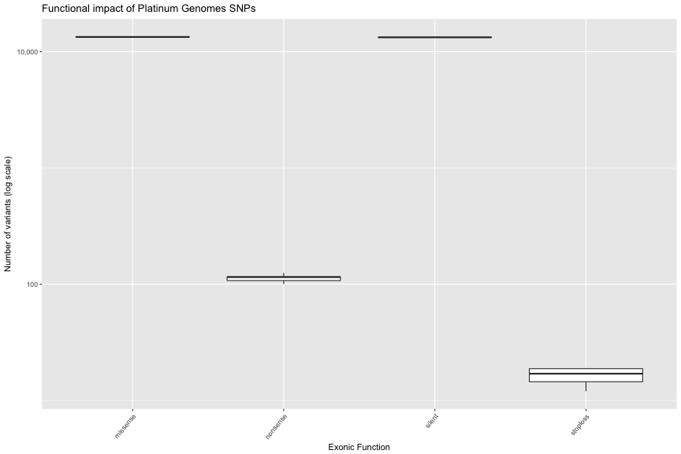

Platinum Genomes
================

### Additional Resources

There are just a handful of queries below but you will find a whole suite of
queries for the Platinum Genome dataset written as a codelab for performing
[Quality Control on Variants](https://github.com/googlegenomics/codelabs/tree/master/R/PlatinumGenomes-QC).

* [variants table](https://bigquery.cloud.google.com/table/genomics-public-data:platinum_genomes.variants?pli=1)
* [sample_info table](https://bigquery.cloud.google.com/table/google.com:biggene:platinum_genomes.sample_info)
* See [Google Genomics Public Data](http://googlegenomics.readthedocs.io/en/latest/use_cases/discover_public_data/platinum_genomes.html)
for provenance details for this data.


### SNP Annotation

Let's annotate variants in the [Illumina Platinum Genomes dataset](http://googlegenomics.readthedocs.io/en/latest/use_cases/discover_public_data/platinum_genomes.html)
using Tute Genomics' table of annotations for hg19 SNPs.  Please see [Google Genomics Public Data](http://googlegenomics.readthedocs.io/en/latest/use_cases/discover_public_data/tute_genomics_public_data.html)
for more detail about these annotations.

First we'll count variants by exonic functional impact:

```
#standardSQL
  --
  -- Count SNPs by functional impact for each sample in Platinum Genomes.
  --
WITH
  sample_variants AS (
  SELECT
    REGEXP_EXTRACT(reference_name, r'chr(.+)') AS chr,
    start AS start,
    reference_bases,
    alt,
    call.call_set_name
  FROM
    `genomics-public-data.platinum_genomes.variants` v,
    v.call call,
    v.alternate_bases alt WITH OFFSET alt_offset
  WHERE
    -- Require that at least one genotype matches this alternate.
    EXISTS (SELECT gt FROM UNNEST(call.genotype) gt WHERE gt = alt_offset+1)
    )
  --
  --
SELECT
  call_set_name,
  ExonicFunc,
  COUNT(ExonicFunc) AS variant_count
FROM
  `silver-wall-555.TuteTable.hg19` AS annots
JOIN sample_variants AS vars
ON
  vars.chr = annots.Chr
  AND vars.start = annots.Start
  AND vars.reference_bases = annots.Ref
  AND vars.alt = annots.Alt
WHERE
  ExonicFunc IS NOT NULL
GROUP BY
  call_set_name,
  ExonicFunc
ORDER BY
  call_set_name,
  ExonicFunc
```

Results:

|call_set_name |ExonicFunc | variant_count|
|:-------------|:----------|-------------:|
|NA12877       |missense   |         13377|
|NA12877       |nonsense   |           116|
|NA12877       |silent     |         13313|
|NA12877       |stoploss   |            18|
|NA12878       |missense   |         13399|
|NA12878       |nonsense   |           115|

Visualized:


Next we'll identify rare variants across the cohort indicated as pathenogenic
by [ClinVar](https://www.ncbi.nlm.nih.gov/clinvar/):

```
#standardSQL
  --
  -- Return all SNPs from the Platinum Genomes cohort that are:
  --   annotated as 'pathogenic' in ClinVar
  --   with observed population frequency less than 1%
  --
WITH
  cohort_variants AS (
  SELECT
    REGEXP_EXTRACT(reference_name, r'chr(.+)') AS chr,
    start AS start,
    reference_bases,
    alt
  FROM
    `genomics-public-data.platinum_genomes.variants` v,
    v.alternate_bases alt WITH OFFSET alt_offset
  WHERE
    -- Require that at least one sample in the cohort has this variant.
    EXISTS(SELECT gt FROM UNNEST(v.call) call, UNNEST(call.genotype) gt WHERE gt = alt_offset+1)
    )
  --
  --
SELECT
  annots.Chr,
  annots.Start,
  Ref,
  annots.Alt,
  Func,
  Gene,
  PopFreqMax,
  ExonicFunc,
  ClinVar_SIG,
  ClinVar_DIS
FROM
  `silver-wall-555.TuteTable.hg19` AS annots
JOIN
  cohort_variants AS vars
ON
  vars.chr = annots.Chr
  AND vars.start = annots.Start
  AND vars.reference_bases = annots.Ref
  AND vars.alt = annots.Alt
WHERE
  PopFreqMax <= 0.01
  AND ClinVar_SIG LIKE '%pathogenic%'
  AND NOT CLinVar_SIG LIKE '%non-pathogenic%'
ORDER BY
  Chr,
  Start,
  Ref,
  Alt
```

Results:

|Chr |     Start|Ref |Alt |Func     |Gene  | PopFreqMax|ExonicFunc |ClinVar_SIG                                                |ClinVar_DIS                                                                                                                                                                                                                       |
|:---|---------:|:---|:---|:--------|:-----|----------:|:----------|:----------------------------------------------------------|:---------------------------------------------------------------------------------------------------------------------------------------------------------------------------------------------------------------------------------|
|1   | 155205633|T   |C   |exonic   |GBA   |     0.0028|missense   |pathogenic&#124;other&#124;other&#124;pathogenic           |Gaucher's_disease,_type_1&#124;Parkinson_disease,_late-onset,_susceptibility_to&#124;Dementia,_Lewy_body,_susceptibility_to&#124;not_provided;Gaucher_disease                                                                     |
|11  |   6638384|C   |T   |splicing |TPP1  |     0.0010|NA         |pathogenic&#124;pathogenic                                 |Ceroid_lipofuscinosis,_neuronal,_2&#124;Spinocerebellar_ataxia,_autosomal_recessive_7                                                                                                                                             |
|12  | 103234251|T   |C   |exonic   |PAH   |     0.0010|missense   |pathogenic&#124;pathogenic                                 |Hyperphenylalaninemia,_non-pku&#124;not_provided                                                                                                                                                                                  |
|15  |  89870431|C   |T   |exonic   |POLG  |     0.0014|missense   |pathogenic&#124;pathogenic&#124;pathogenic&#124;pathogenic |Cerebellar_ataxia_infantile_with_progressive_external_ophthalmoplegia&#124;Sensory_ataxic_neuropathy,_dysarthria,_and_ophthalmoparesis&#124;Myoclonic_epilepsy_myopathy_sensory_ataxia&#124;Progressive_sclerosing_poliodystrophy |
|16  |  29825021|C   |T   |exonic   |PRRT2 |     0.0100|missense   |pathogenic                                                 |Dystonia_10;not_specified&#124;not_provided                                                                                                                                                                                       |
|6   | 161127500|A   |G   |exonic   |PLG   |     0.0089|missense   |pathogenic                                                 |PLASMINOGEN_DEFICIENCY,_TYPE_I                                                                                                                                                                                                    |
|7   |  87060843|C   |T   |exonic   |ABCB4 |     0.0100|missense   |pathogenic&#124;pathogenic                                 |Cholestasis,_intrahepatic,_of_pregnancy_3&#124;Cholecystitis                                                                                                                                                                      |
|7   | 117227791|G   |A   |splicing |CFTR  |     0.0014|NA         |pathogenic                                                 |Cystic_fibrosis                                                                                                                                                                                                                   |
|7   | 143048770|C   |T   |exonic   |CLCN1 |     0.0080|nonsense   |pathogenic&#124;pathogenic&#124;pathogenic                 |Congenital_myotonia,_autosomal_recessive_form&#124;Congenital_myotonia,_autosomal_dominant_form&#124;Myotonia_congenita                                                                                                           |
|7   | 150884002|C   |T   |exonic   |ASB10 |     0.0040|missense   |pathogenic                                                 |Glaucoma_1,_open_angle,_F                                                                                                                                                                                                         |
|8   | 106431419|A   |G   |exonic   |ZFPM2 |     0.0060|missense   |pathogenic&#124;pathogenic                                 |Tetralogy_of_Fallot&#124;Double_outlet_right_ventricle                                                                                                                                                                            |

And finally we'll re-run this analysis using only the variants for one specific individual:

```
#standardSQL
  --
  -- Return SNPs for sample NA12878 that are:
  --   annotated as 'pathogenic' in ClinVar
  --   with observed population frequency less than 1%
  --
WITH
  sample_variants AS (
  SELECT
    REGEXP_EXTRACT(reference_name, r'chr(.+)') AS chr,
    start AS start,
    reference_bases,
    alt,
    call.call_set_name
  FROM
    `genomics-public-data.platinum_genomes.variants` v,
    v.call call,
    v.alternate_bases alt WITH OFFSET alt_offset
  WHERE
    call_set_name = 'NA12878'
    -- Require that at least one genotype matches this alternate.
    AND EXISTS (SELECT gt FROM UNNEST(call.genotype) gt WHERE gt = alt_offset+1) )
  --
  --
SELECT
  call_set_name,
  annots.Chr,
  annots.Start,
  Ref,
  annots.Alt,
  Func,
  Gene,
  PopFreqMax,
  ExonicFunc,
  ClinVar_SIG,
  ClinVar_DIS
FROM
  `silver-wall-555.TuteTable.hg19` AS annots
JOIN
  sample_variants AS vars
ON
  vars.chr = annots.Chr
  AND vars.start = annots.Start
  AND vars.reference_bases = annots.Ref
  AND vars.alt = annots.Alt
WHERE
  PopFreqMax <= 0.01
  AND ClinVar_SIG LIKE '%pathogenic%'
  AND NOT CLinVar_SIG LIKE '%non-pathogenic%'
ORDER BY
  Chr,
  Start,
  Ref,
  Alt,
  call_set_name
```

Results:

|call_set_name |Chr |     Start|Ref |Alt |Func     |Gene | PopFreqMax|ExonicFunc |ClinVar_SIG                |ClinVar_DIS                                                                           |
|:-------------|:---|---------:|:---|:---|:--------|:----|----------:|:----------|:--------------------------|:-------------------------------------------------------------------------------------|
|NA12878       |11  |   6638384|C   |T   |splicing |TPP1 |     0.0010|NA         |pathogenic&#124;pathogenic |Ceroid_lipofuscinosis,_neuronal,_2&#124;Spinocerebellar_ataxia,_autosomal_recessive_7 |
|NA12878       |12  | 103234251|T   |C   |exonic   |PAH  |     0.0010|missense   |pathogenic&#124;pathogenic |Hyperphenylalaninemia,_non-pku&#124;not_provided                                      |
|NA12878       |6   | 161127500|A   |G   |exonic   |PLG  |     0.0089|missense   |pathogenic                 |PLASMINOGEN_DEFICIENCY,_TYPE_I                                                        |
